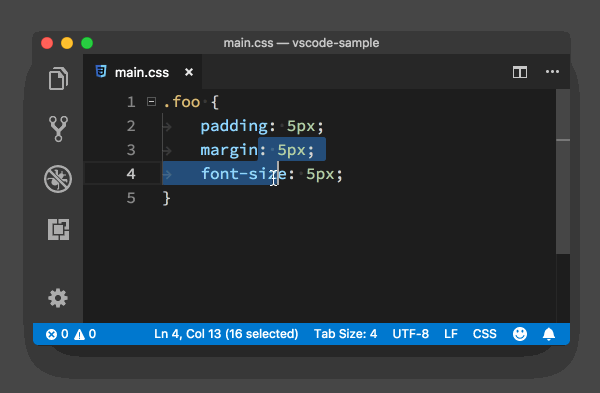
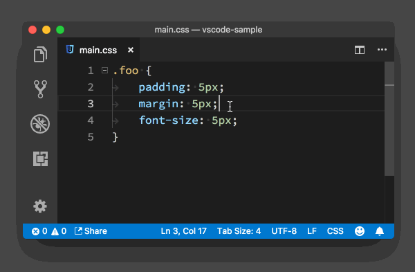
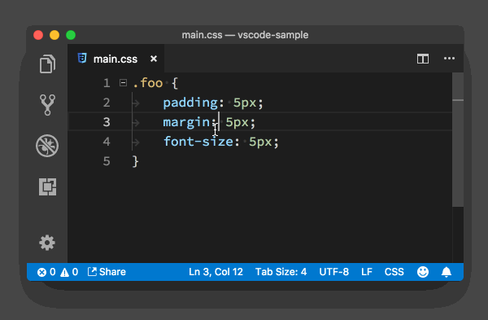
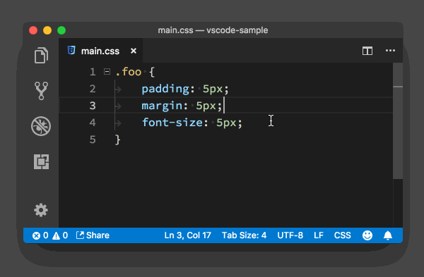
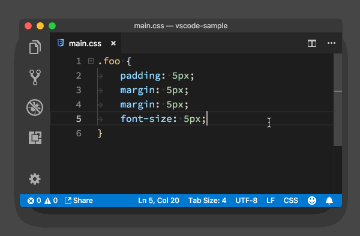

# 04_VSCode代码行编辑

**VSCode 代码行编辑**，下面我就以一段 CSS 代码作为例子，来和你分享下代码行编辑中的高阶技巧。

```css
.foo {
  padding: 5px;
  margin: 5px;
  font-size: 5px;
}
```

CSS

要删掉一行代码，你可以选中它，然后再按 Delete 键。不过还有一个快捷键，那就是直接按下 “ Cmd + Shift + K ” (Windows 上是 “Ctrl + Shift + K”)，当前代码行就可以被删除了。



如果你只是想要剪切这行代码，那么你直接按下 “ Cmd + x ” (Windows 上是 “Ctrl + x”) 即可。



我想你肯定很清楚，“Enter” 键的基础作用是能在编辑器里光标所在的位置添加一个换行符。但是很多时候你可能并不是单纯地要将一行分成两段，而是希望在这行的下面或者上面开始一段新的代码。

这个功能对应的快捷键非常好记，它跟 “Enter”键十分接近。当你想在当前行的下面新开始一行时，你只需按下 “Cmd + Enter” （Windows 上是 “Ctrl + Enter”）；而当你想在当前行的上面新开始一行时，你只要按下 “Cmd + Shift + Enter” （Windows 上是 “Ctrl + Shift + Enter”）就行了。



当你想移动一段代码时，一般你可能会分三步走：先选中，再剪切，最后粘贴。不过我更喜欢的是按住 “Option + 上下方向键”（Windows中就是“Alt + 上下方向键”） ，将当前行，或者当前选中的几行代码，在编辑器里上下移动。



如果你同时按住 “Shift” 键的话，也就是 “Option + Shift + 上下方向键”（Windows中就是“Alt + shift + 上下方向键”），那就可以复制这几行，然后粘贴到当前行的上面或者下面。


另外，你在尝试“Option + 上下方向键”这个快捷键“上下移动”时，可能也发现了，当你把一段代码移动到花括号里面或者外面时，代码前的制表符或者空格的数量会自动发生改变，这样你就不需要移动完代码后再调整了。

