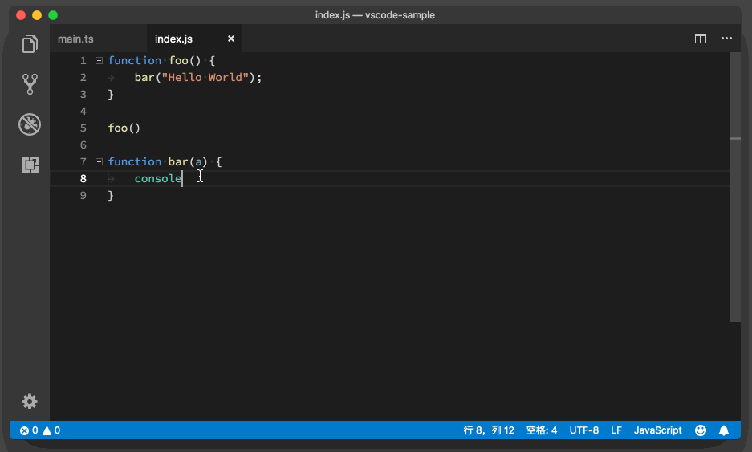
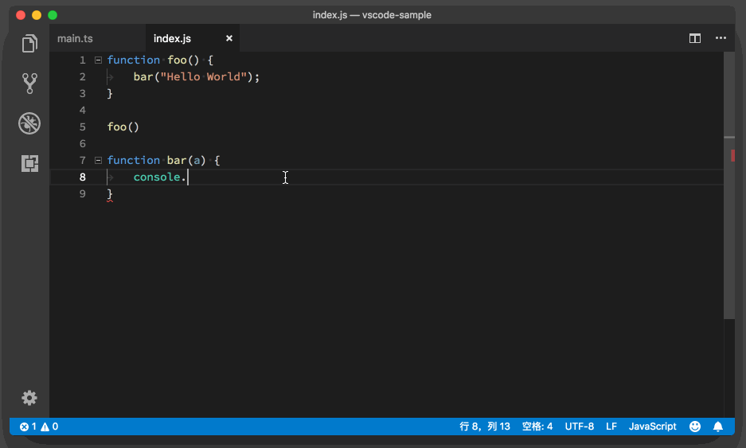
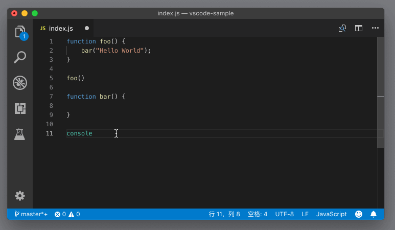

# 13_VSCode自动补全

**VS Code自动补全**,VS Code 当中的自动补全内容，其实是由语言服务来提供的。本文介绍VS Code自动补全功能和VS Code自动补全设置。

VS Code 为编程语言工作者提供了统一的 API ，即 Language Server Protocol，每种语言都能够通过实现这个 API 在 VS Code 上得到类似 IDE 的开发体验，而各个语言根据这个 API 实现的服务，就被称为**语言服务**。

文章目录

- [1 VS Code自动补全功能](https://geek-docs.com/vscode/vscode-tutorials/vs-code-auto-complete.html#VS_Code)
- [2 VS Code自动补全设置](https://geek-docs.com/vscode/vscode-tutorials/vs-code-auto-complete.html#VS_Code-2)
- [3 VS Code基于单词的自动补全](https://geek-docs.com/vscode/vscode-tutorials/vs-code-auto-complete.html#VS_Code-3)

## VS Code自动补全功能

语言服务会根据当前的项目、当前的文件，以及光标所在的位置，为我们提供一个建议列表。这个列表包含了在当前光标位置下我们可能会输入的代码。当我们不断地输入字符，VS Code 就会根据当前输入的字符，在这个列表进行过滤。

```javascript
function foo() {
 bar("Hello World");
}

foo()

function bar(a) {

}
```

JavaScript

今天我们继续使用一段 JavaScript 代码来做例子。当我们在编辑器里输入 `console.` 之后，VS Code 里的 JavaScript 语言服务，会给我们建议与 `console` 相关的 API。



当我们找到了合适的函数后，按下 Tab 键或者回车键就可以将其补全。



如果我们偶尔觉得这个自动补全窗口是多余的，希望暂时不看到它，可以按下 Escape 键将其隐藏。后续如果希望再次看到这个窗口，除了通过打字来将其调出以外，我们还可以按下 “Ctrl + 空格键”来手动地调出建议列表。


刚才我们提到，VS Code 会根据我们输入的字符在这个建议列表里进行过滤。同时，这个过滤是允许我们犯一点小错误的，比如打字特别快的时候少打一个字母，VS Code 也能处理这个情况。比如在下面的动图里，我想使用 console 里的 debug 函数，但是我只打了 db 两个字母，建议列表依然为我提供了 debug 这个选项。



## VS Code自动补全设置

上面的这几个窗口，它们都是通过我们输入的内容自动触发的，也就是说，编程语言决定了我们什么时候看到什么内容。虽然我们可以通过快捷键将其快速地关闭和唤出，但是有的时候自动补全窗口出现得过于频繁，也是会影响我们的编程体验的，毕竟悬浮窗口会遮盖一部分代码，影响我们的阅读。

不过，我们可以通过几个设置，控制自动补全窗口出现的频率和方式，甚至这个窗口的大小。

首先我们可以通过设置 “editor.quickSuggestions” 来决定在什么语境下自动补全窗口会被唤出。默认设置如下：

```json
 "editor.quickSuggestions": {
    "other": true,
    "comments": false,
    "strings": false
  }
```

JSON

这个配置有三个选项：other、comments和strings。其中，comments 就是代码注释，strings 就是指字符串。默认情况下，当光标在代码注释或者字符串里，自动补全窗口就不会被自动唤出了。但如果你希望这个窗口永远不被自动唤出，那么你就需要将“other” 也改为 “false”。

这时你可能会问了，如果关闭了这个设置，我想看到自动补全该怎么办呢？不用担心，当你按下 “Ctrl + 空格键” 之后，这个窗口依然会被打开，不管设置是关闭还是开启的状态。看到这个设置，你肯定也就明白了，为什么默认情况下你在写注释的时候没有代码自动补全的提示了吧。

参数预览窗口也是一样的，你可以通过参数 “editor.parameterHints.enabled” 将其关闭。当你觉得自己需要看一看参数预览时，按下快捷键或者通过命令面板就能够将其打开了。

上面的这个设置决定“是与否”的问题，但你也可以控制自动补全窗口出现的时间。自动补全窗口监听文件内容的变化，当你停止输入时，它就会试着给你提供建议。但是有的时候你打字稍微快一些，自动补全窗口才刚刚出现，你就输入了更多的内容，紧接着代码服务就要重新计算并提供建议了。如果你希望减少这种不必要的提示，可以增大设置 “editor.quickSuggestionsDelay” 的值，这样在你输入完代码后，自动补全窗口就会多等一会儿，然后再跳出来。

其他几个自动补全的设置，你可以在设置里搜一搜 “editor.suggest”，自己修改玩一玩。

## VS Code基于单词的自动补全

上面提到的几个功能，它们都依托于语言服务来提供内容。但是有的时候，语言服务并不完美。编辑器于是提供了一种相对 “笨” 一些的提示，那就是基于单词的提示。编辑器通过分析当前的文件里的内容，进行简单的正则表达式匹配，给我们建议已经出现过的单词。

当然，如果你觉得语言服务的提示已经足够好了，不需要这么暴力、这么笨的文本提示，那你也可以通过设置 “editor.wordBasedSuggestions” 将其关闭。