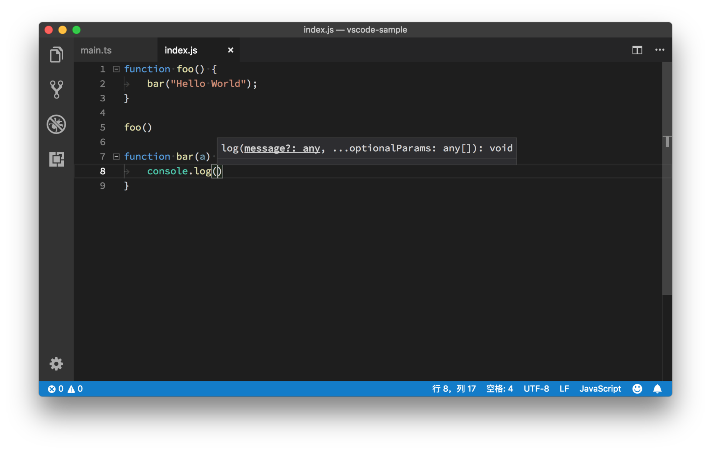

# 16_VSCode参数预览

**VS Code参数预览**,当我们从建议列表选择了一个函数，然后输入括号，准备开始输入参数时，我们会看到一个参数预览的悬浮框。通过这个参数预览的窗口，我们可以知道这个函数可以传入哪些参数，它们的参数类型又是什么样的。

同样的，隐藏这个窗口的快捷键也是 Escape。如果你想再次将其调出的话，需要按下 “Cmd + Shift + Space” （Windows 上是 Ctrl + Shift + Space）。