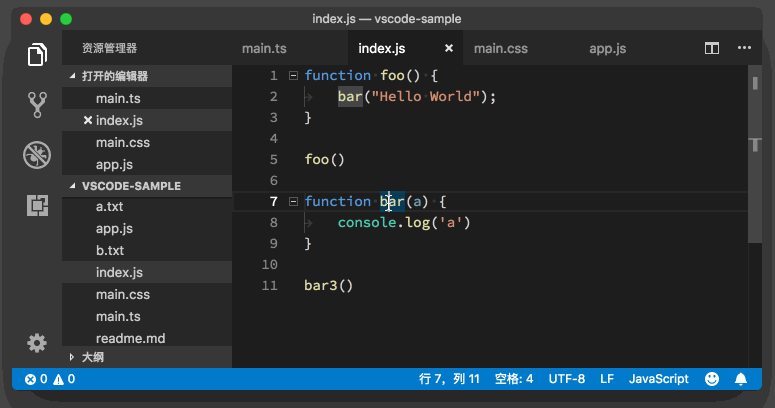
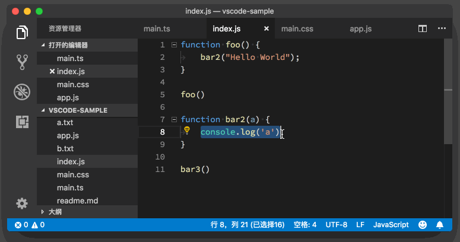

# 18_VSCode重构

**VS Code重构**, 重构这个功能，相信你已经在频繁地使用了。

当我们想修改一个函数或者变量的名字时候，我们只需把光标放到函数或者变量名上，然后按下 F2，这样这个函数或者变量出现的地方就都会被修改。

这个操作并不是一个粗暴的搜索关键词并替换，在上面的动图中你可以看到，最后一行代码里有个 bar3函数调用，但当我们去重命名 bar这个函数时，bar3并没有受到影响。

除了重命名外，另一个常用的重构的操作就是把一段长代码抽取出来转成一个单独的函数。在VS Code中，我们只需选中那段代码，点击黄色的灯泡图标，然后选择对应的重构操作即可。

要注意的是，并不是每个语言服务都支持重构的操作。如果你选中一段代码后，但没有看到那个黄色的灯泡图标，那么也就是说你使用的这门语言可能还没有支持快速重构。