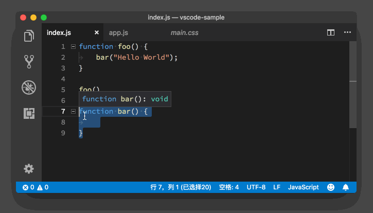

# 19_VSCode文本编辑

**VS Code文本编辑**，在 VS Code中，我们除了能够使用鼠标来选择文本以外，还能够使用鼠标对文本进行一定程度的修改，我们把它称为拖放功能（drag and drop）。

比如在今天的示例代码中，我们选中 bar 这个函数，然后将鼠标移到这段选中的代码之上，按下鼠标左键不松开。这时你可以看到，鼠标指针已经从一条竖线，变成了一个箭头。这时候我们移动鼠标的话，就可以把这段文本拖拽到我们想要的位置。

在移动的过程当中，我们能够在编辑器中看到一个由虚线构成的光标，当我们松开鼠标左键的时候，这段文本就会被移动到这个虚拟的光标所在的位置。

在上面的动图里，我们把 bar这个函数，从文档的末尾移动到了第四行。这个功能就相当于使用键盘进行的“剪切+粘贴”。

那么能不能使用鼠标进行“复制+粘贴”呢？别担心，VS Code 肯定也会考虑到这个情况的，所以答案是：必须能。

如果我们在拖拽这段文本的同时，按下 Option 键（Windows 上是 Ctrl 键），鼠标指针上会多一个加号，这时候我们再移动鼠标或虚拟光标至我们想要的位置，然后当我们松开鼠标左键的时候，这段文本将会被复制粘贴到虚拟光标所在的位置，也就是我们既定的目标位置。

你看，在移动鼠标的过程中，多按了个 Option 键（Windows 上是 Ctrl 键），操作结果就由原来的“剪切+粘贴”变为“复制+粘贴”了。

