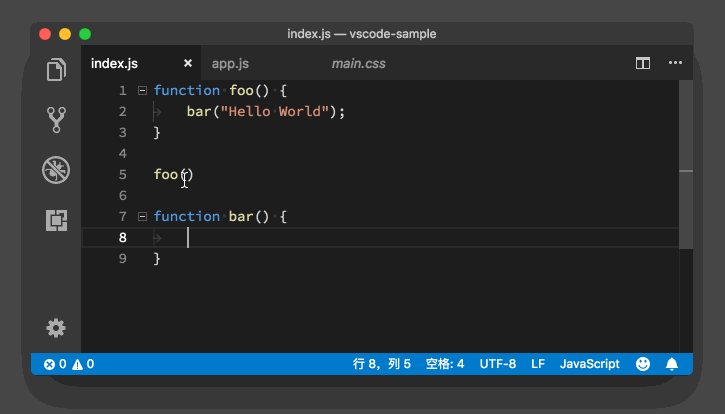
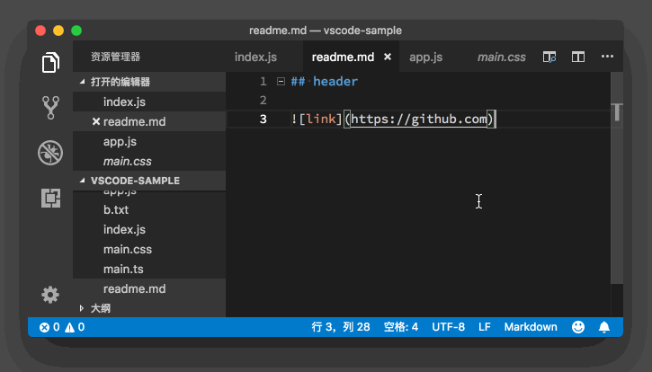

# 21_VSCode代码跳转和链接

**VS Code代码跳转和链接**, 除了能够使用鼠标进行代码选择、编辑、预览之外，我们还可以借助鼠标来完成跳转操作。不知道你还记得我们之前讲的文件、代码跳转相关的快捷键吗？如果不记得，一定要回去再复习哦。如果记得，今天在这里我再教你如何使用鼠标来完成跳转操作。

我们还是把鼠标移动到示例代码的第五行 foo 上，然后按下 Cmd 键，这时候 foo下面出现了一个下划线。然后当我们按下鼠标左键，就跳转到了 foo函数的定义处。

当我们在编写 Markdown 这样的非编程语言的文档时，也可以通过 Cmd + 鼠标左键（Windows 上是 Ctrl + 鼠标左键）来打开超级链接。

