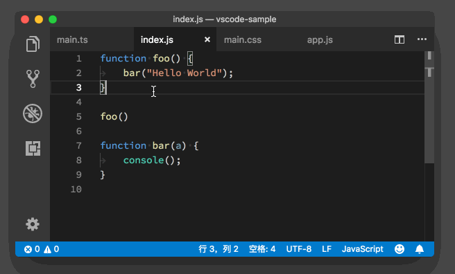
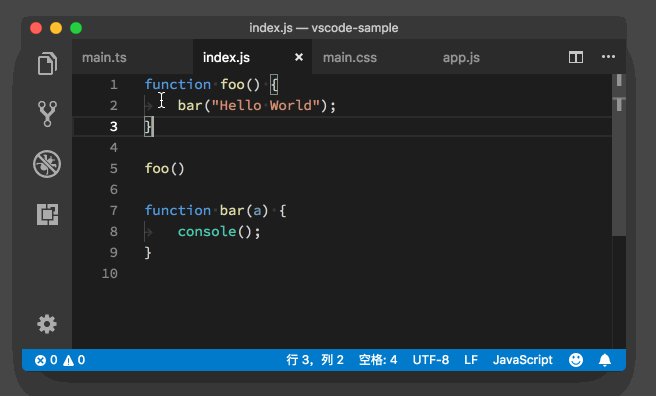
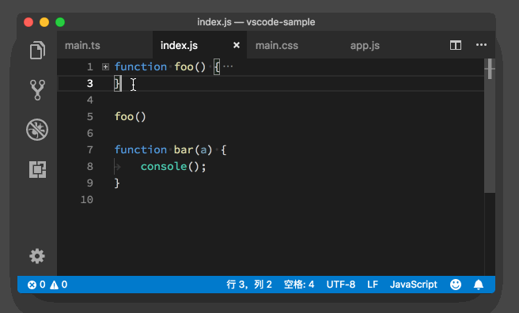
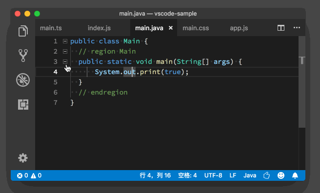

# 33_VSCode折叠代码

**VSCode折叠代码**，很多编程语言都使用花括号来包裹代码块。比如说类的定义、函数的定义、条件判断语句或者循环语句，它们都是用花括号作为一个代码块的开始和结尾。而VS Code 就是通过对花括号的匹配来决定哪些代码块是能够被折叠的。

首先，我们一起来看一下编辑器中最基础的代码折叠方式。比如在下面的这段 JavaScript 代码中：

```javascript
function foo() {
bar("Hello World");
}

foo()

function bar(a) {

}
```

JavaScript

前三行里是一个foo的函数，并且这个函数当中只有一行内容。

当我们把鼠标移动到行号的附近时，就能够看到一个类似于减号的标记，同时鼠标指针变成了手的形状。


鼠标移动到行号附近

此时若我们单击这个图标，就能够看到 foo函数内部的这行代码消失了，取而代之的则是三个点的缩略图。


代码被折叠

在代码被折叠后，行号附近的这个图标就变成了一个加号的形状，若再点击这个加号就能把这段代码展开。



以上内容就是代码折叠最基本的概念，下面介绍下VSCode基于语言定义的代码折叠。

## VSCode基于语言定义的代码折叠

上面讲述的代码折叠的判断方式，是通过花括号或者代码缩进的检测来实现的。但若遇到不使用花括号或者缩进不正确的代码时，可能就不能实现这样的操作了。为此，VS Code 给语言服务提供了一个接口，语言服务可以动态地检测代码，然后告诉 VS Code 哪段代码是可以被折叠的。

这样一来，VS Code 就不用傻傻地检查花括号的匹配了，并且我们写代码的时候也不用为了折叠而更改代码风格了。

除了让语言服务参与到代码折叠的定义当中来，VS Code 还给了用户一定的控制权。也就是说，我们可以通过在代码注释里书写特殊的关键词来申明，哪一行是可折叠代码的开始，哪一段则是这个可折叠代码块的结束。

举例子可能要比解释定义要来的容易一些，所以我们一起看下面的这段 Java 代码：

```java
public class Main {
// region Main
public static void main(String[] args) {
}
// endregion
}
```

Java

其中，// region Main 申明了一个可折叠代码块的开始，而// endregion则申明了这段可折叠代码的结束。当我们把鼠标指针移动到行号附近时，我们能够看到三个加号，说明这段代码包含了三个可折叠的代码块，两个是由花括号控制的，一个则是基于特殊的语言的定义。



至于哪个语言可以使用哪些关键词来控制代码的折叠，还请参考 [VS Code 的官方文档](https://code.visualstudio.com/docs/editor/codebasics#_folding)。

下面我们再来一起看一下有哪些折叠和展开代码的快捷键。

[VSCode折叠代码快捷键](http://vscode.geek-docs.com/editor/vscode-folding-shortcut-key.html)