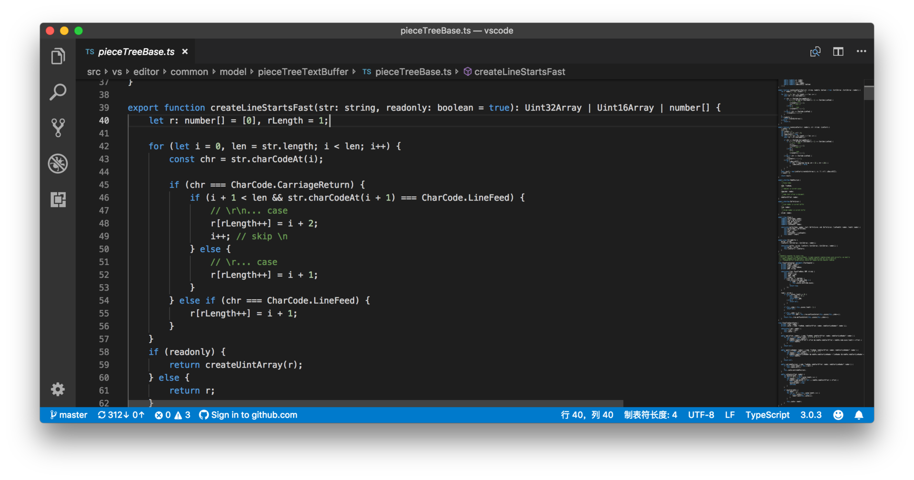
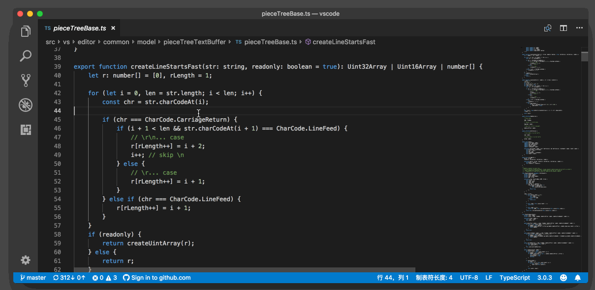

# 35_VSCode面包屑

**VSCode面包屑**，叫做 Breadcrumb，翻译过来就是面包屑导航，主要是展示目前的代码在整个工程里的路径，同时你还能够看出这个代码所在位置的结构层级并且可以快速跳转。这个功能相信你在浏览文档类的网站时经常能看到，而在 VS Code 中你能够看到则是当前的光标、在哪个符号或者函数里，然后是哪个文件中、在哪个文件夹下，等等。

不过，VS Code 在最近几个月才添加了面包屑这个功能，并且默认是关闭的。要打开这个功能，我们需要“打开设置”（Open Settings），搜索 `“breadcrumbs.enabled”`，找到后将它打开。

在上图中，从左到右，我们能够看到一层一层文件夹的名字，然后是当前文件名，最后则是光标所在的函数的名字。我们可以通过点击这个工具栏上的文字，然后进行文件夹、文件或者是函数的跳转。

这里我还可以分享一点这个功能的技术细节，面包屑这个功能除了 UI 部分，它底层的服务其实都是早就存在的。就比如说在上面的截图中，面包屑左侧的文件结构，跟我们在资源管理器看到的是一样的；右侧的函数名之类的，则是来自语言服务提供的符号；至于在这些文件和符号之间的快速跳转，更没有超出我们在第七讲 “如何快速在文件、符号、代码之间跳转？”里介绍的内容。

换句话说，面包屑的功能，可以当作一种新的文件、内容预览和快速跳转的方式。