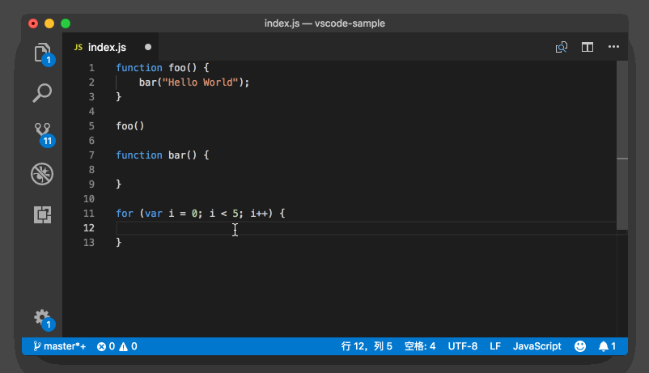

# 36_VSCode小地图

**VSCode小地图**，细心的你可能已经发现了，在之前所有的截图里，我都把小地图关掉了（在查看菜单栏中可以打开或关闭小地图）。这是因为图片小，而小地图又比较占地方。

但是如果你是在一个比较大的屏幕上工作，需要快速了解整个文件的全貌，并且还能靠鼠标快速地移动，那么这时小地图就很有用了。这个功能默认是打开的，所以你无需特别设置。这个使用起来比较简单，你可以像我在图中展示的那样试着打开一个较大的文件，感受一下它的妙处。

很多游戏中也有类似的小地图功能，不知道你有没有似曾相识的感觉。

除了控制小地图是否打开，编辑器还为我们提供了几个渲染的配置项。比如说，默认情况下，小地图会将每个字符都渲染出来。但是我们并不能真正地通过小地图来看代码，我们只是要看个大概结构罢了，那么我们可以打开命令面板，搜索“打开设置”（Open Settings），进入设置界面后，搜索 `“editor.minimap.renderCharacters”` ，找到后将其关闭，这样一来，所有的字符，都会被渲染成一个个小色块。

同样的，我们还可以通过 `“editor.minimap.maxColumn”` 来控制小地图里每一行渲染多少个字符。很多时候我们只需看下每行代码前的缩进和前面的代码高亮，就能看出个大概来了。