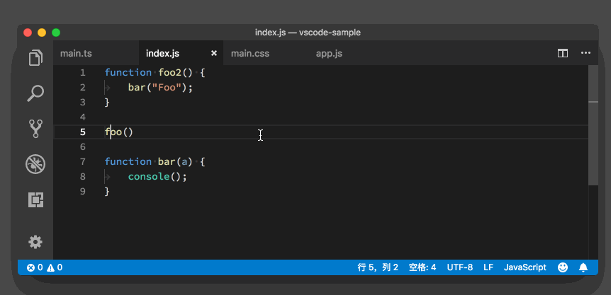

# 39_VSCode多文件搜索和替换

**VSCode多文件搜索和替换**，虽然在“基础入门”这个部分中，我们一直都在介绍编辑器的各种功能，但是，为了把搜索这样的一个功能介绍完整，我们今天就再讲一下在 VS Code 当中如何使用多文件搜索。

关于VSCode单文件搜索和替换可参看下面的文章：

- [VSCode单文件搜索](https://geek-docs.com/vscode/vscode-tutorials/vscode-single-file-search.html)
- [VSCode单文件替换](https://geek-docs.com/vscode/vscode-tutorials/vscode-replace-in-single-file.html)

多文件搜索的运行方法跟单文件搜索非常类似。单文件搜索，我们是通过按下`“Cmd+ F”` 来调出搜索窗口的，而多文件搜索则是通过按下 `“Cmd + Shift + F”` （Windows 上是 `Ctrl + Shift + F`）来调出多文件搜索的视图。

在这样一个视图中，我们看到了熟悉的搜索输入框，以及大小写敏感、全单词匹配和正则表达式三个配置按钮。搜索框的左侧则是下拉按钮，点击即可调出替换框。

默认情况下，当我们调出多文件搜索的视图时，VS Code 会在当前打开的文件夹下进行搜索。不过，要发挥多文件搜索的更大功效，我们可以通过书写配置来决定在哪些子文件夹下进行搜索，以及过滤掉哪些特殊的文件或者文件夹。

要完成这样的配置，我们需要点击搜索框下三个点形状的图标，点开后，我们能看到两个输入框，它们的名字分别是“包含的文件” 和 “排除的文件”。这两个配置的书写格式是 `glob`，很多编程语言和配置都会使用 glob 来模糊匹配文件名和文件夹，估计你已经有所了解。而如果你不熟悉的话，就当作是课后作业了，这一定不是你最后一次需要书写 `glob`。

## 多文件搜索配置

多文件的配置比单文件里的搜索框还要更多一些，你可以打开设置搜索 “search” 看看都有哪些。这里我主要介绍两个被用户修改比较频繁的设置。

第一个是 `“search.collapseResults”` 。它是用来控制是否自动展开搜索结果。默认的配置是 `“auto”` 自动， 也就是说，VS Code 会根据搜索结果的多少来决定是否要将某个文件下的搜索结果展开，如果某个文件夹下的结果过多的话，就会将其暂时折叠，用户需要展开结果。我自己喜欢将其设置为 `“alwaysExpand”`，这样我每次都能直接看到结果了。

第二个是 `“search.location”` ，也就是多文件搜索视图的位置。默认情况下，搜索视图会出现在侧边栏。但是 VS Code 同样允许你把搜索视图放到底部面板中去，你只需将其修改为 `“panel”` 即可。相信很多用户都跟我一样，使用过非常多把搜索视图放在底部的开发工具，并且很习惯了，那这个设置就能够帮助到我们。

最后，我再给 macOS 用户介绍一个 macOS 系统上特有的搜索功能，叫做共享搜索记录。这个功能需要通过设置 `“editor.find.globalFindClipboard”` 和 `“search.globalFindClipboard”` 打开。当这个功能被打开之后，我们在 VS Code 中的搜索关键词和搜索记录，都会被共享给系统，然后当我们打开别的支持这个功能的应用时，比如 `Safari` 或者 `Chrome` 浏览器，按下 `“Cmd + F”` 键，就会发现同样的搜索关键词已经被自动填充到搜索框中了。