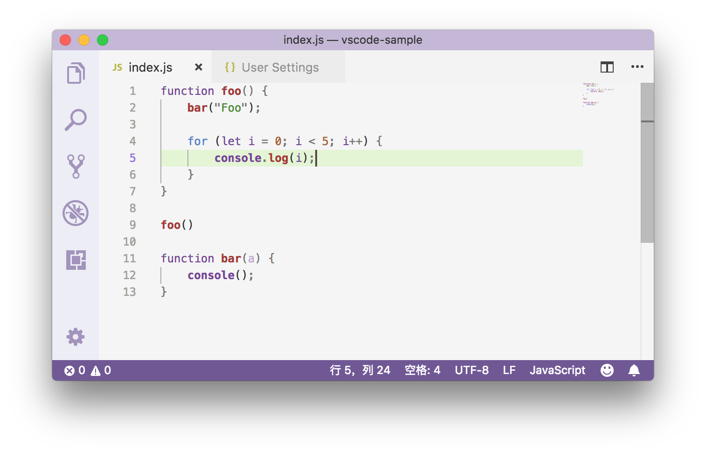
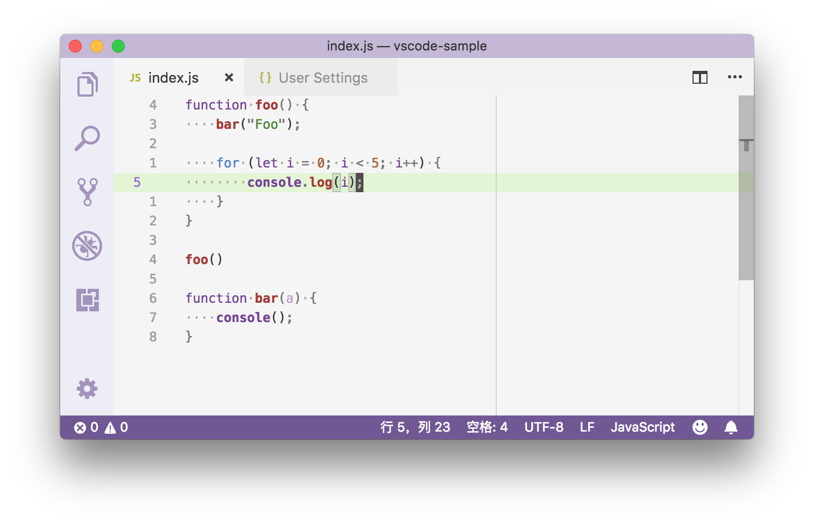

# 43_VSCode缩进参考线和垂直标尺

**VSCode 缩进参考线和垂直标尺**，这里我们可以先一起来玩一个“大家来找茬”的游戏：

**图1是使用没有修改过任何编辑器设置的 VS Code 打开的一个 JavaScript 的文件**

**图2是使用经过了不少的个性化定制的编辑器打开的同一个文件**

在图1中，第二行到第六行代码的中间，从内到外你能够依次看到两个竖线。这两个竖线就是缩进参考线。编辑器会根据你指定的制表符的长度，来决定缩进参考线的位置。这样你就可以非常清楚地知道代码有没有正确地缩进，而且也方便你区分出不同代码块之间的层级关系。这个功能是可以通过 `editor.renderIndentGuides` 来控制开关的。

而图2中的竖线则不一样了，它叫做垂直标尺。如果你的项目中有规定说每一行代码不得超过多少个字符，比如说120个字符，那么你就可以将标尺设置为 `120`，即 `editor.rulers: [120]`。这样的话编辑器就会在第120个字符所在的位置处画出这样一条垂直的竖线，所以你一眼就可以看出自己的代码是否达标。