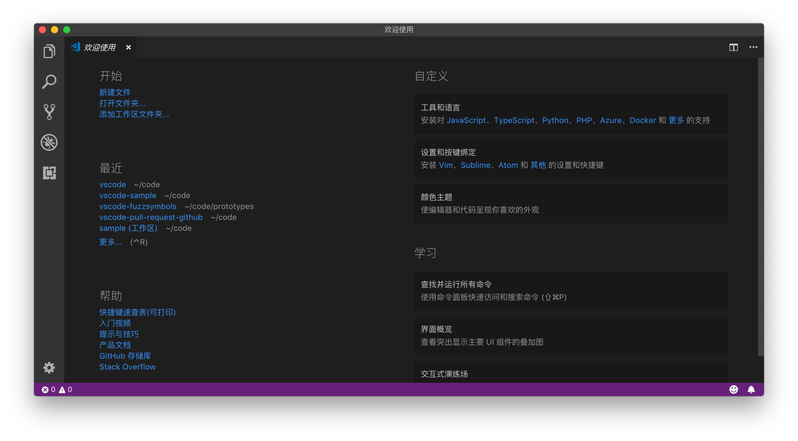
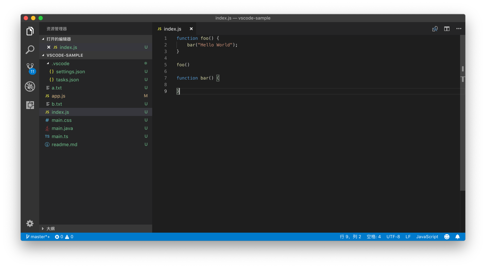

# 47_VSCode如何管理文件和文件夹

**VS Code是如何管理文件和文件夹**，首先需要说明的是，VS Code 的各个功能，都是基于当前打开的文件或者文件夹的。

该怎么去理解这个概念呢？如果你使用过 IDE 的话， 你应该记得在第一次打开 IDE 的时候，它们往往需要你创建一个工程，这个工程会生成一个特殊的工程文件。这个工程文件记载了这个项目有哪些相关的文件、项目的配置、构建脚本等等。这个文件记录着 IDE 管理工程的元信息，开发团队也能够通过共享这个工程文件保证成员工作环境的一致性。但是工程文件对用户体验就不太友好了，比如说项目文件可能对 IDE 的版本有所要求，项目文件损坏了 IDE 读取不了但是我们也不知道如何修复，等等。

VS Code 则选择了一种相对轻量，而且大家都易于理解的方式，那就是**所有的操作都基于文件和文件夹**。当你打开一个文件夹，VS Code 的核心功能就会对这个文件夹进行分析，并提供对应的功能。比如，在打开的文件夹下检测到有 .git 文件，就加载 Git 插件来提供版本管理的功能；或者发现文件夹下有 tsconfig.json ，就会激活 TypeScript 插件提供语言服务。

当你第一次打开 VS Code 的时候，工作台中还没有打开任何文件夹。这时候在欢迎界面的左上方，你能够看到：“新建文件”和“打开文件夹”等这样的快捷键。

未打开文件夹，状态栏为紫色

这时候请注意工作台最下方的状态栏，当 VS Code 没有打开任何文件夹的时候，它的颜色是紫色的。而如果在工作台中打开了某个文件夹，状态栏的颜色就会变成蓝色。

打开文件夹后，状态栏变成蓝色