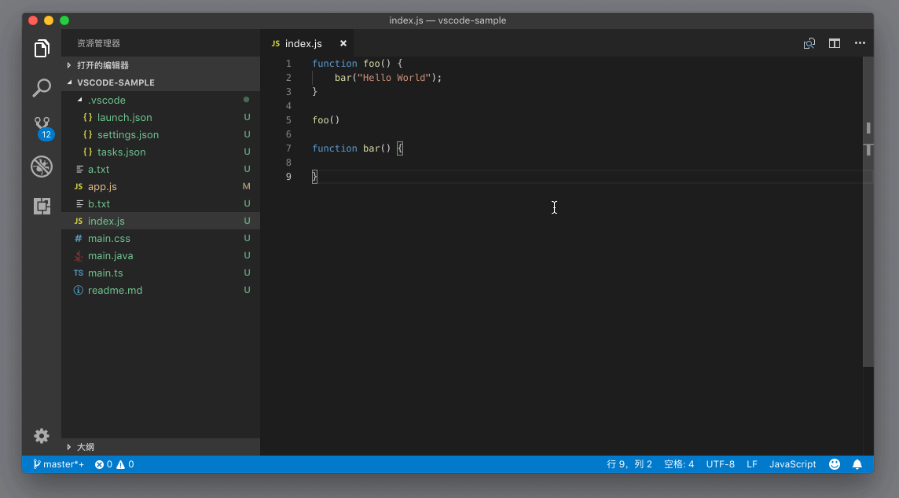
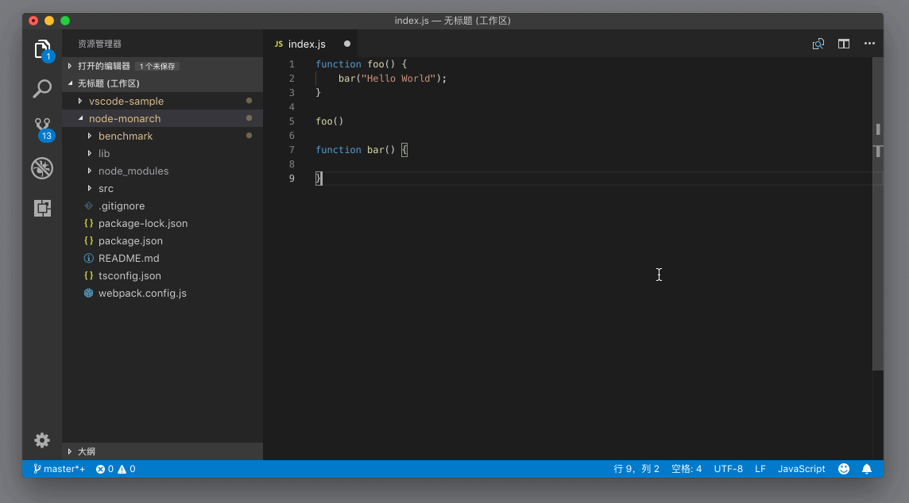
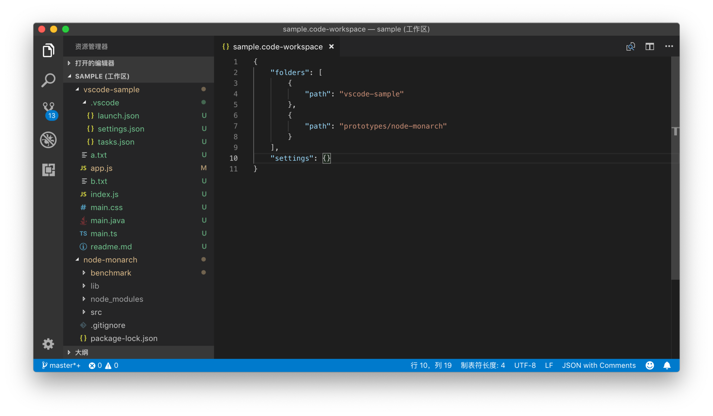

# 49_VSCode多文件夹工作区

**VS Code 多文件夹工作区**，多文件夹工作区（multi-root workspace）。老实说呢，这个概念是有一定的理解难度的。

上面我们提到的基于文件夹的这种项目管理方式，从 VS Code 第一天开始就存在了。也几乎从第一天开始，我们就收到了用户对于这一个设计不满的反馈。对于这些不满的用户而言，他们的痛点在于他们经常需要同时对多个文件夹下的代码进行操作。但是 VS Code 关于单个文件夹的这种操作模式，要求了他们必须同时打开多个窗口，并不停地在它们之间切换。

多文件夹工作区就是为了针对这个问题而实现的解决方案。那下面我们就一起来看一看怎样去创建一个多文件夹工作区。

首先，在 VS Code 中打开一个文件夹，此时 VS Code 处于一个单文件夹的状态。然后你可以调出命令面板，搜索 “将文件夹添加到工作区” （add folder to workspace）并执行，或者使用菜单，“文件 —> 将文件夹添加到工作区”，这之后，选择你想要在当前窗口打开的文件夹。


添加新的文件夹到工作区内

此时在资源管理器里的标题栏里，你能看到“无标题 （工作区）”这样的文字，这说明当前的工作区已经有多个文件夹了，只是现在你还没有保存这个多文件工作区，也没有给它指定一个名字。

要保存这个工作区，接下来你可以调出命令面板，搜索“将工作区另存为” （save workspace as），VS Code 就会为这个工作区创建一个文件，这个文件的后缀名是 “code-workspace”。比如，在下面的动图中，我给这个工作区取名为 sample，然后指定在 Code中这个文件夹下保存。这样操作后，VS Code 就会在 Code 文件夹下创建一个 sample.code-workspace 文件。


保存多文件夹工作区

你可以看到，操作完之后资源管理器的标题栏已经相应地改变了。另外，sample.code-workspace 虽然有个特殊的后缀，但这个文件的格式其实也是 JSON，你可以自行打开这个文件查看一下。



打开sample.code-workspace这个文件

```json
{
"folders": [
{
"path": "vscode-sample",
},
{
"path": "vscode"
}
],
"settings": {}
}
```

JSON

这个 JSON 文件，默认有两个键（key）。第一个是 folders 文件夹，它里面罗列的是这个多文件工作区里有哪些文件夹。可以看出，这些文件夹的地址，都是这个 sample.code-workspace 文件的相对路径。第二个则是 settings 设置，你可以在这个值里面添加专属于这个多文件夹工作区的设置。它的作用，跟上面我们介绍的 .vscode 文件夹下的 settings.json 文件是类似的。

此外，这个文件还有两个可选的键，它们分别是 extensions 和 launch，相信看到名字，你已经猜出来它们大概是跟什么相关的了。这部分我会在后面的章节中详细介绍的。