# 51_VSCode版本管理

**VSCode 版本管理**，会介绍如何在VSCode中进行查看代码变化、改变文件状态和代码提交。

首先，在工作台的左侧活动栏上，我们能看到一个版本管理的图标，位于下图的第三个。

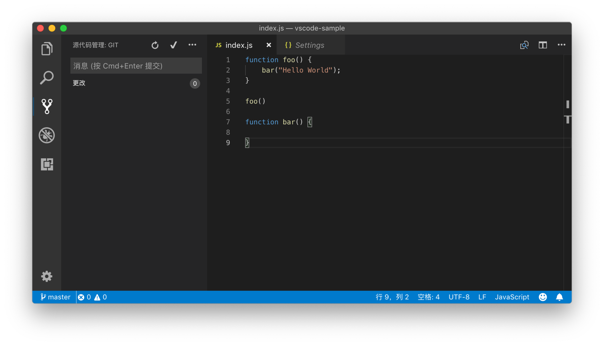

文章目录

- [1 查看未提交的改动](https://geek-docs.com/vscode/vscode-tutorials/vscode-version-control.html#i)
- 2 状态管理
  - [2.1 Git状态管理](https://geek-docs.com/vscode/vscode-tutorials/vscode-version-control.html#Git)
  - [2.2 SVN 状态管理](https://geek-docs.com/vscode/vscode-tutorials/vscode-version-control.html#SVN)
- [3 提交变更](https://geek-docs.com/vscode/vscode-tutorials/vscode-version-control.html#i-3)
- [4 其他操作](https://geek-docs.com/vscode/vscode-tutorials/vscode-version-control.html#i-4)
- [5 差异编辑器](https://geek-docs.com/vscode/vscode-tutorials/vscode-version-control.html#i-5)
- [6 内置版本管理操作](https://geek-docs.com/vscode/vscode-tutorials/vscode-version-control.html#i-6)
- [7 状态栏和资源管理器](https://geek-docs.com/vscode/vscode-tutorials/vscode-version-control.html#i-7)
- [8 版本管理命令结果输出](https://geek-docs.com/vscode/vscode-tutorials/vscode-version-control.html#i-8)

## 查看未提交的改动

如果在当前的文件夹下有尚未被提交的改动，我们能够在这个图标上面看到一个数字。数字代表了有多少个文件被修改了，只是虽改动但还未被提交。

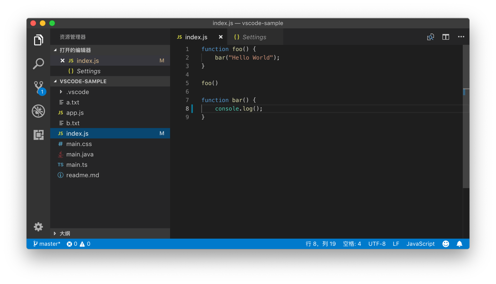

当我们点击这个图标，或者是按下 `Ctrl + Shift + G` 快捷键，就能够打开版本管理这个视图。这个视图的最上方是一个多行输入框，用于输入代码提交时候的描述内容。在这个输入框的下面，我们则能够看到各种不同状态下的代码改动，按照它们的不同状态被归类到不同的列表中。

比如在下图中，我们只有一个更改：

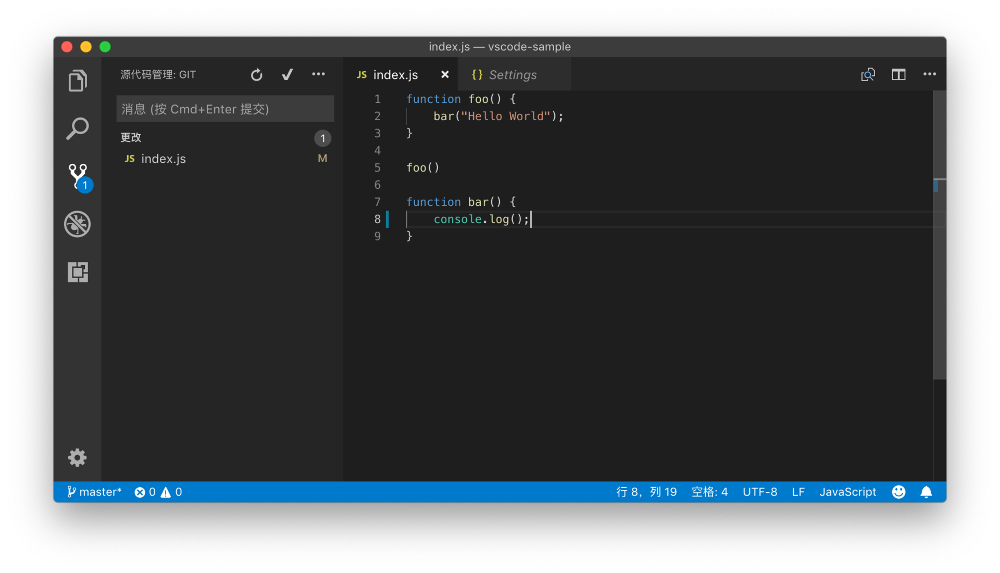

## 状态管理

不同的版本管理有不同的状态管理方式，不过 VS Code 的版本管理界面为它们提供了统一的界面，并且相同状态下的文件会被归类在一起。

### Git状态管理

我们先拿 `Git` 来举例。比如说 `Git` 中有三种主要的文件状态：已提交（`Committed`）、修改（`Modified`）和暂存（`Staged`）。这里借用 Git-SCM 文档 Git – Git Basics 里的一张图来解释，一个文件或者修改，能够在这三个状态直接切换。

当我们修改了一个文件，它会变成修改状态（`Modified`）；然后我们可以通过脚本 “`git add ${filename}`” 把这个文件的状态改为暂存（`Staged`），被标记为暂存状态的文件，才有机会被提交。 最后我们可以通过 “`git commit`” 来提交所有在暂存状态里的文件。

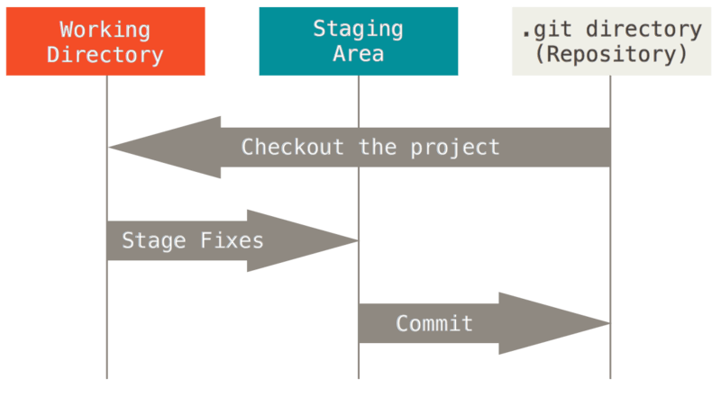

回到 VS Code 的版本管理界面，在下图里，我们能够看到两种不同的状态。

- 第一个是 “暂存的修改”，也就是所有处于暂存状态的修改，它们都有机会被提交；
- 第二种则是普通的修改。此时侧边活动栏上的版本管理图标已经显示了数字 2，它提示我们当前项目里有两个不同的修改。

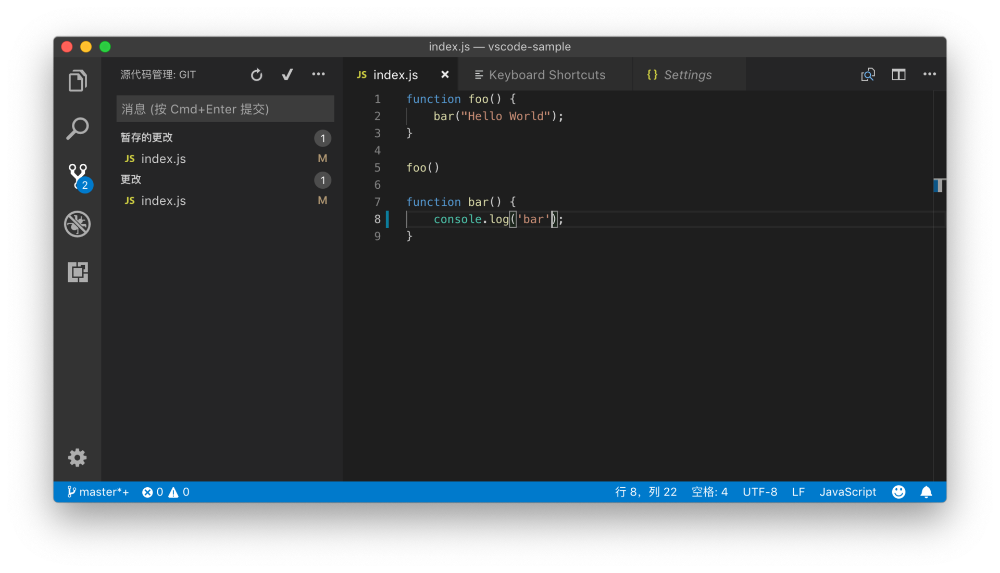

上面我们提到，在 Git 中提交代码前，我们需要先将代码改动变成暂存状态。这个操作的对应的命令行是 `git add ${fileName}`。我们同样也可以通过版本管理的视图来完成这样的操作：只需将鼠标移动到我们想要提交的文件上，就能够看到三个图标。

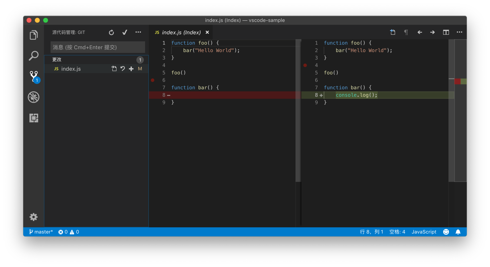

它们分别是：打开文件、放弃更改和暂存更改。我们只需点击 “暂存更改” 这个按钮，就能完成跟上面`git add` 一样的操作。

### SVN 状态管理

在 SVN 中，则有一个变更列表（changelist 的概念），即可以使用变更列表来将不同任务里的代码变更统一到一起。在下图里，我们能够看到一个“两个分组”，一个是尚未被添加到变更列表里的代码变动，另一个是名叫 TEST 的变更列表。

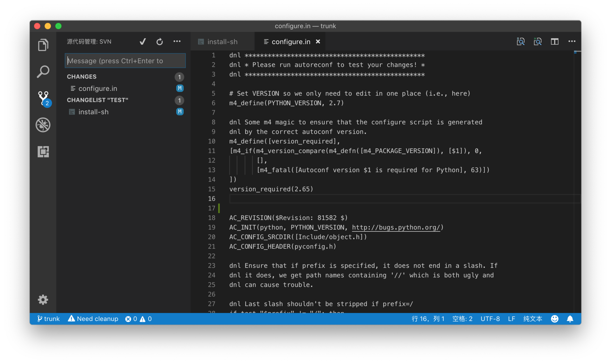

而如果我们使用的是 SVN，鼠标移动到文件改动上时，只能看到一个按钮 “Set Changelist”。

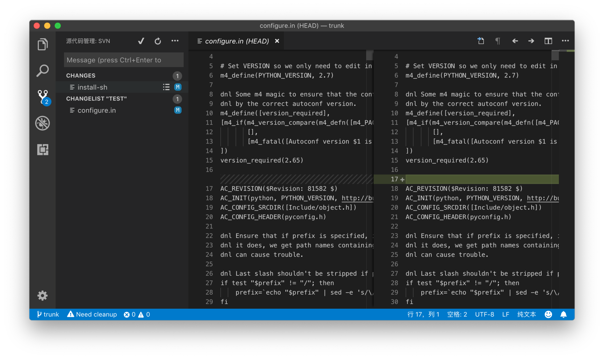

按下这个按钮后，我们就能看到一个列表，通过这个列表，可以选择创建新的变更列表（changelist），或者选择将这个改动增加到现有的某个变更列表中。

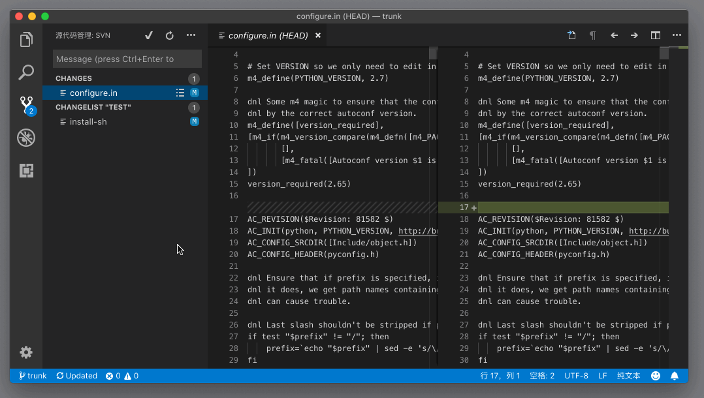

## 提交变更

在选择完哪些代码变更要提交之后，下一步就是填写描述信息并提交了。在版本管理视图的上方，有一个输入框，我们把描述信息填入到这个输入框后，按下 Cmd + Enter 就能提交了（Subversion 是 Ctrl + Enter），也可以通过输入框上方的对号按钮来提交。

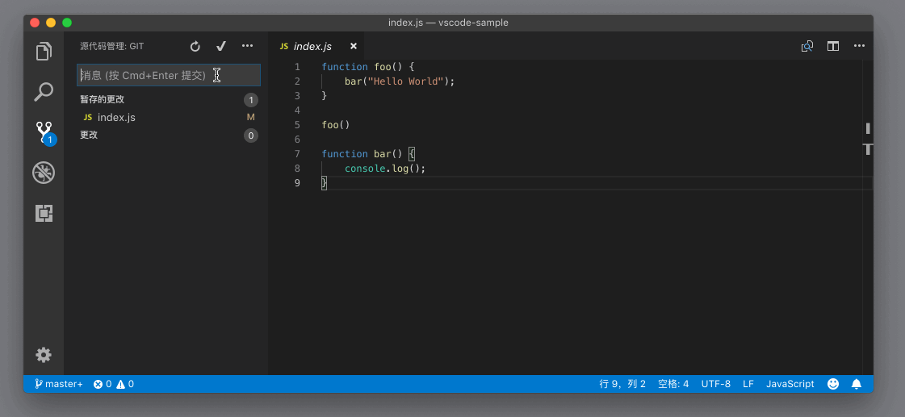

## 其他操作

查看代码变化、改变文件状态和代码提交，这就是我们日常最常使用的几个操作了。而其他的操作，比如更新、回退、发布、储藏代码等等，我们可以通过点击输入框上方最右侧的三个点的图标，打开一个下拉菜单，选择我们想要的功能并执行。

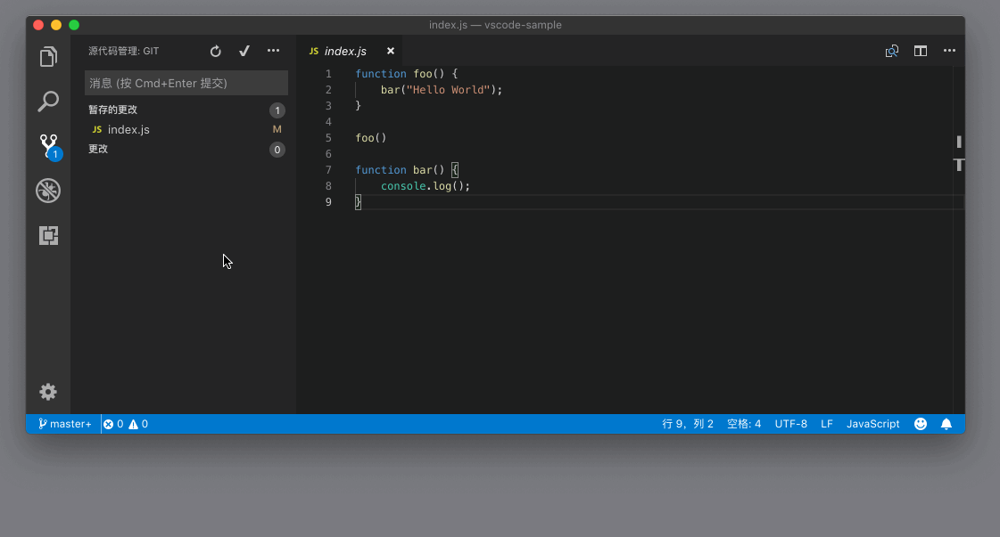

## 差异编辑器

**VSCode 差异编辑器**，介绍差异编辑器功能，包括：从差异编辑器跳转到一个普通的编辑器；在差异编辑器里显示代码里行末的空格符的变化；在当前文件里的多个变动之间进行跳转了。

下面我们来说一下差异编辑器。在差异编辑器的右上角，我们能够看到一排按钮。

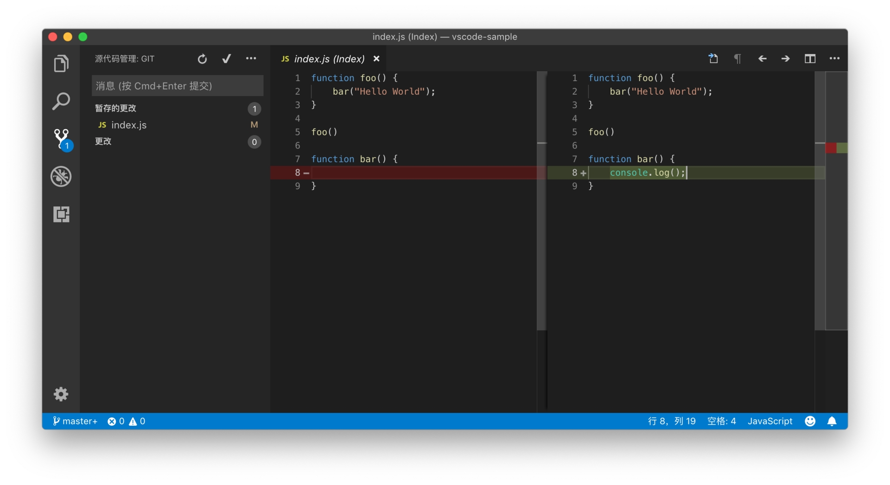

**第一个按钮**的功能是从差异编辑器跳转到一个普通的编辑器，并且打开这个文件。这样我们能够无干扰地进行编辑操作了。

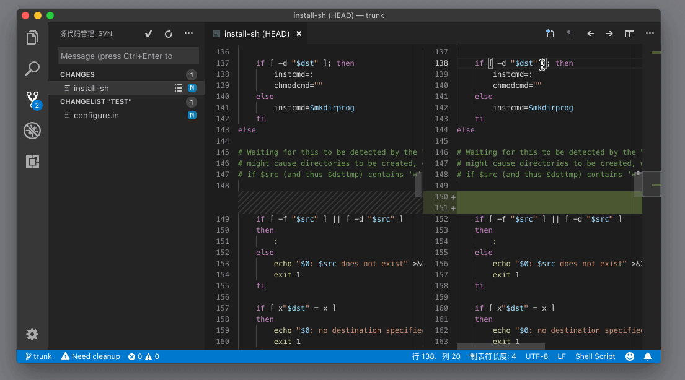

**第二个按钮**控制的是：是否要在差异编辑器里显示代码里行末的空格符的变化。比如说你不小心在行末添加了几个空格，默认情况下，VS Code 觉得这几个空格不影响代码，就不会在差异编辑器里显示。但我建议把它打开，这样你就可以确保能够看到所有的代码改动。

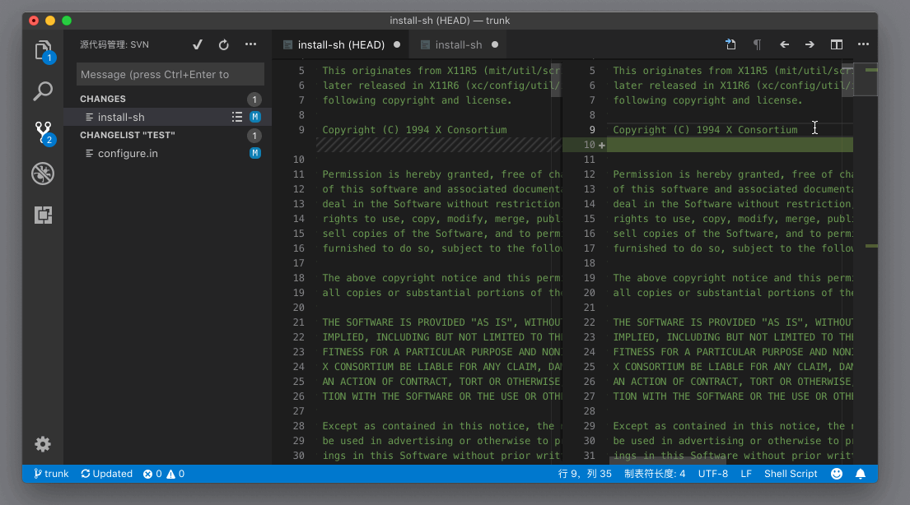

接下来的**两个箭头按钮**，就是用于在当前文件里的多个变动之间进行跳转了。

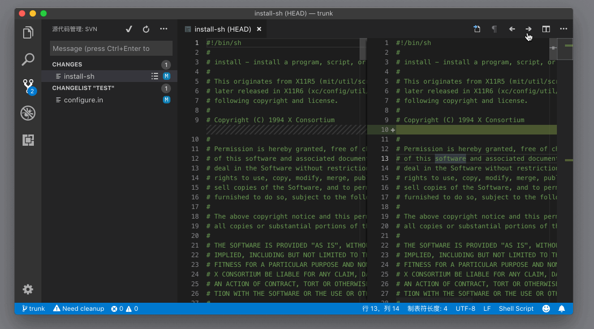

最后是一个**三个点的图标**，想必不用点击开你也知道，它意味着里面有更多的功能，点击后即可看到一个下拉菜单。

这个下拉框里的命令，前三个是和 Git 相关的。在版本管理视图里我们只能够对文件的状态进行操作，但是 Git 同样允许我们修改文件中某一段代码变动的状态，就是通过这三个命令实现的。

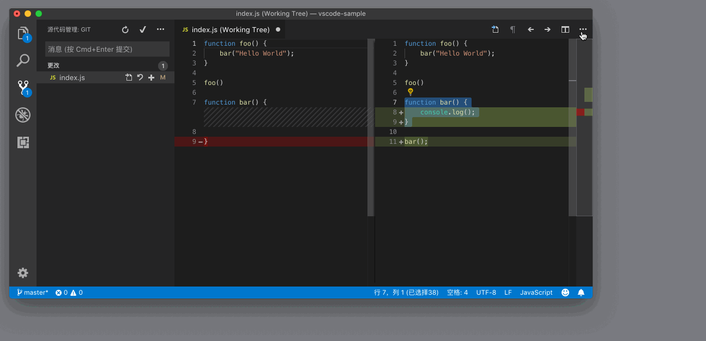

比如在上面的动图中，index.js 文件里有两段不同的改动，现在我只想把第一段代码改动变为暂存状态。那接下来我要做的就是选中这段代码，从下拉菜单里选择 “暂存所选范围”运行。这之后，我们在版本管理视图里就能够看到两组代码变动，“暂存的更改”这个组里是我刚才选中的那段代码变动，而“更改”组里则是第二个代码变动。

相信你已经猜想到了这个功能的用途，有的时候我们在修一个 bug 或者完成一个功能时，对代码做了一些临时的变动，但我们既不想提交这个变动，也不想把它清除掉，那通过这几个命令我们就能够真正按需提交代码变动了。

不过遗憾的是，SVN 这个插件并没有支持这个功能。

下拉菜单里的第四个则是和差异编辑器呈现方式相关的。默认情况下，差异编辑器采取并排的方式显示两个编辑器，左边的编辑器显示改动前的文件内容，右侧则是改动后的文件内容。其实我们也可以使用 “切换内联视图”，将代码改动显示在同一个编辑器里。

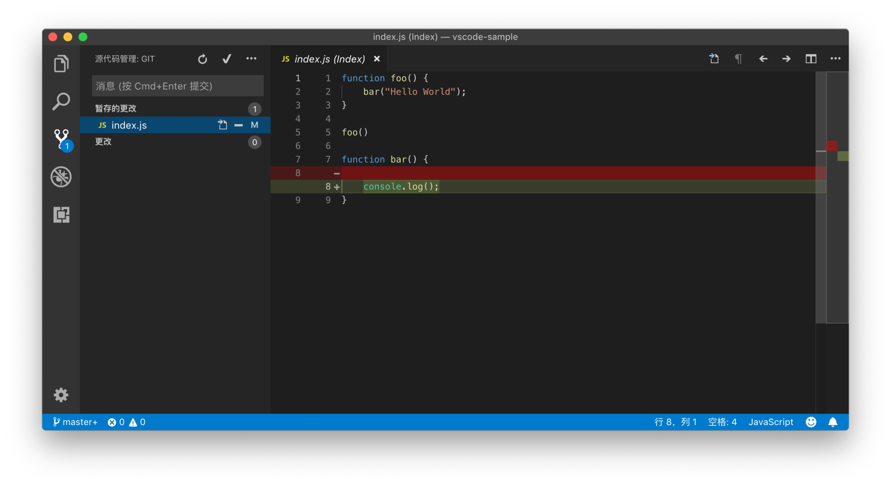

在这个内联的差异编辑器里，我们依然可以看出代码变动的情况。

至于最后的三个则是通用的编辑器命令，打开任意编辑器时，我们都能够使用它们。这里就不多赘述。

## 内置版本管理操作

**VSCode 内置版本管理操作**，前面我们一起学习了如何使用版本管理视图和差异编辑器对代码变动进行管理，其实我们同样也能够在普通的编辑器里完成这样的操作。当我们对一个文件作了修改后，我们能够在普通编辑器里，行号的右侧看到不同颜色的竖线。它们代表着不同状态的代码变动，比如代码增加、修改和删除。

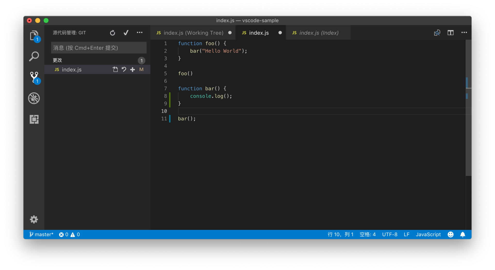

当我们点击这个竖线时，我们就能在当前编辑器里，立刻看到一个内置的差异编辑器。这样我们就不用每次都打开版本管理视图里去查看代码变动了。

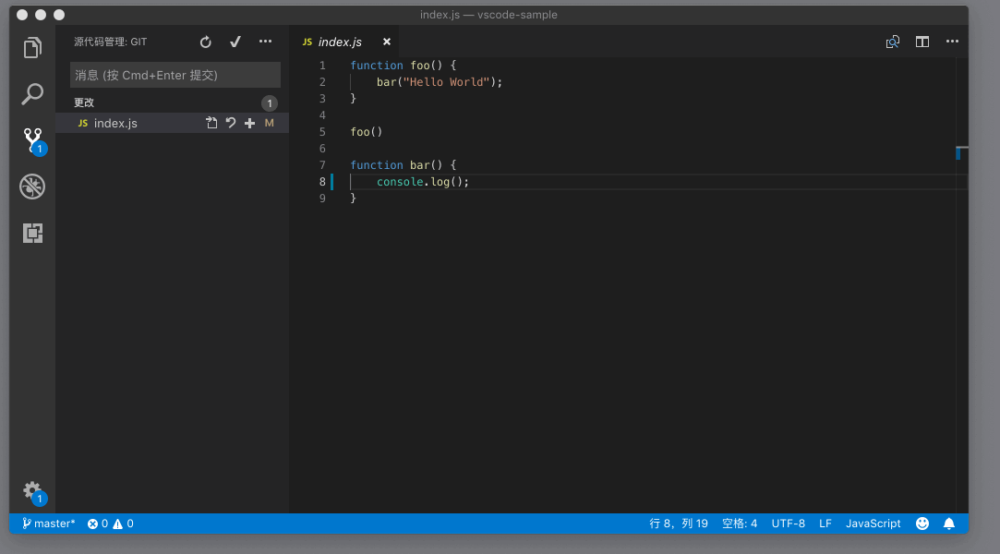

在这个内置的差异编辑器的内侧，我们能够看到一些按钮。它们的作用跟差异编辑器右上角的那些按钮是一样的，你能够通过它们暂存、撤销代码改动，以及在代码改动之间跳转。当我们把鼠标移动上去时，还能够看到它们对应的快捷键。

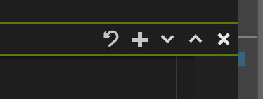

## 状态栏和资源管理器

**VSCode 版本管理状态栏和资源管理器**，除了版本管理视图以外，另外一个能够快速了解项目版本状态的就是状态栏了。无论是使用 Git，还是 SVN 来做版本管理的项目里，我们都能在状态栏的左侧看到当前代码属于哪个分支。不仅如此，我们还能通过点击它来进行分支的创建与切换。

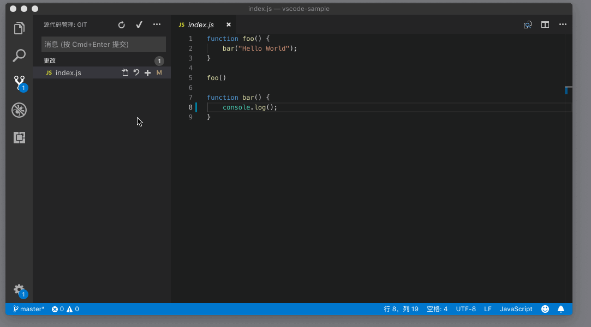

此外，当我们在专心于写代码的时候，大部分情况下我们打开的都是资源管理器。为了方便我们在这种情况下快速地了解哪些文件被修改了、有什么类型的改动，VS Code 会把资源管理器中对应的文件项的颜色改变，同时在这个文件项的最后附上一个简单的字母，用于表明这个文件的状态。比如说我们在下面的图中看到，index.js 这个文件被修改了，那么在资源管理器里，这个文件项变成了黄色的，同时最后还有一个字母 M，也就是修改 Modified 的首字母。

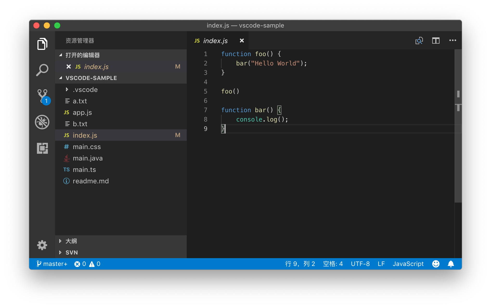

## 版本管理命令结果输出

**VSCode 版本管理输出版本管理命令**，VS Code 的设计哲学并不想当一个黑盒，而是尽可能地开放给你。就好比说版本管理，Git 非常流行，但它的学习成本也很高，即便是一个熟练使用它的工程师，也偶尔会遇到奇怪的情况，更不要说刚刚学习它的新手了。为了保证你知道你按下某个按钮后，VS Code 最终转化成了哪个 Git 命令，或者你遇到意外情况的时候 Git 发生了什么，VS Code 会把所有这些信息全部输出到输出面板中。你可以打开输出面板，点击下拉框，然后选择你使用的版本管理工具的 log 进行查看。

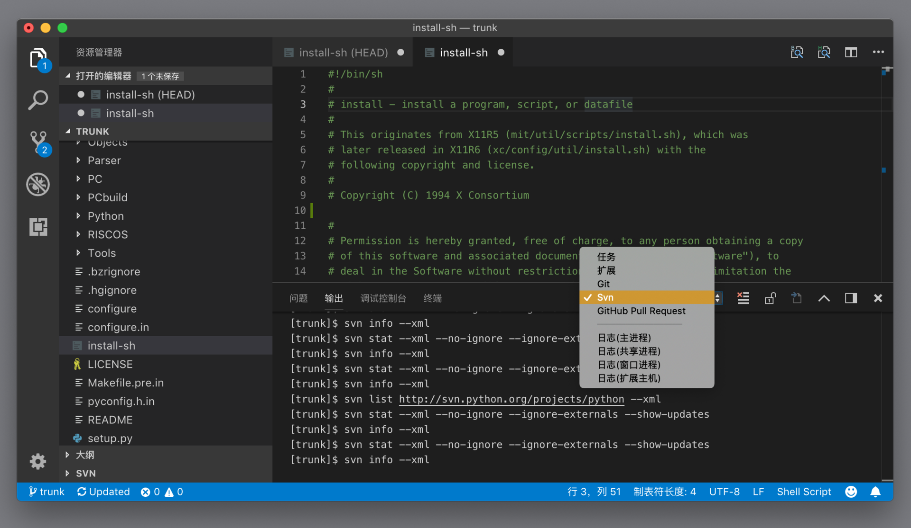