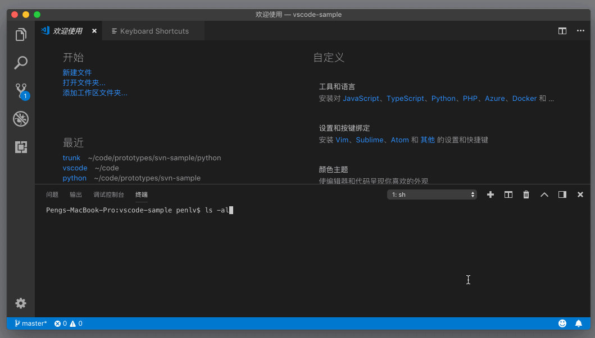
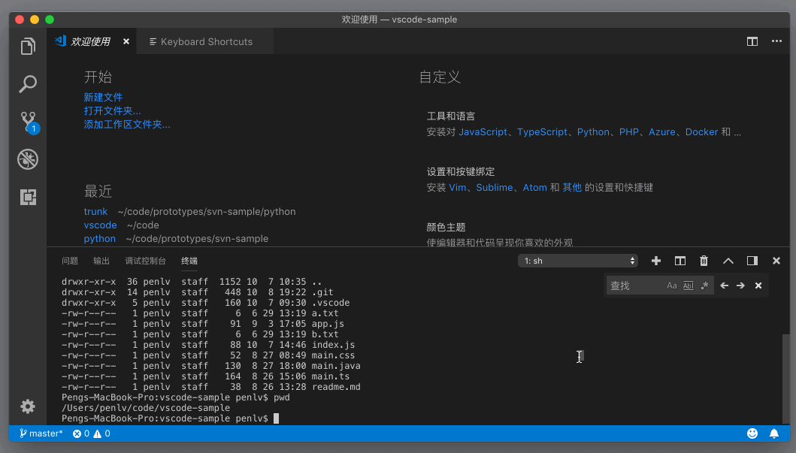

# 53_VSCode终端快捷键操作

**VSCode 终端内操作**，接下来，我们再一起了解一下集成终端里的快捷键操作。

我们能够在终端里使用 Shell 自身支持的那些快捷键操作。比如在 Bash 里，我们可以按下 `Ctrl + A` 或者 `Home` 键把光标移动到一行的开头，也可以按下 `Option + 左方向键` （Windows 上是 `Alt + 左方向键`）把光标向前移动一个单词；如果我们在集成终端里使用的也是 Bash，那么这些操作依然生效。

但同时，VS Code 也为几个常用的操作提供了接近于编辑器命令的快捷键。比如，我们知道在编辑器里，按下 `Cmd + 左右方向键` 能够把光标移动到这行的开头或者结尾，其实我们也可以在集成终端里这么做。再比如，在编辑器里可以使用“`Cmd + C`”“`Cmd + V`”来复制粘贴，同样，在集成终端里也可以完成一样的操作。

除了快捷键，集成终端里另外一个大家都熟悉的部件就是搜索框了，我们可以按下`Cmd + F`调出搜索框。

这个搜索框和编辑器里的搜索框，使用的是同一套代码。相信在上图中你也看到了，搜索输入框的右侧也有三个小按钮，这说明大小写敏感、全单词匹配和正则表达式都可以在这个搜索框里使用。

假如你想了解集成终端里可以使用的全部命令，可以打开命令面板，搜索“终端”或者“Terminal”进行查看，这里我就不一一介绍了。但是要注意的是，如果你想给这些命令绑定快捷键的时候，要注意它会不会跟 Shell 原有的快捷键发生冲突。