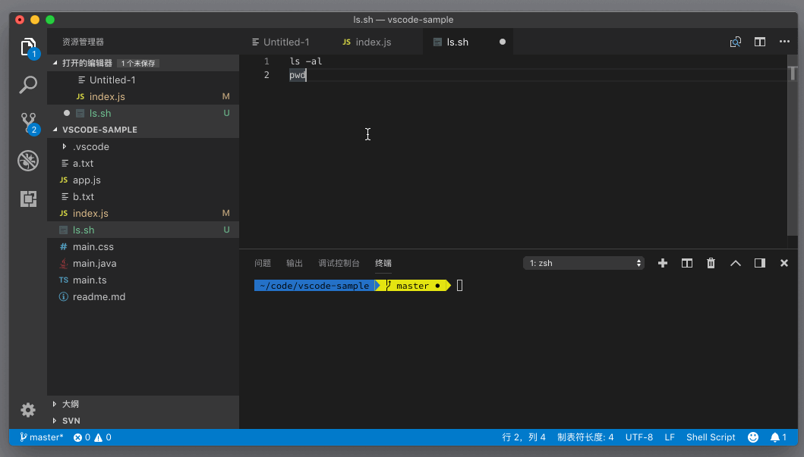

# 55_VSCode怎么运行代码

**VSCode 怎么运行代码**，集成终端和资源管理器也有互动。比如我们打开了一个脚本文件，希望直接执行这个脚本文件，就可以打开命令面板，运行 “在活动终端中运行活动文件”（Run Active File In Active Terminal），这样这个脚本就会在当前打开的集成终端中运行了。

我们也可以选中编辑器中的某段代码，然后打开命令面板，运行“在活动终端中运行所选文本”（Run Selected Text In Active Terminal），这段代码就会在终端中执行。

