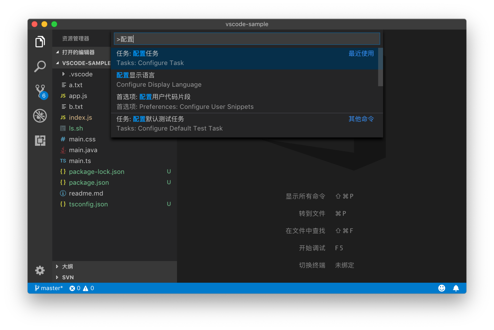
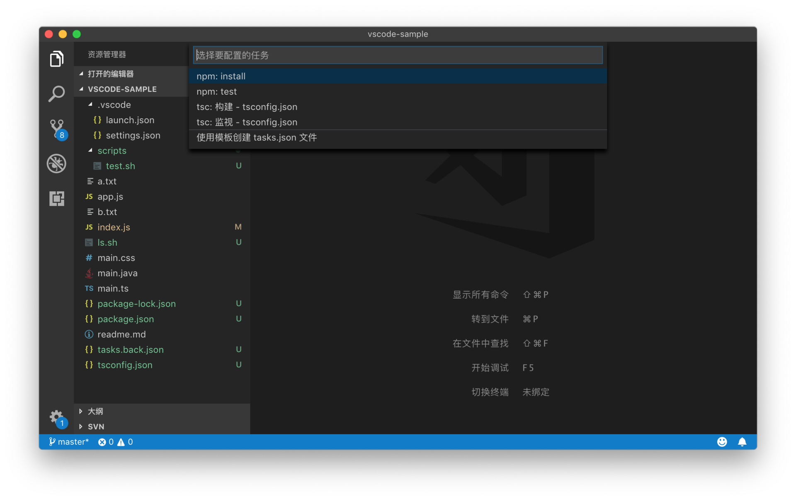
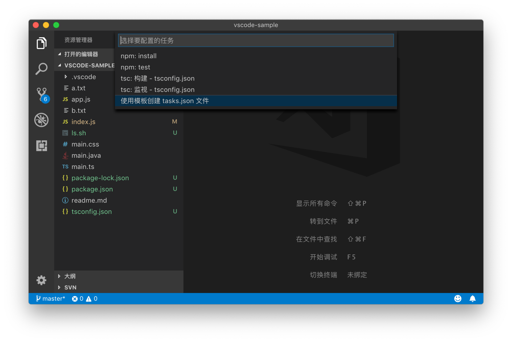
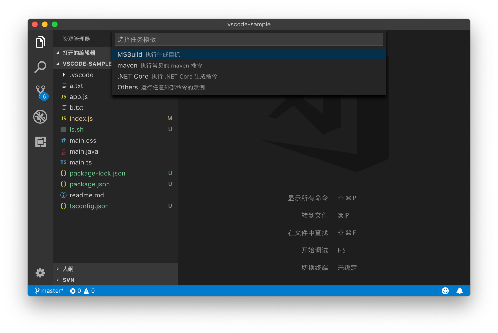
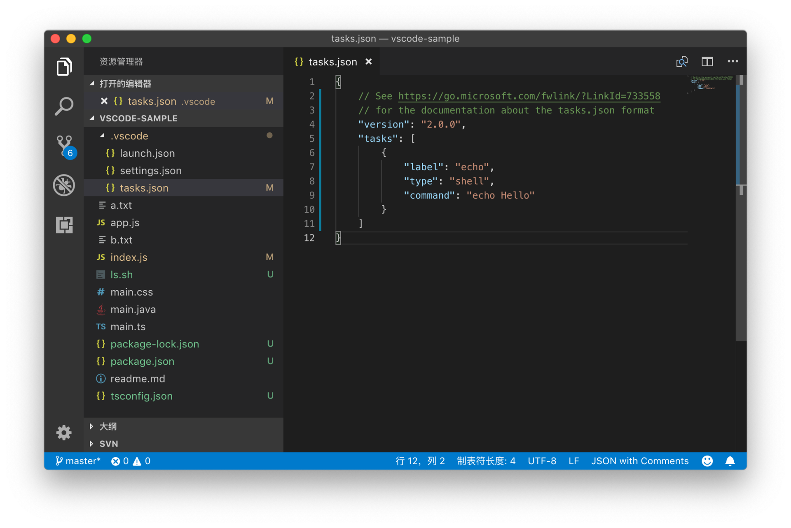
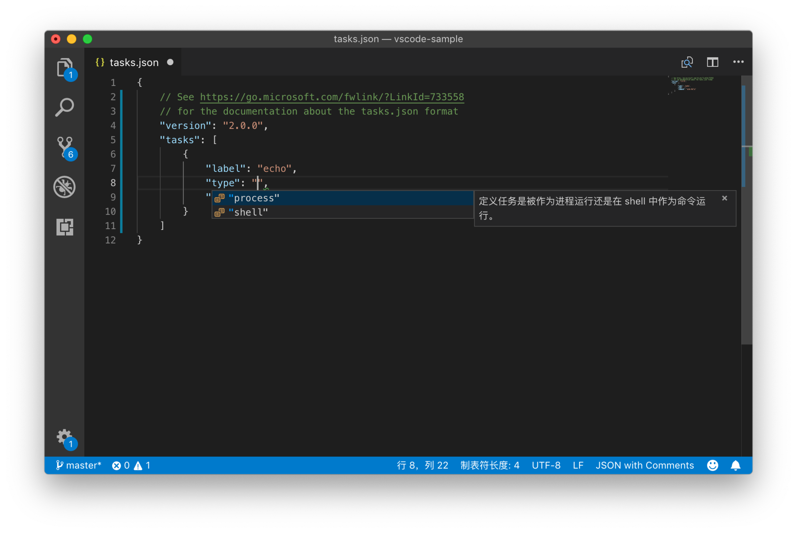
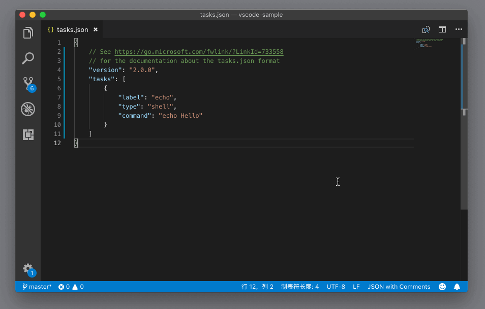
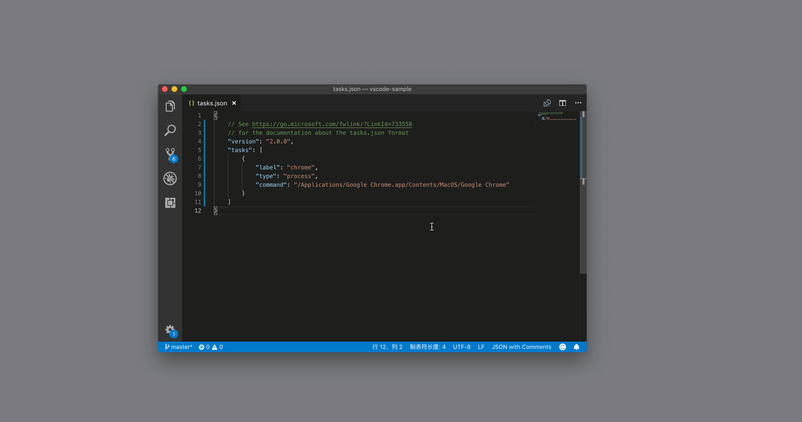

# 58_VSCode如何创建自定义的任务

**VSCode 如何创建自定义的任务**，学习完本文你可以掌握如何在VSCode中创建自定义的任务，首先我们在命令面板里，搜索 “配置任务”（Configure Task）并执行。



我们能够看到一个下拉框，这里面提供了多个不同的选项。



如果我们选择第一个，也就是`npm: install`这一项的话，VS Code 会立刻在 `.vscode`文件夹下创建一个 `tasks.json` 文件，它的格式是 JSON，可读性很好且易于修改。

```json
{
 // See https://go.microsoft.com/fwlink/?LinkId=733558
 // for the documentation about the tasks.json format
 "version": "2.0.0",
 "tasks": [
  {
   "type": "npm",
   "script": "install",
   "problemMatcher": []
  }
 ]
}
```

JSON

我们能够看到，这个文件里有一个属性叫做tasks，它的值是一个数组，这就是我们可以在当前文件夹下使用的所有任务了。现在这个模板里，只有一个任务 npm，它有三个属性。

**第一个属性是 type**，它代表着你要使用哪个脚本工具，我们这里使用是 npm。

**第二个是 script 脚本**，则是我们想要 npm 工具执行的某个脚本。

**第三个属性 problemMatcher**，这个我放在后面的内容里介绍，暂时看不懂也没关系，稍安勿躁。

可以看得出来，这个任务相当于上面自动检测的任务系统的一个映射。我们把 npm 脚本自己的配置文件，转变成了 VS Code 任务系统的配置文件，也就是`tasks.json`。

但是这种类型的任务，受限于 VS Code 或者插件所支持的脚本工具，缺乏一定的灵活性。我们把 `.vscode/tasks.json` 文件先删除，然后重新打开命令面板，执行 “配置任务”（Configure Task）。不过这一次，我们选择最后一项，使用模板创建 `tasks.json` 文件。（请注意，这里我们是为了从 0 了解任务系统，所以才把之前的 `tasks.json` 文件删除，如果你已经在项目中使用 `tasks.json` ，大可不必这么做，照着文章读下去就可以了。）



紧接着 VS Code 就问我们了，希望使用哪种模板。这里模板的多少，同样取决于你装了哪些插件。默认情况下，VS Code 为 `MSBuild`、`Maven`、`.NET Core` 提供了模板，而最后一个 Others，则是一个通用的模板，我们一起来看下它。



选择完 Others 之后，VS Code 在当前文件夹根目录下的 `.vscode` 文件夹中，创建了 `tasks.json` 文件。



这个文件的内容如下：

```json
{
 // See https://go.microsoft.com/fwlink/?LinkId=733558
 // for the documentation about the tasks.json format
 "version": "2.0.0",
 "tasks": [
  {
   "label": "echo",
   "type": "shell",
   "command": "echo Hello"
  }
 ]
}
```

JSON

这个文件跟最开始我们看到的非常接近，tasks 属性下有一个任务，只不过它的三个属性跟之前很不一样。

**第一个属性是 label 标签**，就是这个任务的名字。我们在命令面板里执行任务会需要读到它，所以它的值应该尽可能地描述这个任务是干什么的。

**第二个属性是 type 类型**。对于自定义的任务来说，这个类型可以有两种选择，一种是这个任务被当作进程来运行，另一种则是在 shell 中作为命令行来运行。默认情况下我们会在 shell 下运行，而且这个 shell 命令行将会在集成终端里执行，shell 的选择则会尊重我们在集成终端的配置。比如在我的例子中，我是在 macOS 下运行的，系统默认的 shell 是 zsh，那么当我运行这个脚本时，就会在 zsh 里执行。



**第三个属性是命令command**，它代表着我们希望在 shell 中运行哪一个命令，或者我们希望运行哪个程序。

好了，看完这三个属性，你一定希望第一时间试试看这个任务。下面我们要做的就是打开命令面板，搜索“运行任务”，选择“echo”这个任务（这个就是我们在label里写的名字），按下回车后，VS Code 会问我们 “选择根据何种错误和警告扫描任务输出”，这个问题涉及到任务系统的另一个重要功能，我会在后面介绍，现在就选择第一个选项 “继续而不扫描任务输出” 好了。



到这里你可能会吐槽，为了完成一个任务，搞得好复杂啊。别着急，等我们把各个功能都介绍完毕，就能够选择快速的方式运行了。

刚才上面我们提到了 “type” 类型，还支持 “process”， 也就是以进程的形式运行。如果我们选择这个类型，那么就需要在 “command” 里提供程序的地址。比如下面的例子里，我提供了 Chrome 浏览器在 macOS 下的地址。

```json
{
 "version": "2.0.0",
 "tasks": [
  {
   "label": "chrome",
   "type": "process",
   "command": "/Applications/Google Chrome.app/Contents/MacOS/Google Chrome"
  }
 ]
}
```

JSON

我们运行看看它的效果：



我们成功地执行这个任务，打开了浏览器。如果我们把这个任务分享给同事，而他们使用的系统是 Windows 或者 Linux，那么这个任务就没法使用了，因为Chrome 的地址完全对不上号。不过我们可以为 Windows 或者 Linux 系统指定特定的地址，书写的方式如下（请注意，在你的操作系统上，Chrome 的地址可能不完全跟下面的代码样例一样）：

```json
{
 "version": "2.0.0",
 "tasks": [
  {
   "label": "chrome",
   "type": "process",
   "command": "/Applications/Google Chrome.app/Contents/MacOS/Google Chrome"，
   "windows": {
    "command": "C:\\Program Files (x86)\\Google\\Chrome\\Application\\chrome.exe"
      },
      "linux": {
          "command": "/usr/bin/google-chrome"
      }
  }
 ]
}
```