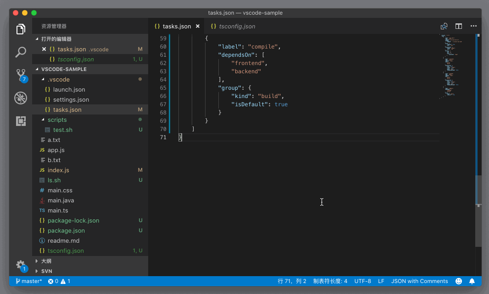

# 60_VSCode任务配置参数及任务结果分析

**VSCode 任务配置参数及任务结果分析**，任务系统的知识体系相对复杂，今天继续介绍任务系统的内容：任务配置的更多参数以及任务结果的分析功能。

文章目录

- [1 Command相关属性和特殊处理](https://geek-docs.com/vscode/vscode-tutorials/vscode-task-configuration-parameters-and-task-results-analysis.html#Command)
- [2 结果分析](https://geek-docs.com/vscode/vscode-tutorials/vscode-task-configuration-parameters-and-task-results-analysis.html#i)
- [3 自定义问题分析器](https://geek-docs.com/vscode/vscode-tutorials/vscode-task-configuration-parameters-and-task-results-analysis.html#i-2)
- [4 多任务](https://geek-docs.com/vscode/vscode-tutorials/vscode-task-configuration-parameters-and-task-results-analysis.html#i-3)
- [5 总结](https://geek-docs.com/vscode/vscode-tutorials/vscode-task-configuration-parameters-and-task-results-analysis.html#i-4)

## Command相关属性和特殊处理

在自定义的任务里可以使用 command 属性，并在这个属性里指定我们想要运行的脚本或者程序。但是有的时候我们运行这个脚本的时候需要传入一些参数，这时候就可以简单地把这些参数全部写在 command 里，比如说在运行 echo ‘Hello World’ 这样的脚本时，我们可以把它直接放入 command 这个属性的值中：

```json
{
  "label": "echo",
  "type": "shell",
  "command": "echo 'Hello World'"
}
```

JSON

我们也可以使用一个新的属性，叫做`args`。它是一个字符串的数组，在运行指定 command 的时候，args 里的每个值都会被当作其参数传入，所以就上面的例子，我们还可以写为：

```json
{
 "label": "echo",
 "type": "shell",
 "command": "echo",
 "args": [
  "hello world"
 ]
}
```

JSON

但这里要注意的是，因为我们使用的是 JSON 来存储这些参数，而 JSON 的数据格式并不一定能够满足 shell 的要求，比如不同的 shell 对空白符、`$` 符之类的都有不同的解析方式，这时候就需要对这些符号进行转义。我们可以将参数调整为下面的格式：

```json
"args": [
        {
            "value": "Hello World",
            "quoting": "escape"
        }
]
```

JSON

我们可以看到，`args` 里的值，从一个字符串，变成一个对象。它的第一个键是 `value` 值，也就是原先的字符串，而第二个键 `quoting` 则决定了该如何处理这段字符串。

`quoting`在默认情况下是使用escape转义，也就是说任务系统会根据我们所使用的 shell 的要求，对这段字符串进行转义。比如说，bash 下我们使用`\`来转义特殊字符，那么当我们执行这个任务时，真正运行的脚本如下：

```shell
echo Hello\ World
```

Shell

从上面的代码示例里，你可以看到空格被转义成了 `\` 。

除此之外，`quoting` 这个参数还有另外两个值。第一个是 `strong`，那么在 bash里， 我们将会使用单引号包裹这段字符串，然后传给脚本，那么最终执行的脚本是：

```shell
echo 'Hello World'
```

Shell

另一个值是 `weak`，在 bash 里我们则会使用双引号来包裹这段字符串。如：

```shell
echo "Hello World"
```

Shell

`strong` 和 `weak` 分别对应了 shell 不同的使用引号的策略，而bash、cmd、powershell 也都有各自的策略。如果你不熟悉，可以搜索 “quoting mechanism” 来查找，当然我们在[VS Code关于 Task 参数转义部分的文档](https://code.visualstudio.com/docs/editor/tasks#_custom-tasks)也有涉及。

对了，当你在 VS Code 里编辑这个 `tasks.json` 文件的时候是提供了自动补全和提示的，所以你可以看看它还支持什么别的属性，也可以试着根据提示进行修改。我们在文章的最后，还会介绍几个其他重要的属性的。

## 结果分析

到这里我已经基本把任务系统是如何设置的、如何运行的跟你简单地介绍了一遍，相信你已经可以将一些简单的脚本用任务系统来执行了。但是如果说任务系统只是提供一种新的运行脚本的方式，或者说几个快捷键进行一键的脚本运行的话，那跟集成终端比只能说是往前迈了小小的一步。

不过，任务系统还有一个真正的威力，就是我们可以自动地去分析任务运行的结果。

任务运行的结果是由 `tasks.json` 里任务的一个属性 `problemMatcher` 来控制的。我们可以选择 VS Code 内置的，或者其他插件提供的结果分析器，甚至可以自己书写结果分析器来分析任务运行结果，然后将其中出现的错误或者警告，显示在问题面板中。

比如说我们跑一个构建脚本，有的时候代码写的不对了，构建脚本就会打印出在哪个文件的第几行有一个什么类型的错误，然后我们再借助合适的结果分析器，去解析相对冗余的结果日志，最后把它们塞入问题面板中。这样我们在书写的过程当中，就不需要到结果日志里去找错误和警告了，只需要查看问题面板，点击错误跳转到代码处，直接进行修改就可以了。

另外，如果我们在运行一些脚本的时候使用了观察模式 （watch mode），那么每次代码有更新，就会重新运行脚本输出日志，这时一个实时分析日志并提供反馈的结果分析器就大大提升效率了。

**VS Code 现在已经自带了以下几种问题分析器**：

- `$tsc`，用于分析 TypeScript 编译的结果，$tsc-watch 则是用于分析运行在观察模式下的 TypeScript 编译器的结果；
- `$jshint`用于分析 JSHint 的结果，$jshint-stylish 用于分析JSHint Stylish的运行结果；
- `$eslint-compact` 和 `$eslint-stylish` 分别用于分析 ESLint Compact 和 ESLint Stylish；
- `$go` 是 Go 编译器的分析器；
- `$mscompile` 用于分析 CSharp 和 VB 的编译结果；
- `$lessc` 是用于分析 Lessc 的运行结果的；
- `$node-sass` 用于分析 Node Sass 编译结果。

如果这些还不适用于你的项目，那你可以看看插件市场上有没有问题分析器相关的插件[Search results – problem matcher | Visual Studio Code , Visual Studio Marketplace](https://marketplace.visualstudio.com/search?term=problem%20matcher&target=VSCode&category=All%20categories&sortBy=Relevance)，或者看看你使用的语言插件是否已经支持了相对应的结果分析。

## 自定义问题分析器

VS Code 还支持我们自己书写结果分析器，不过这个涉及一定的正则表达式的知识，如果你已经有所了解，那么可以继续看下去。如果还未有涉及，还请学习正则表达式，然后阅读下面的示例。

首先我们将下面的配置，放入任务配置文件 tasks.json。

```json
{
    "version": "2.0.0",
    "tasks": [
        {
            "label": "echo",
            "type": "shell",
            "command": "echo",
            "args": [
                {
                    "value": "index.js:5:3: warning: unused variable",
                    "quoting": "escape"
                }
            ],
            "problemMatcher": {
                "owner": "echo",
                "fileLocation": ["relative", "${workspaceFolder}"],
                "pattern": {
                    "regexp": "^(.*):(\\d+):(\\d+):\\s+(warning|error):\\s+(.*)$",
                    "file": 1,
                    "line": 2,
                    "column": 3,
                    "severity": 4,
                    "message": 5
                }
            }
        }
    ]
}
```

JSON

这个示例，较之前我们介绍的示例，多一个 problemMatcher，其他都是一样的。但是这个 problemMatcher 不再是一个字符串，而是一个对象；我们在这个对象里，自定义了如何去分析任务运行的结果。

这个任务执行的脚本是：

```shell
echo index.js:5:3:\ warning:\ unused\ variable
```

Shell

在 bash 下执行的结果如下：

```
index.js:5:3: warning: unused variable
```

这是我们通常能够看到的构建或者测试脚本报错时的输出结果，我们需要从中把以下几个信息提取出来：

- 文件地址
- 行号
- 列号
- 错误的重要级别
- 错误信息

通过文件的地址、行号和列号，我们能够快速定位到错误的位置，而错误的级别和信息则能够帮助我们了解错误的具体情况。为了把这个信息提取出来，我们将会使用正则表达式的捕获组（group capture）。比如在我们的例子里，我们提供了一个正则表达式：

```
"^(.*):(\\d+):(\\d+):\\s+(warning|error):\\s+(.*)$"
```

当我们拿这个正则表达式去匹配下面的字符串时，

```
index.js:5:3: warning: unused variable
```

捕获组 1 对应的是文件的名字，捕获组 2 则是行号，以此类推。然后我们通过给这个任务的 problemMatcher 设置 pattern 来告诉 VS Code，我们想使用什么样的正则表达式去匹配，以及文件名 file、行号 line 、列 column 等该从第几个捕获组读取出来。

```json
"pattern": {
    "regexp": "^(.*):(\\d+):(\\d+):\\s+(warning|error):\\s+(.*)$",
    "file": 1,
    "line": 2,
    "column": 3,
    "severity": 4,
    "message": 5
}
```

JSON

除了 pattern 这个属性，我们还需要 fileLocation 文件位置来告诉 VS Code，如何在当前文件夹下定位这个文件。比如我们从错误信息里得到 index.js 是一个相对的地址，然后我们通过把 fileLocation 设置为 `[“relative”, “${workspaceFolder}”]` 来提示 VS Code，请把 index.js当作相对地址，然后在当前文件夹下定位。

最后，当我们运行了这个任务，我们就能够在问题面板里看到这个错误信息，而当我们点击这个错误时，则能够在编辑器里打开 index.js 这个文件并跳转到第五行。

上面就是一个非常基础的问题分析器 problemMatcher 了。它能够逐行使用正则表达式分析任务执行的结果，并输出给问题面板。但是如果你的任务执行的结果里，错误信息横跨多行，那么这个分析器就不起作用了。这时候你就需要一个更强大的多行结果分析器，这个我会在后面的 VS Code 高级定制章节里进一步介绍，如果你非常感兴趣现在就想动手试一试的话，也可以阅读[Tasks in Visual Studio Code](https://code.visualstudio.com/docs/editor/tasks#_defining-a-multiline-problem-matcher) 自行学习。

## 多任务

很多时候，我们的项目并不只包含一种语言、一个框架，这导致我们需要同时使用多种不同的构建或者测试工具，并需要额外写一些脚本把它们同时运行起来。不过不用担心，VS Code 的任务系统也为这种情况提供了便捷的任务定制方案。比如说我们的项目里有前端和后端两种代码，然后我们希望同时把它们运行起来，这时我们就要首先为前、后端分别定义好各自的任务，这里我们将它们称为 “frontend”“backend”。我们可以新建一个任务，内容如下：

```json
{
 "taskName": "compile",
 "dependsOn": [
  "frontend",
  "backend"
 ],
 "group": {
  "kind": "build",
  "isDefault": true
 }
}
```

JSON

这个任务有个新的属性，叫做 `dependsOn`。它指定了“compile”这个任务依赖于 “frontend” 和 “backend” 这两个脚本，而这个任务本身并没有制定任何的命令 （command），同时我们还制定了这个任务为默认的生成任务（build），所以当我们按下 Cmd + Shift + B，我们就能够看到“frontend” 和 “backend” 这两个任务都被触发执行了。



通过多任务的设置，我们就真正做到一键运行了。不过要注意，这个功能在 VS Code 里叫做 Compound tasks ，这可能并不是一个特别好记的英文名字。

## 总结

以上就是我们今天的全部内容了。VS Code 的任务系统，在我看来，精髓全在这个 tasks.json 的书写，也就是说一个 JSON 对象，控制了任务的方方面面。而我只是根据我的理解和学习方式，为你做了一次梳理：

- VS Code 和一些语言相关的插件，能够自动检测我们本地已经有的任务脚本配置，这样我们就能够直接使用任务系统去直接执行它们了。你不妨看看，你的项目里正在使用的任务脚本，是否能够被 VS Code 检测出来？如果不能，那有没有插件能够做到这点呢？

  

- 我们可以将自动检测出来的任务，以 tasks.json 的形式储存在 .vscode 文件夹中，成为项目的一部分。同时，我们也可以在 tasks.json 中，对它们进行修改定制。

- 除了自动检测，我们还能够自己书写自定义的任务，在书写自定义任务配置时，有以下几个要点：

  - 在处理脚本或者文件地址的时候，我们要非常小心。比如说在指定 command 的时候，我们使用了绝对地址，那这个地址在其他同事的机器上就不一定存在了；而如果我们使用了当前文件夹下的相对地址，或者说使用预定义变量 ${workspaceFolder}，就能很好地避免了这样的问题。
  - 我们要考虑不同操作系统可能对格式有不同的要求。如果遇到了类似的问题，我们可以为某个特定的操作系统指定配置。
  - 我们可以指定默认的 Build 或者 Test 任务，以及使用多任务，争取做到一键执行。

- 任务结果的分析也很重要，虽然我们能够去阅读任务脚本的全部输出结果，自己去查找错误，但是如果我们使用了合适的错误分析器，就能够将错误和警告自动放入到问题面板中。

  

对一个个体而言，任务系统的优势可能还不明显。但是如果你通过设置任务系统、添加错误分析器，把工作流程针对 VS Code 进行一次优化，这样你的同事在使用 VS Code 的时候，也就可以直接使用 VS Code 的任务系统和问题面板了，而无需为命令行脚本工具而烦恼了。

当然，你熟悉完我上面所讲的那些知识点后，可能还会有更多的问题提出来，我们可以在讨论区里交流。另外，我也鼓励你自己动手调试这个文件，VS Code 为这个文件做了专门的自动补全，所以你可以通过提示来研究学习。由于篇幅所限，我可能无法将任务系统的每个知识点都覆盖到，比如说任务系统的配置[支持预定义参数](https://code.visualstudio.com/docs/editor/tasks#_variable-substitution)，但是这个知识点我们在介绍代码片段里涉及到了，如果你对代码片段的预定义参数很熟悉，这个也就不陌生了。