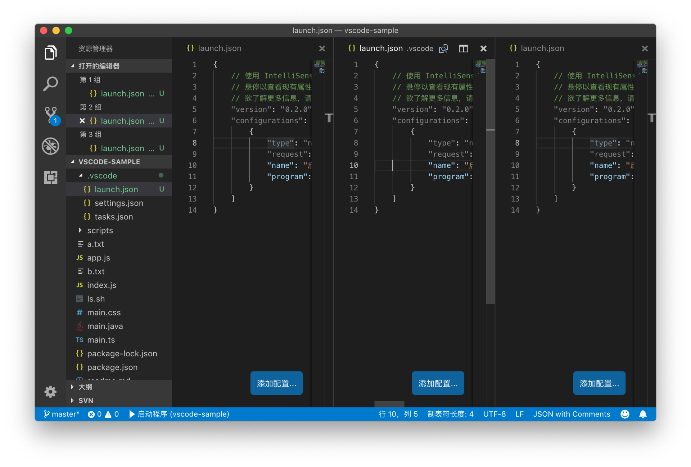
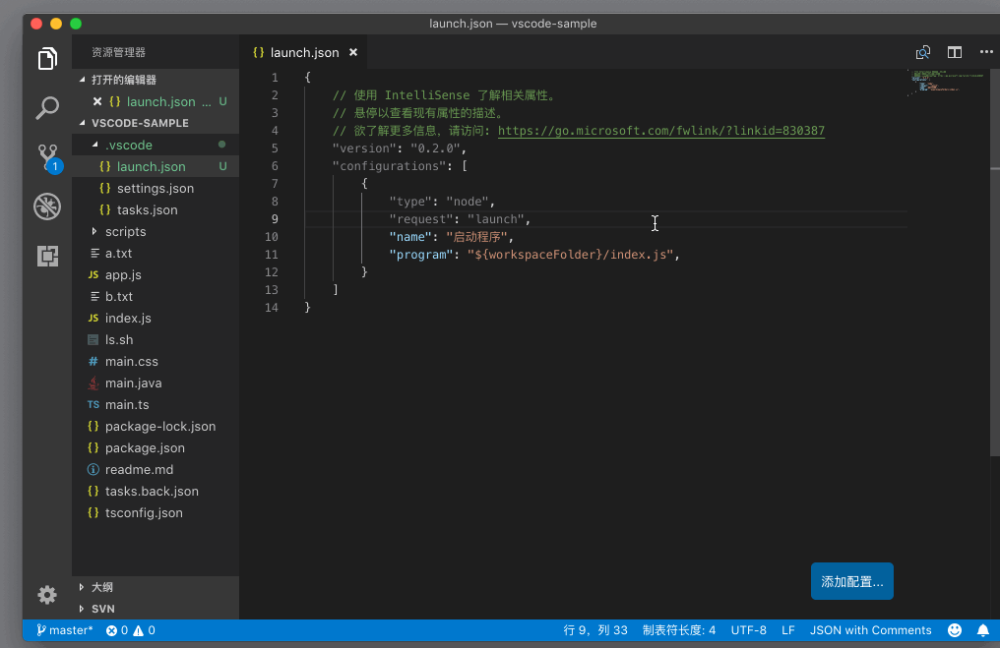
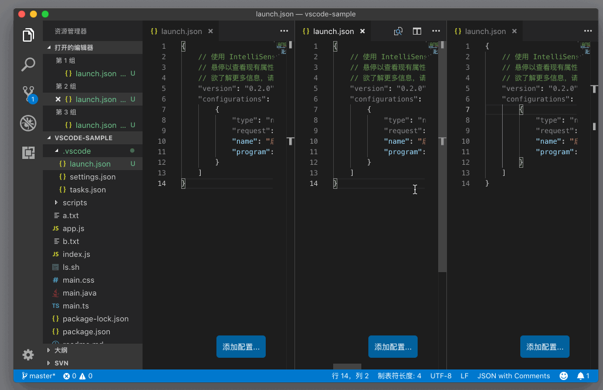
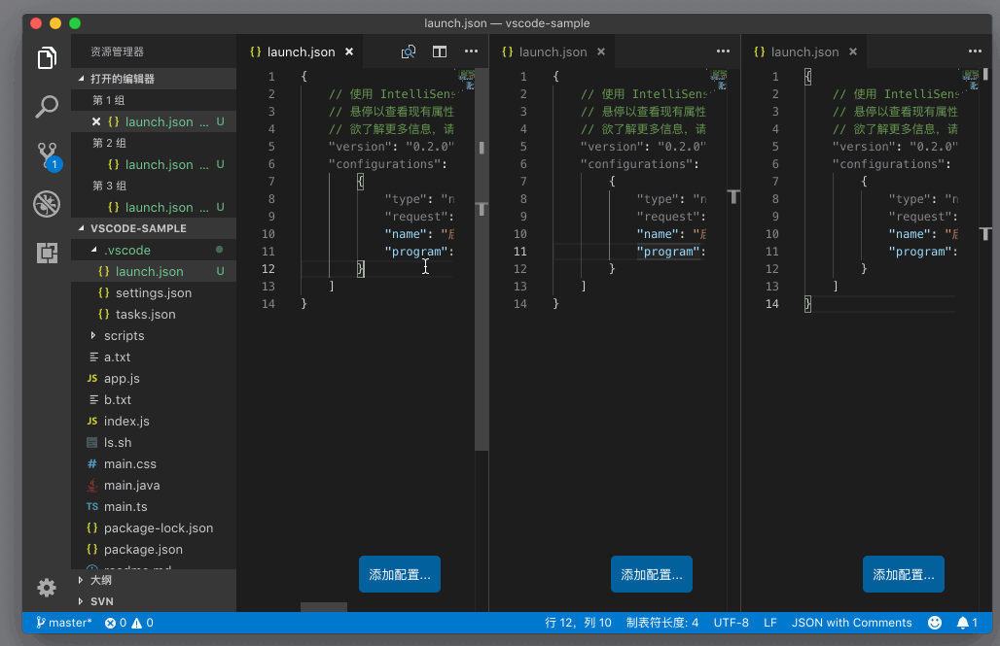

# 62_VSCode横向编辑器组和纵向编辑器组

**VSCode 横向编辑器组和纵向编辑器组**，VS Code 的编辑器的组织方式，还是相对比较常见的，没有什么特别难的地方，相信你可以轻松使用。不过，要提到编辑器相关的操作，这个就比较复杂了。下面我们来看看横向编辑器组和纵向编辑器组。

文章目录

- [1 横向编辑器组](https://geek-docs.com/vscode/vscode-tutorials/vscode-landscape-editor-group-and-portrait-editor-group.html#i)
- [2 纵向编辑器组](https://geek-docs.com/vscode/vscode-tutorials/vscode-landscape-editor-group-and-portrait-editor-group.html#i-2)

## 横向编辑器组

编辑器的管理方式，可以说是 VS Code 一直在变化的部分。最开始的时候，VS Code 并不支持 Tab，同时你最多只能在工作区横向创建三个编辑器，比如下图：

并且在每个单独的编辑器里，你也只能看到当前打开的这个文档，而没有 Tab，所以你看不到在这个编辑器里打开过但是暂时隐藏起来的文件。

至于如何创建出多个编辑器（最多三个），你只需要按下快捷键`Cmd + \`（Windows 上是 `Ctrl + \`），或者从命令面板里搜寻 “拆分编辑器” （Split Editor）并运行即可实现。

虽然没有 Tab 的功能，但其实每个编辑器依然记录了在这个编辑器中曾经被打开的文件。所以 VS Code 把每个编辑器，称作编辑器组（Editor Group）。同时，VS Code 还提供了能在这几个编辑器组里进行快速跳转的快捷键，你可以按下 `Cmd + 1`、`Cmd + 2`和`Cmd + 3`（Windows 上是 `Ctrl+1`，`Ctrl+2`，`Ctrl+3`）分别在这三个编辑器组里跳转。

## 纵向编辑器组

这之后 VS Code 就收到了非常多的反馈，很多用户希望能够把编辑器组进行纵向的布局。所以你可以使用命令 “切换垂直/水平编辑器布局” （Flip Editor Group Layout）或者按下`Cmd + Option + 0`（Windows 上是 `Shift + Alt + 0`）来进行布局方向的切换了。

另外，在纵向布局的情况下，上面提到的跳转编辑器组的快捷键也依然会生效。