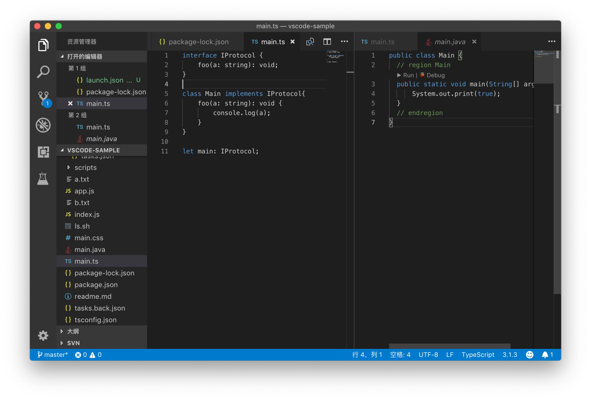
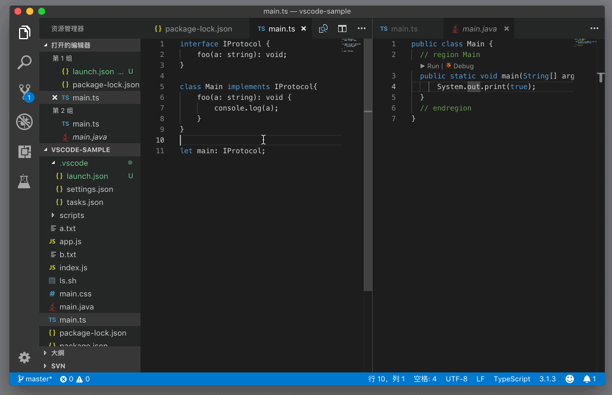
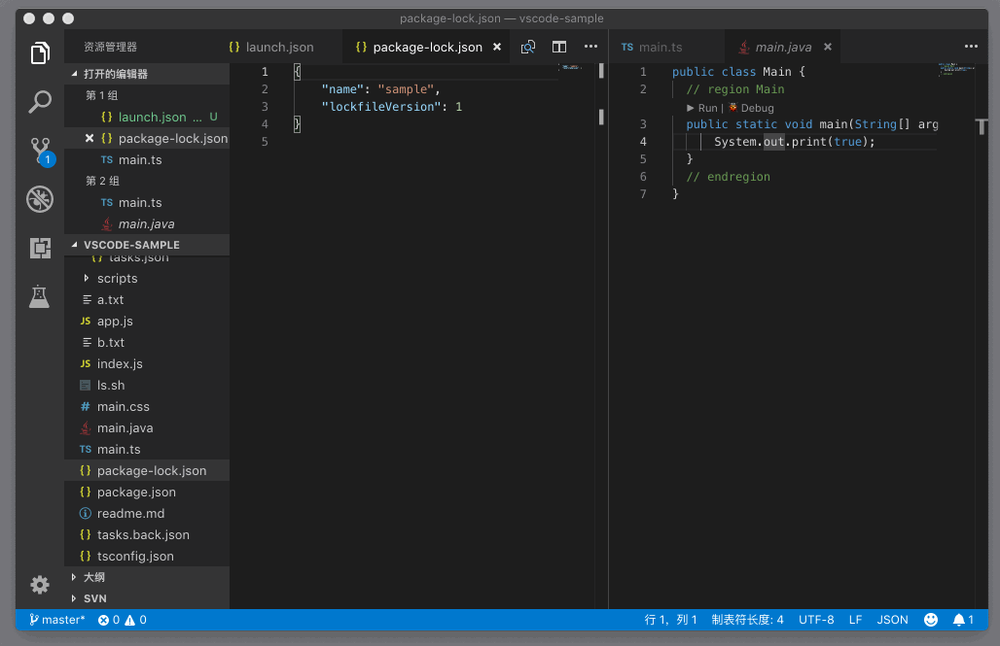
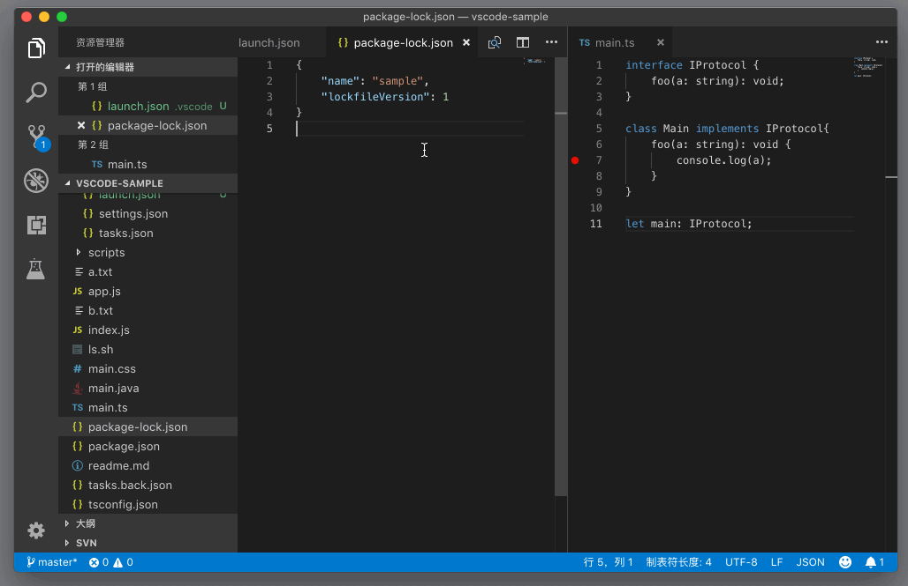

# 63_VSCode编辑器_Tab

**VSCode 编辑器 – Tab**，呼声非常高的编辑器相关的需求就是 Tab 的支持了。VS Code 虽然一直以来技术上是支持 Tab 的，但是并不会显示出来，而是要求你按下`Cmd + P`（Windows 上是 `Ctrl + P`）打开命令面板来进行文件的切换。但是 Tab 的呼声真的非常高，于是很快 VS Code 就把这个功能加上了。

所以，我想对于 Tab ，就并不需要过多的介绍了。不过，还是不得不提以下几个跟 Tab 相关的快捷键。

比如，在 Tab 之间进行跳转。你可以使用命令 “打开上/下一个编辑器”（Open Previous/Next Editor）或者按下 `Cmd + Option + 左/右方向键`（Windows 上是 `Ctrl + Pagedown/Pageup`）在编辑器 Tab 之间进行跳转。

要注意的是，这个命令会依次打开每个编辑器组里的每个 Tab。但是如果你只希望在某个编辑器组里进行跳转的话，那么你就需要另一个命令 “打开组中的下一个编辑器”（Open Next Editor in Group）。

## 移动编辑器 Tab

除了将鼠标聚焦到其他编辑器组里，VS Code 还允许我们把当前的编辑器 Tab 移动到其他编辑器组当中去。比如我们可以使用命令 “将编辑器移动到下一组”（Move Editor into Next Group），将当前的 Tab 移动到下一个编辑器组中。

类似的命令还有，“将编辑器移动到上一组”（Move Editor into Previous Group）等。