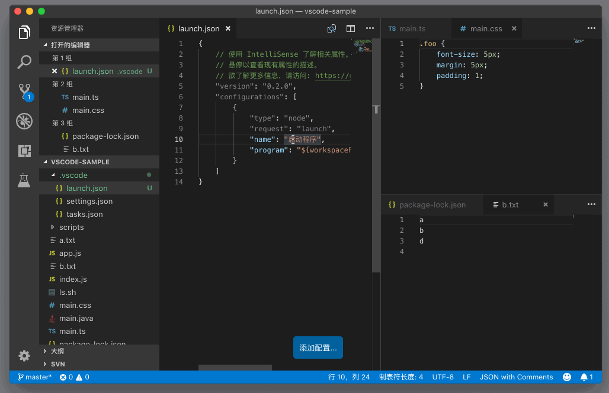
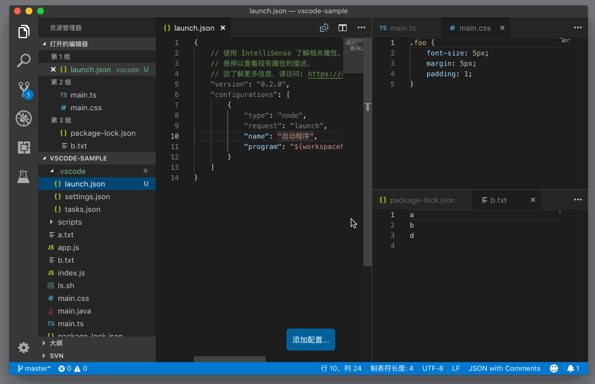
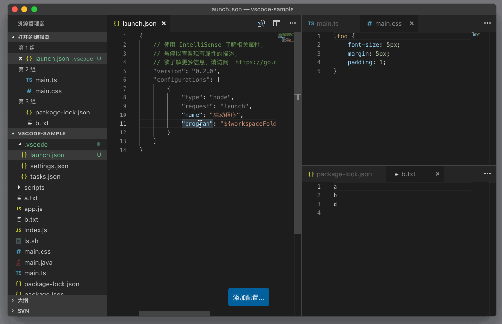
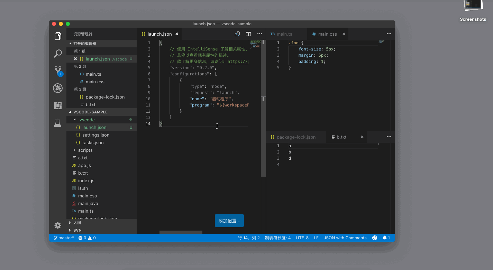
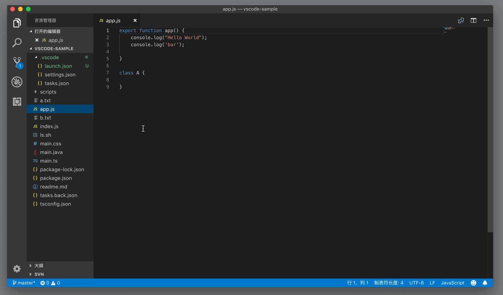
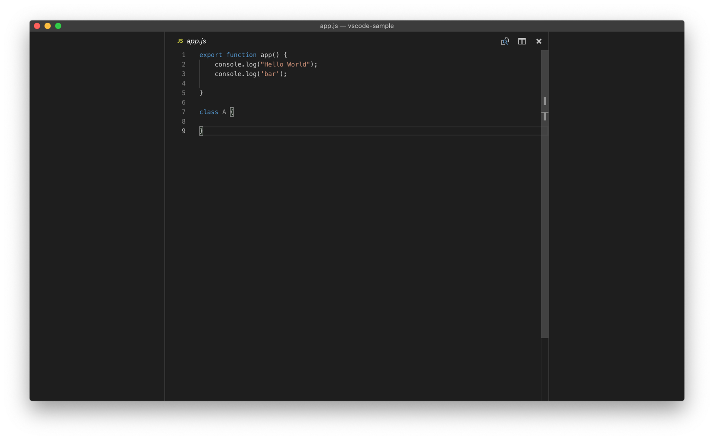
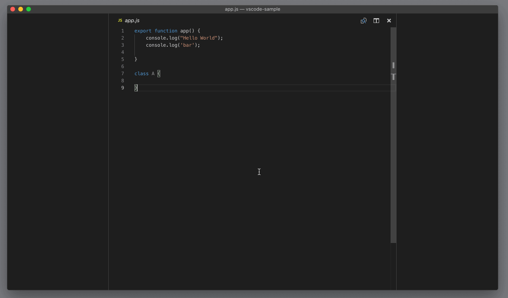

# 66_VSCode编辑器专注模式

**VSCode 编辑器专注模式**，我们在工作的时候，有时候希望更专注于代码编辑器，而不希望被 VS Code 的其他组件，比如视图或者面板所打扰。或者我们在比较小的屏幕上工作，比如说笔记本，有时候也有类似的需求，视图和面板等都太占屏幕面积了。对于这样的需求，VS Code 有几个非常实用的快捷键。

首先，我们可以按下 `Cmd + B` （Windows 上是 `Ctrl + B`）打开或者关闭整个视图；

也可以按下 `Cmd + J` （Windows 上是 `Ctrl + J`）来打开或者关闭面板。

如果我们不希望看到最左侧的活动栏，或者最下面的状态栏，也可以通过命令 “切换活动栏可见性”（Toggle Activity Bar Visibility）和 “切换状态栏可见性”（Toggle Status Bar Visibility）来一键开关。

除了可以使用上面介绍的这几种快捷键去分别打开、隐藏不同的组件以外，VS Code 还提供了一个禅模式，通过运行 “切换禅模式”(Toggle Zen Mode)，就可以把侧边栏、面板等全部隐藏。进入禅模式后，只需按下 Escape 键，即可退出禅模式。

看到这里你可能会问，“这几个操作，都是为小屏幕做了很好的优化，但如果说我的屏幕特别大，VS Code 有什么好的优化没有？”

有！你可以执行 “切换居中布局”（Toggle Centered Layout），将编辑器放在 VS Code 工作区的正中间，同时你还可以通过拉动编辑器两边的边框，调整编辑器的宽度。如此一来，当你使用大屏幕时，就不用担心编辑器里的代码，都“缩”在屏幕的左上角了。

有了上面这几个快捷键，当你在需要专注于某个代码的时候，就可以只显示编辑器了，比如下图：

而当你需要使用其他组件时，比如集成终端，你只需按下 Ctrl + ` ，就可以将其调出了。

不管怎样，我个人还是更喜欢把编辑器配置得简洁一些，然后每次只专注于一个任务。当然喜欢或习惯并行操作的同学，可能就会更喜欢使用网格系统。这个因人或因任务而异吧。