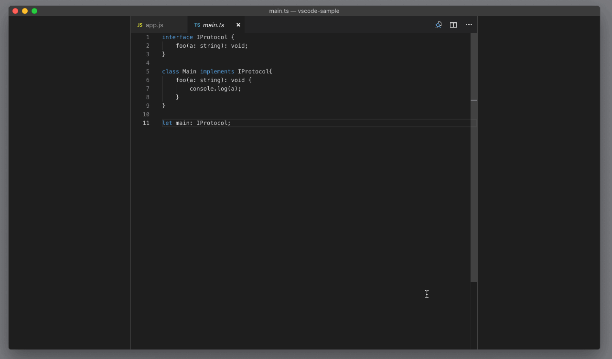
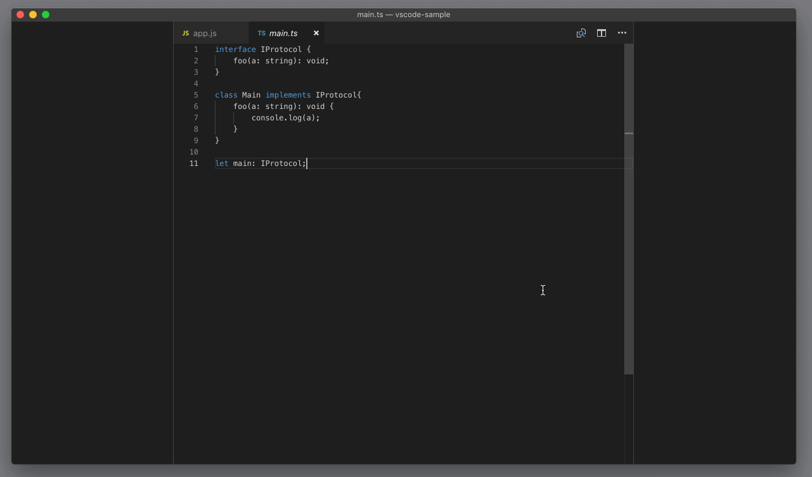

# 67_VSCode编辑器缩放

**VSCode 编辑器缩放**，缩放功能也是我在日常工作中经常使用的。比如我自己配置的字体比较小，而当需要给其他同事展示代码的时候，就往往需要把字体调大以便于更好地展示，这时候我就会按下`Cmd +/-`（Windows 上是 `Ctrl +/-`）来缩放整个工作区。

而如果我希望一键将缩放调整为默认设置，就可以执行命令 “重置缩放”（reset zoom）。

