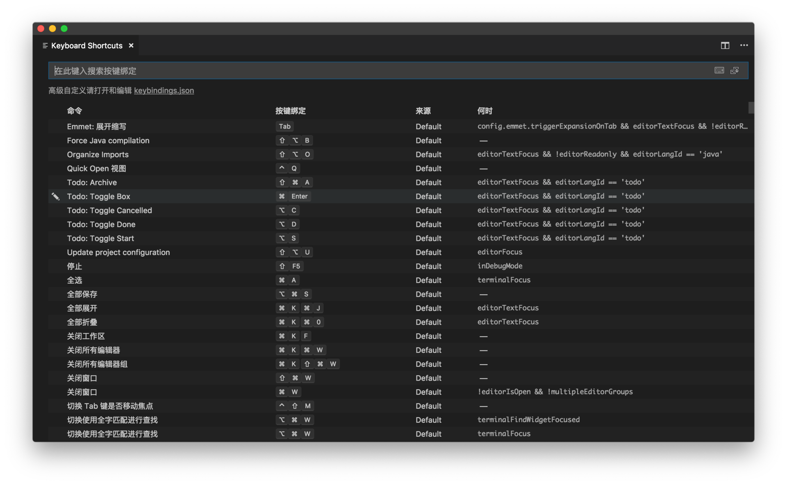
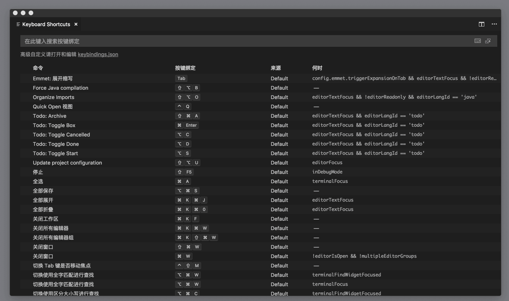

# 69_VSCode快捷键绑定

**VSCode 快捷键绑定**，虽然一直都是介绍使用图形化的快捷键修改界面，但是 VS Code 快捷键修改，在最开始的时候，跟编辑器设置界面是一样的，也是基于文本编辑器的。你可以在快捷键界面的搜索框下，看到一行提示“高级自定义请打开和编辑器 keybindings.json”。你不妨点击这个链接，效果如下图：


文章目录

- [1 快捷键绑定文本界面](https://geek-docs.com/vscode/vscode-tutorials/vscode-shortcut-key-binding.html#i)
- [2 快捷键绑定图形界面](https://geek-docs.com/vscode/vscode-tutorials/vscode-shortcut-key-binding.html#i-2)
- 3 快捷键高级定制
  - [3.1 Command](https://geek-docs.com/vscode/vscode-tutorials/vscode-shortcut-key-binding.html#Command)
  - [3.2 When](https://geek-docs.com/vscode/vscode-tutorials/vscode-shortcut-key-binding.html#When)
  - [3.3 Key](https://geek-docs.com/vscode/vscode-tutorials/vscode-shortcut-key-binding.html#Key)
- [4 VSCode 快捷键高级定制 – 删除快捷键](https://geek-docs.com/vscode/vscode-tutorials/vscode-shortcut-key-binding.html#VSCode_8211)
- [5 工作区常用快捷键汇总](https://geek-docs.com/vscode/vscode-tutorials/vscode-shortcut-key-binding.html#i-4)

## 快捷键绑定文本界面

如果你要搜索某个命令或者快捷键，可以在左侧编辑器唤出搜索框；而添加快捷键，则是使用右下角的 “定义按键绑定” 按钮。


你是不是会觉得，虽然我们更好地理解了快捷键设置都是绑定在 `keybindings.json` 这个文件里的，格式也是 JSON，但是好像这个文本编辑器完全比不上图形化的界面啊？

别着急，下一篇就要聊一聊今天文章里技术含量最高的知识点了。

## 快捷键绑定图形界面

**VSCode 图形界面绑定快捷键**，我们再来说说快捷键绑定，之前介绍了如何使用快捷键界面去搜索和修改界面——在命令面板里“打开键盘快捷方式”（Open Keyboard Shortcuts）并执行。



修改某个命令的快捷键也很简单，搜索并找到命令后，双击命令项就可以对快捷键进行修改了。

不过，这里我要介绍一个 VS Code 新增的功能（注意你需要更新到最新版本的 VS Code）。我们有的时候发现某个快捷键执行的命令不是我们想要的，这说明可能某个插件或者我们自己的配置有问题。要想看看某个快捷键究竟绑定在哪个命令上，我们可以在快捷键界面的搜索框里输入这个快捷键对应的字符。比如我可以在搜索框里输入 `cmd+s` 来看看它是不是绑定到了文本保存这个命令上。


不过要手动输入 `cmd+s` 还是很麻烦的，更不要说如果我们要输入的是 `cmd+option+shift+s` 之类的复杂快捷键了。在最新版本里，这个搜索框的最右侧，多出一个小按钮。


这个按钮的作用是键盘录制。如果我们点击这个按钮，激活键盘录制模式，此时，当我们在这个搜索框里按下键盘，键盘按钮所对应的快捷键文本就会被输入到搜索框中。所以有了这个按钮，即便搜索再复杂的快捷键，也不怕麻烦了。（第二个按钮则是对结果进行排序，老版本也有。）



## 快捷键高级定制

**VSCode 快捷键高级定制**，点击了 “定义按键绑定” 的蓝色按钮的话，你会看到右侧的文本编辑器中，插入了一段文本。


这段插入的文本，是一个代码片段

```json
{
  "key": "cmd+enter",
  "command": "command",
  "when": "editorTextFocus"
}
```

JSON

### Command

这段代码片段，有两个 Tab Stop。第一个 Tab Stop 停留在 ”command” 这个属性的值中，它的意思是，我们想要为哪个命令指定特殊的快捷键。这个 command 在左侧的编辑器中也可以查询得到。

### When

而第二个 Tab Stop，则是在 “when” 这个属性的值中。这个 “when” 是什么意思呢？顾名思义，它说的是在什么情况下这个快捷键绑定能够生效。此时 “when” 的值已经有一个占位符 （placeholder）了，叫做“editorTextFocus”，它代表着光标聚焦在代码编辑器的文本上。如果光标在编辑器的文本上时，那么 “editorTextFocus” 就是 true，那么这个“when”的条件就生效了，这则快捷键绑定就会生效。而假如光标处在集成终端里，此时 “editorTextFocus”就是 false 了，这个 “when” 就不生效了，同样也就不会绑定这个快捷键了。

在 “when” 条件里，除了editorTextFocus外，我们还有非常多的值可以使用，并且加以组合。比如集成终端对应的是 terminalFocus，资源管理器对应的是 filesExplorerFocus 。除此之外，你也可以[利用VS Code的文档去查询全部可以使用的值](https://code.visualstudio.com/docs/getstarted/keybindings#_when-clause-contexts)。

而在书写 “when” 条件时，VS Code 还支持几个基础的操作符。这样我们就能够书写相对复杂的条件语句了。

- ```
  !
  ```

   

  取反。比如我们希望当光标不在编辑器里时，绑定一个快捷键，那么我们可以使用

   

  ```
  !editorFocus
  ```

  ，使用 ！进行取反。

  

- `==` 等于。when 条件值除了是 boolean 以外，也可以是字符串。比如 resourceExtname 对应的是打开的文件的后缀名，如果我们想给 js 文件绑定一个快捷键，我们可以用 `resourceExtname == .js`。

- `&&` And 操作符。我们可以将多个条件值组合使用，比如我希望当光标在编辑器里且编辑器里正在编辑的是 js 文件，那么我可以用 `editorFocus && resourceExtname == .js`。

- `=~` 正则表达式。还是使用上面的例子，如果我要检测文件后缀是不是 js，我也可以写成 `resourceExtname =~ /js/`，通过正则表达式来进行判断。

你可以试着从简单的`&&`和`==`等操作符开始，然后再使用正则表达式，进行更复杂的条件判断。

### Key

我们回过头来再看下这段快捷键绑定的代码：

```json
{
  "key": "cmd+enter",
  "command": "command",
  "when": "editorTextFocus"
}
```

JSON

在这个 JSON 对象里第一个键是 key，也就是你将要使用的快捷键。如果你是使用“定义按键绑定”按钮来生成的，那么 VS Code 会根据你的键盘布局来自动生成这个文本。你当然也可以自行修改，不过我不建议这么做，因为 VS Code 为了适应各种不同的键盘布局，在 key 这个值上还是有很多特殊要求的。

比如说，你想给某个快捷键绑定上`cmd+\`这个键，VS Code 会自动为你输入 `cmd+[Backslash]`。因为不同键盘上的 `\` 键的布局可能会不同，VS Code 使用统一的 `[Backslash]`来进行指代。你当然也可以输入 `cmd+\`（请注意，这里我使用了两个 \，因为我们在 JSON 里需要进行转义 escape），但是如果你把 `keybindings.json` 分享给其他人的话，是不一定能够保证生效的。

如果你对如何手动输入 key 很感兴趣，可以参考[VS Code 中相关的文档](https://code.visualstudio.com/docs/getstarted/keybindings#_keyboard-layouts)，该文档里介绍了 VS Code 针对不同键盘布局 （keyboard layout）所做的特殊处理。

## VSCode 快捷键高级定制 – 删除快捷键

我们在快捷键的图形界面里也介绍过，可以使用上下文菜单删除某个快捷键绑定。不过，删除操作在 `keybindings.json` 里是如何体现的呢？其实非常简单，假如说我们不想使用 `cmd+s` 来保存文本，首先我们找到 `cmd+s` 对应的快捷键绑定设置

```json
{
  "key": "cmd+s",
  "command": "workbench.action.files.save"
}
```

JSON

然后我们只需在右侧的 keybinding.json 里，添加一条新的快捷键绑定，如下：

```json
{
  "key": "cmd+s",
  "command": "-workbench.action.files.save"
}
```

JSON

在这条新的快捷键绑定里，“command” 的值在开头添加了一个 – 减号。这个减号就告诉 VS Code 我们希望给这个命令解除快捷键绑定。

对了，在解绑快捷键时，我们也可以使用 “when” 条件。这样的话，我们就能够做到只在特定情况下解除某个快捷键的绑定。

## 工作区常用快捷键汇总

**工作区常用快捷键汇总**，关于工作区的常用的快捷键了（可参考下面的汇总表），通过它们我们能够更好地管理我们的工作台界面，以满足我们不同工作场景下的需求，从而也让 “工作台” 这个名字，更名副其实。


如果你想搜索某个组件相关的命令，你可以打开命令面板，搜索名字，然后就能够看到跟这个组件相关的命令了。


总之，VS Code 的界面定制、快捷键、各个组件的功能，给我们提供的选项非常多，但这不意味着我们必须要掌握全部的内容。重要的还是找到适合自己的那几个配置和快捷键，优化自己日常工作的流程，那就足够了。