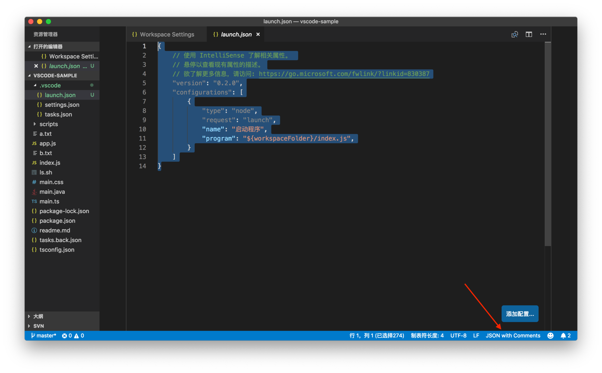
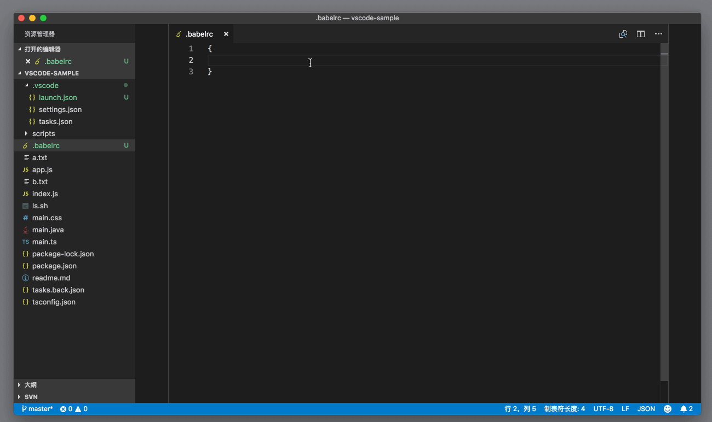
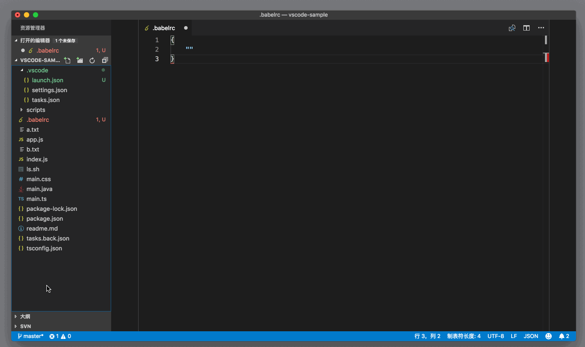
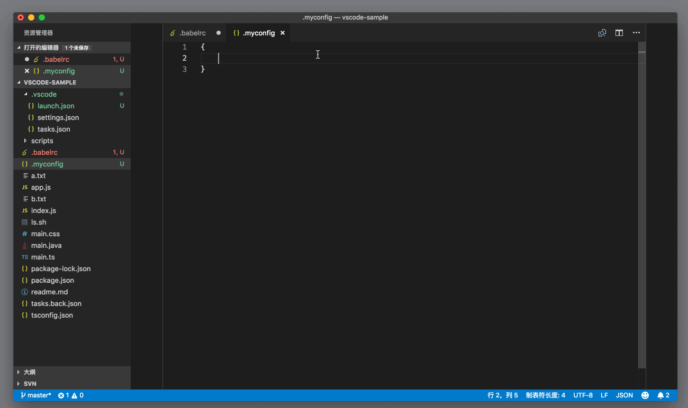

# 70_VSCode支持JSON

**VSCode 支持JSON**，JSON 文件你肯定已经非常熟悉了，VS Code 的配置文件、任务系统、代码片段等都是使用的 JSON 语法。比如下面的这段调试配置：

```json
{
    // 使用 IntelliSense 了解相关属性。 
    // 悬停以查看现有属性的描述。
    // 欲了解更多信息，请访问: https://go.microsoft.com/fwlink/?linkid=830387
    "version": "0.2.0",
    "configurations": [
        {
            "type": "node",
            "request": "launch",
            "name": "启动程序",
            "program": "${workspaceFolder}/index.js",
        }
    ]
}
```

JSON

你可能会疑惑，“JSON 按理说是不允许写注释的呀，为什么 VS Code 里的配置文件都可以写类似 // comment 的内容呢？”

这是因为 VS Code 为配置文件们都指定了一个特殊的 JSON 文件类型，称为`JSON with Comments`。你可以在状态栏的最右侧看到 VS Code 的这个特殊的语言类型。



与此同时，JSON 的语言服务支持 [JSON Schema](http://json-schema.org/)。你可以通过 JSON Schema 规范 JSON 内容的格式，并且做一定程度的语法检查。我们可以先来看看如何给一个 JSON 文件指定 Schema。

**第一种就是在 JSON 文件中直接指定**，这种写法的好处很明显，你能够立刻知道自己在使用的是哪个 schema。比如：

```json
{
   "$schema": "http://json.schemastore.org/babelrc"
}
```

JSON

但是，有的时候你不希望把这个 schema 设置放到代码版本管理中去，为了满足这种需求，你可以采取第二种方法：**将 schema 的配置放在个人设置，或者工作区设置中**。语法如下：

```json
"json.schemas": [
     {
        "fileMatch": [
            "/.babelrc"
        ],
        "url": "http://json.schemastore.org/babelrc"
    }
]
```

JSON

在上面的代码示例中，你可以看到 `json.schemas` 是一个数组，现在数组里只有一个值。这个值就是 schema 的配置，它有两个属性：

- ```
  fileMatch
  ```

  。顾名思义，这个值指定了哪些文件将会使用这个 schema。比如在上面的示例里，fileMatch 的值中有一个 /.babelrc，它意味着根目录下的 .balelrc 文件将会使用这个 schema。

  

- `url`，指定了 schema 的存储地址。在这个示例中，我们会从http://json.schemastore.org/babelrc 下载 schema。

通过这两个示例，当我们在项目中使用 .babelrc 文件来书写 babel （一个 JavaScript 编译器）的配置时，就能获得正确的自动补全和警告了。



到这里你可能会好奇，这个 schema 里的内容到底是什么呢？为什么它能够提供智能提示和检查呢？我们这个专栏的任务虽然不是教你如何掌握 JSON schema，但是我们还是可以来看看如何在 VS Code 里书写 JSON schema。我们先来看如下这个简单的例子：

```json
"json.schemas": [
    {
        "fileMatch": [
            "/.myconfig"
        ],
        "schema": {
            "type": "object",
            "properties": {
                "name" : {
                    "type": "string",
                    "description": "The name of the entry"
                }
            }
        }
    }
]
```

JSON

这个例子跟之前 `.babelrc` 的例子非常接近，fileMatch 现在指定的是 `.myconfig` 这个文件，不过第二个属性不再是 url 了，而是 schema。这个 schema 的值，就是 JSON schema 。这个代码示例应该非常好理解，它指定了 `.myconfig` 里的 JSON 根对象是个 Object 对象，它有个属性叫做 name，name 的类型必须是字符串 string。

添加了这个设置后，你可以在当前打开的文件夹根目录下创建 `.myconfig` 文件，然后在编辑器中打开。这之后你需要点击状态栏最右侧的语言设置，默认情况下，VS Code 并不认识 `.myconfig` 文件，你需要点击这个语言设置，然后选择 JSON。



然后你在 `.myconfig` 里书写 JSON 时，VS Code 就会给你提示 name 这个属性了。



但如果你设置 name 的值时没有使用字符串，而是使用了数字，VS Code 则会提出警告。


这就是一个最简单的 JSON schema 样例了。如果你正在工作的项目，有自己特殊的配置文件，而且这个配置的格式是 JSON，那你就不妨试试使用 JSON schema 来给这个文件添加规范；而如果你的同事们同样适用这个 JSON schema 的话，就能避免很多错误配置了。关于更多 JSON schema 的书写，还请阅读[官方文档](http://json-schema.org/) 。