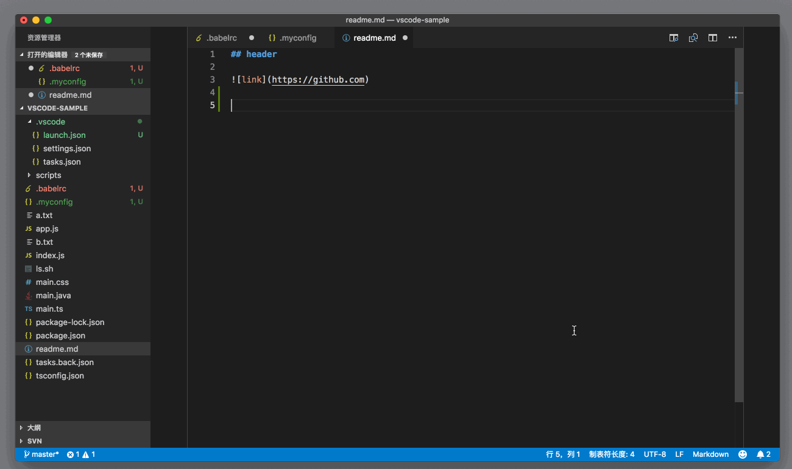
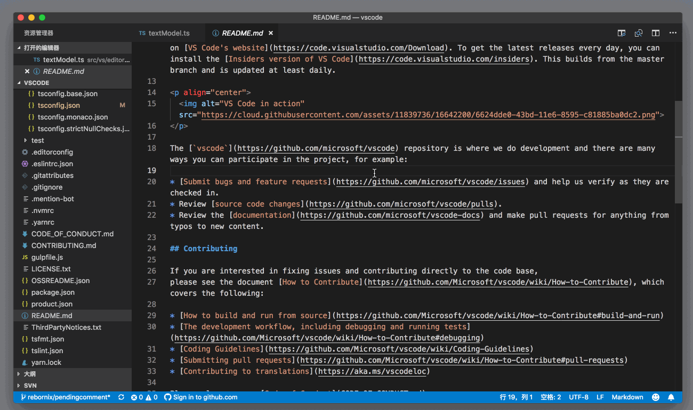
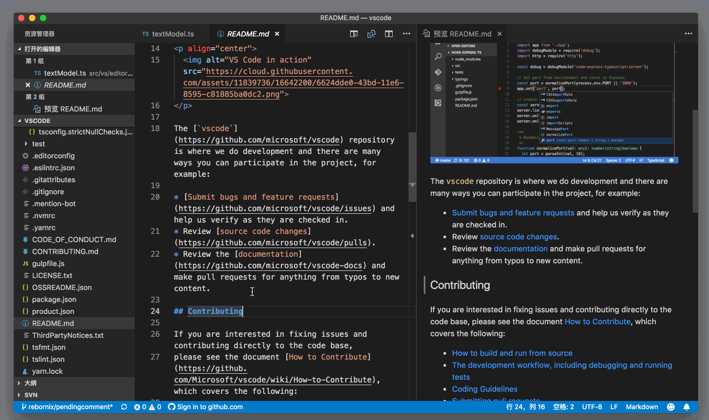
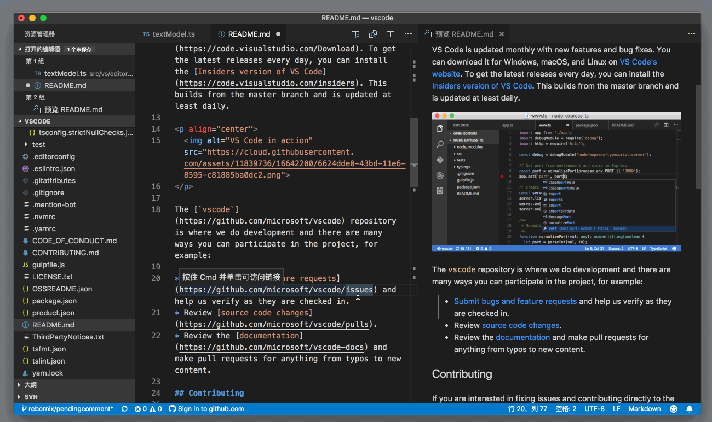
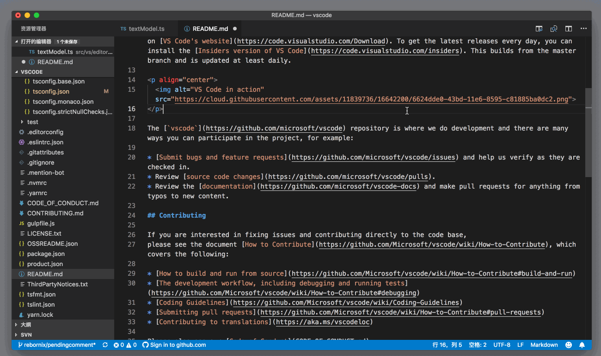
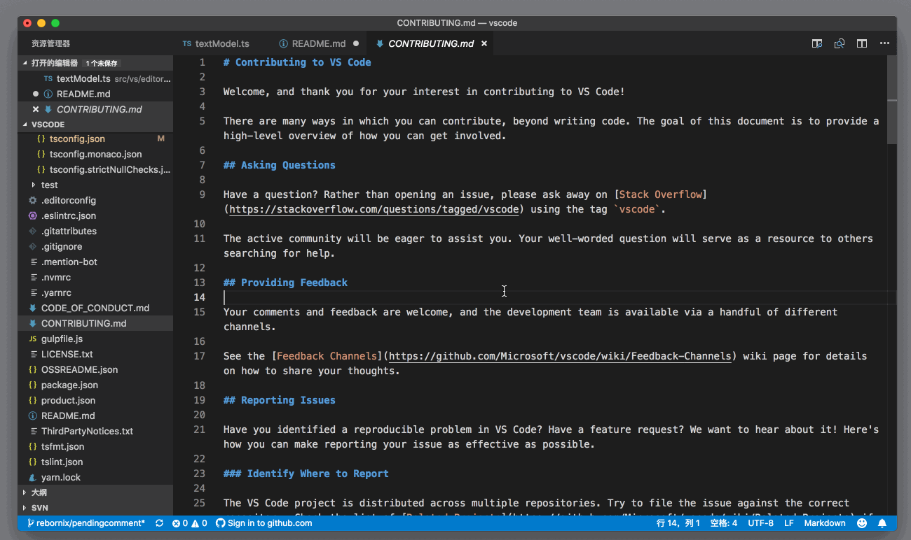
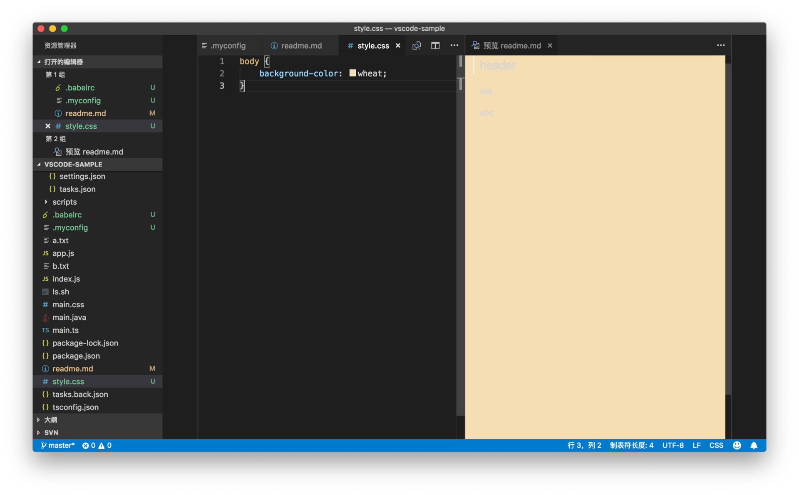
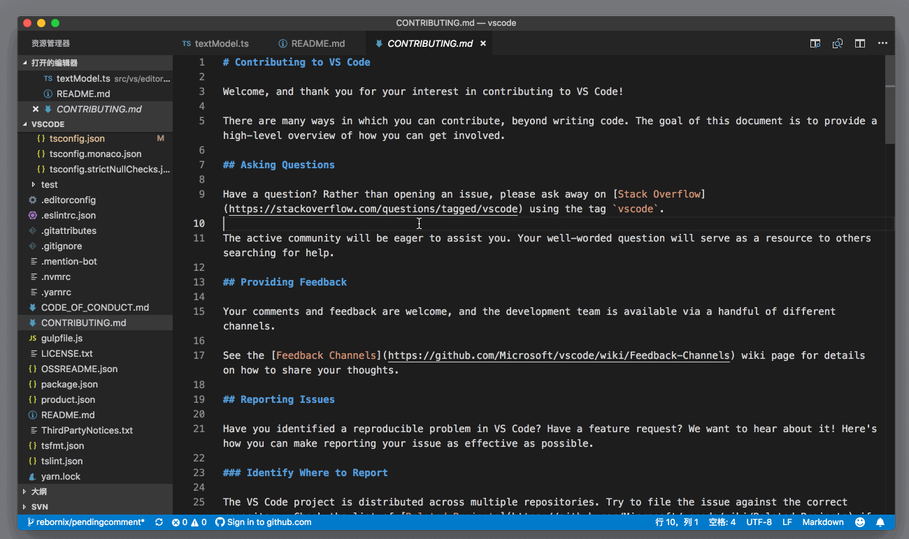
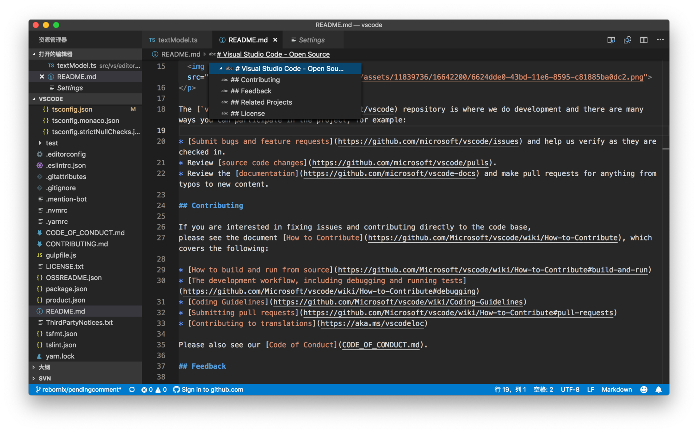
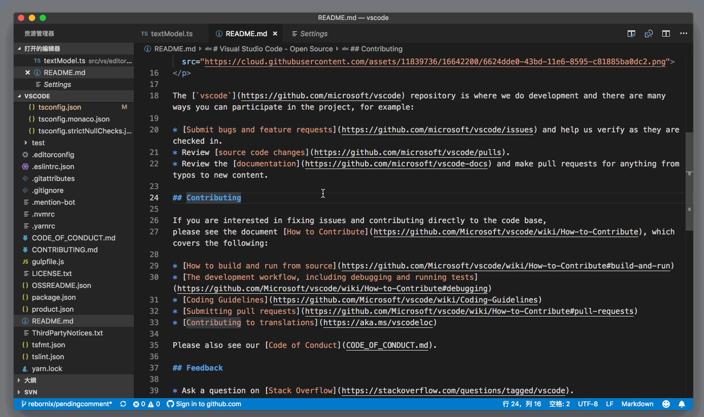

# 71_VSCode支持Markdown

**VSCode 支持Markdown**，我们再来看看另一个 VS Code 支持的非常好的语言——Markdown。Markdown 在近些年已经成为了主流的文档书写语言，比如GitHub 上的项目 readme 默认就是 Markdown，微软在13年也把 MSDN 的文档从 XML 逐步地转为 Markdown 了。

你在 VS Code 中书写 Markdown 的时候，VS Code 会提供语法高亮。



VS Code 的定位是一个文本编辑器，而不是富文本编辑器，所以你并不能像一些 Markdown 编辑器一样，获得所见即所得的体验。但是 VS Code 提供了一个 Markdown 预览的效果。

文章目录

- [1 VSCode Markdown的支持 侧边预览](https://geek-docs.com/vscode/vscode-tutorials/vscode-markdown-support.html#VSCode_Markdown)
- [2 VSCode Markdown的支持 同编辑器内预览](https://geek-docs.com/vscode/vscode-tutorials/vscode-markdown-support.html#VSCode_Markdown-2)
- [3 VSCode Markdown的支持 修改 Markdown 预览格式](https://geek-docs.com/vscode/vscode-tutorials/vscode-markdown-support.html#VSCode_Markdown_Markdown)
- [4 VSCode Markdown的支持 Markdown 内跳转](https://geek-docs.com/vscode/vscode-tutorials/vscode-markdown-support.html#VSCode_Markdown_Markdown-2)
- [5 VSCode Markdown的支持 Markdown 代码折叠](https://geek-docs.com/vscode/vscode-tutorials/vscode-markdown-support.html#VSCode_Markdown_Markdown-3)

## VSCode Markdown的支持 侧边预览

当你在编辑器中打开一个 Markdown 文件后，你可以通过命令面板执行 “Markdown: 打开侧边预览”（Markdown：Open Preview to the Side）来打开预览窗口。



这样无论你在左侧的编辑器还是在右侧的预览窗口滚动时，另一个编辑器都会相对地滚动，以保证你能同时看到对应的 Markdown 内容和预览。

当你修改这个 Markdown 文件时，右侧的预览会自动更新，而且也会跟随你的光标实时地滚动。



另外，在侧边预览打开后，如果你打开另一个 Markdown 文件，侧边预览也会实时地更新成新 Markdown 文件的预览。



但有的时候，你可能会希望这个预览窗口永远只显示“某个” Markdown 文件的预览，而不是根据编辑器内文件而变化，那这时你可以执行 **Markdown: 在侧边打开锁定的预览** （Markdown: Open Locked Preview to the Side）命令，这样预览窗口就会一直显示你想要的这个Markdown文件的预览内容了。



## VSCode Markdown的支持 同编辑器内预览

在侧边打开预览的好处是，你可以直接编辑内容并且看到实时的更新。但是有的时候你只是希望阅览 Markdown 的最终预览，这时候，你就可以使用 “Markdown: 打开预览”（Markdown: Open Preview） 命令，在当前编辑器组内打开预览。



## VSCode Markdown的支持 修改 Markdown 预览格式

我们知道，Markdown 文件最终会被转换成 HTML，然后在指定的网站上呈现出来。这些网站都有自己的一套样式，为了能够让 VS Code 的 Markdown 预览更接近 Markdown 文件发布后的效果，你可以为 Markdown 的预览提供一套自定义的 CSS 样式。比如说你可以把最终网站上使用的 CSS 套用在 VS Code 的 Markdown 的本地预览中。

要达到这个目的，配置也很简单。你可以在设置里，添加如下配置：

```json
{
    "markdown.styles": [
        "Style.css"
    ]
}
```

JSON

通过给 markdown.styles 属性指定 CSS 样式的地址，你就能控制 Markdown 的预览效果了。



除了 CSS 样式，你也可以通过书写插件，给 VS Code 添加新的 Markdown 语法和预览，这个内容我会在专栏的插件部分介绍。

## VSCode Markdown的支持 Markdown 内跳转

相信你还记得，在专栏的编辑器部分，我们介绍过如何在符号（Symbols）中快速跳转。这个功能在 Markdown 中显得更加方便了。你可以通过符号，快速地在不同的章节直接进行跳转。



如果你打开了面包屑功能的话，你也可以通过面包屑工具栏来跳转。



## VSCode Markdown的支持 Markdown 代码折叠

在介绍代码折叠功能（Folding）时，我们探讨过VS Code支持插件来动态地计算哪些代码可以折叠，而不是简单地检测花括号或者代码缩进。Markdown 就是一个特别好的例子，你可以在编辑 Markdown 时，根据章节来对内容进行折叠。

