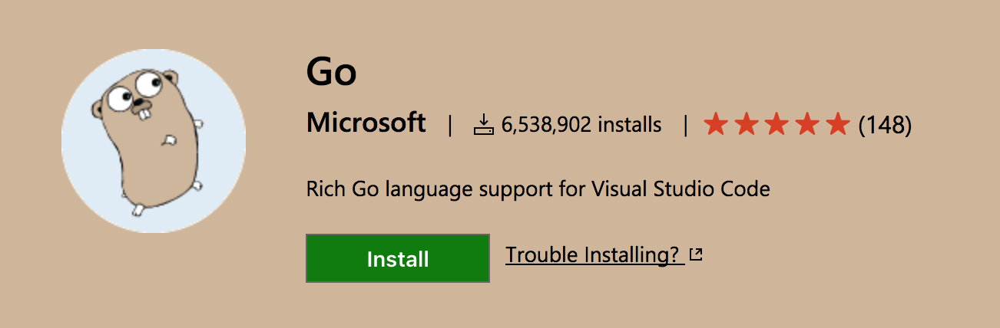
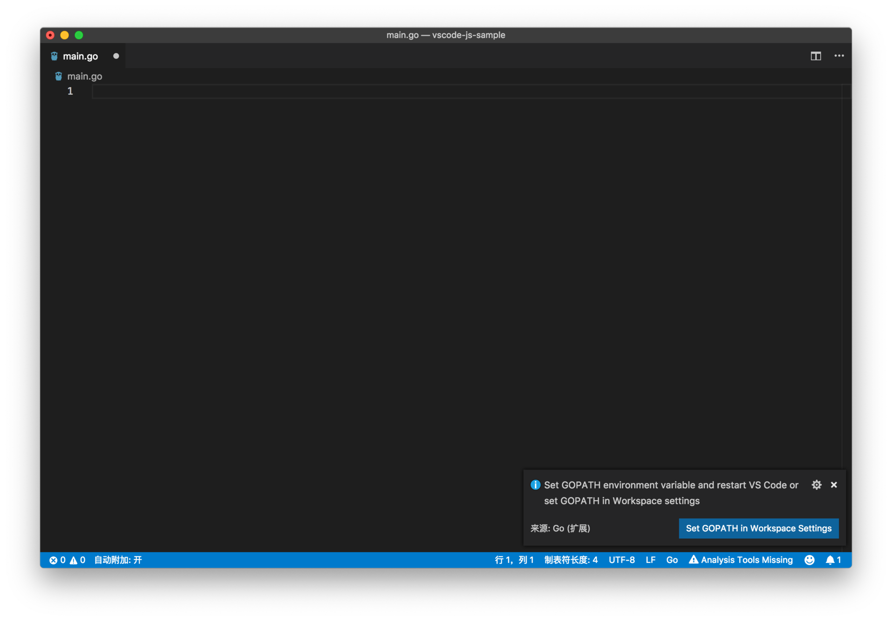
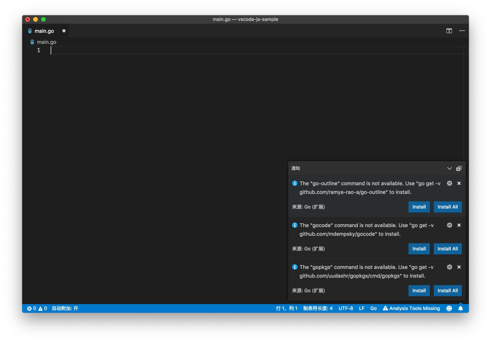
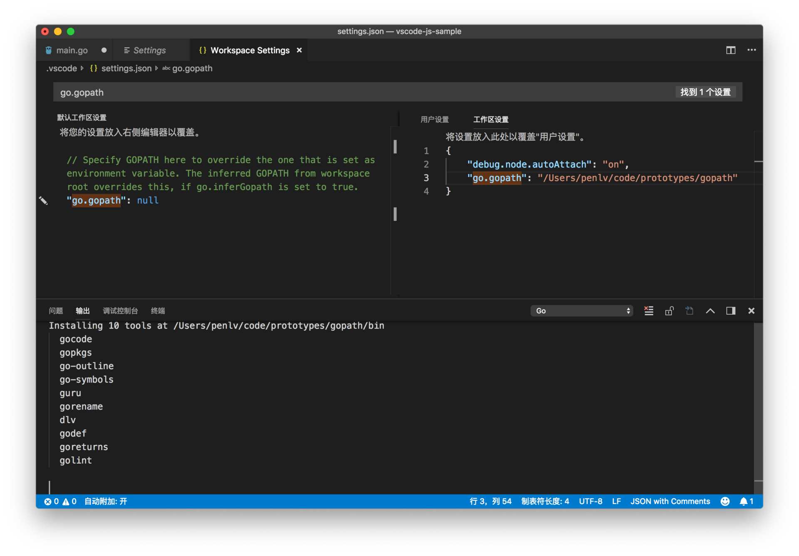
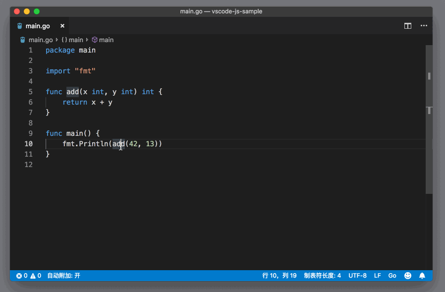
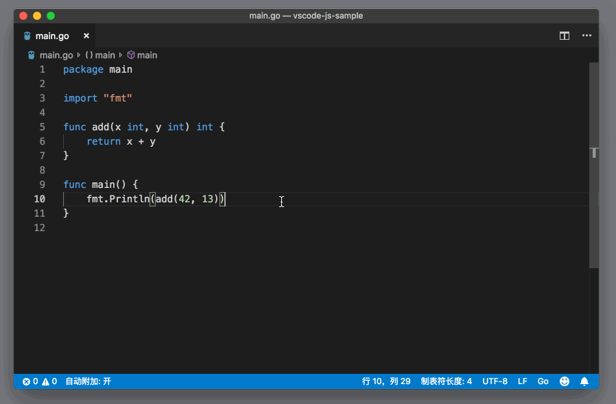
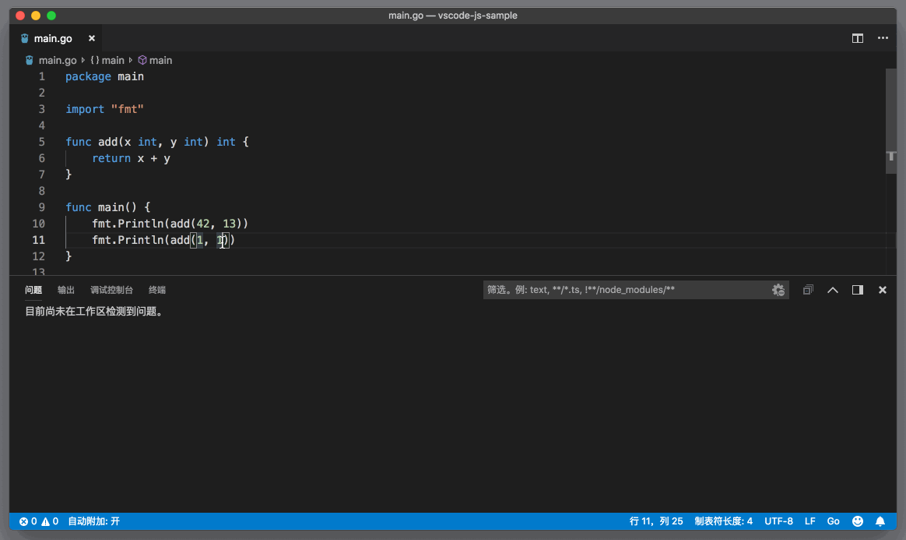
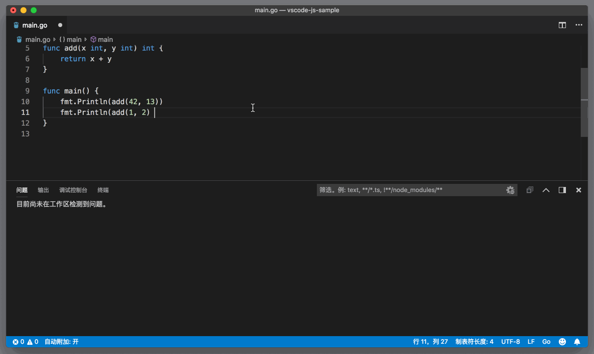
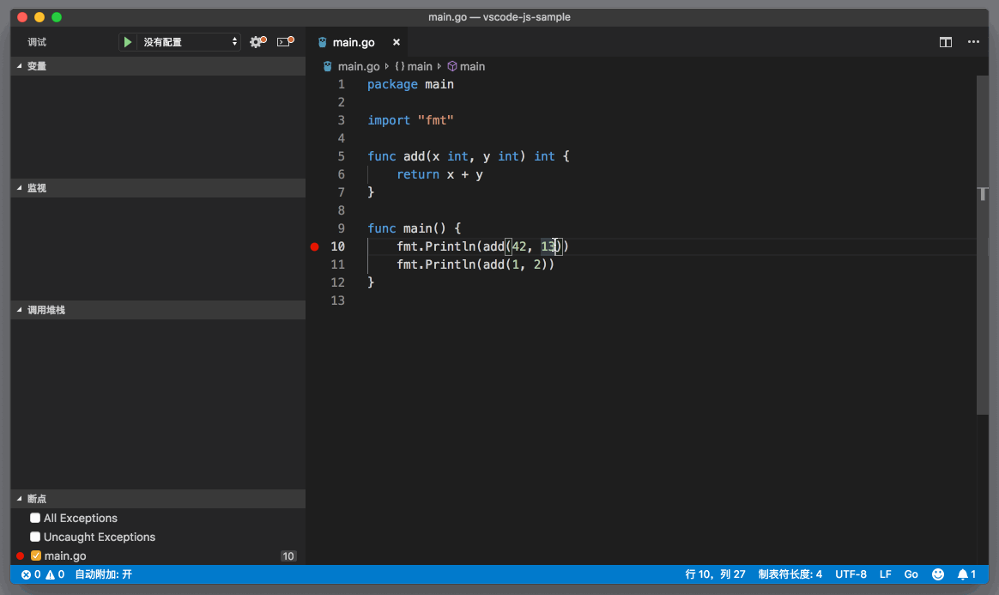

# 74_VSCode支持Go

**VSCode 支持Go**，VS Code上的 Go 语言插件，是由微软官方推出的。Go 语言插件，是VS Code推出插件 API 时的首批插件，直到现在，也依然由VS Code团队成员进行维护开发，项目地址是 <https://github.com/microsoft/vscode-go> 作为 VS Code 团队维护的项目，GitHub issues 是它唯一的反馈渠道。要安装这个插件，你可以在VS Code的插件视图里搜索 Go，也可以通过[插件市场](https://marketplace.visualstudio.com/items?itemName=ms-vscode.Go)进行下载。



VS Code也是 Go 团队官方推荐的开发工具。

文章目录

- [1 安装使用](https://geek-docs.com/vscode/vscode-tutorials/vscode-support-go.html#i)
- 2 语言支持
  - [2.1 IntelliSense](https://geek-docs.com/vscode/vscode-tutorials/vscode-support-go.html#IntelliSense)
  - [2.2 构建（build）、检测（vet, lint）和格式化（Format）](https://geek-docs.com/vscode/vscode-tutorials/vscode-support-go.html#buildvet_lintFormat)
  - [2.3 调试](https://geek-docs.com/vscode/vscode-tutorials/vscode-support-go.html#i-3)
  - [2.4 Language Server（experimental）](https://geek-docs.com/vscode/vscode-tutorials/vscode-support-go.html#Language_Serverexperimental)
- [3 问题和前瞻](https://geek-docs.com/vscode/vscode-tutorials/vscode-support-go.html#i-4)

## 安装使用

当你从插件市场安装了 Go 插件后，重启VS Code，Go 插件就会在你第一次打开 Go 文件的时候被启动。

启动后，如果你还没有设置过 GOPATH 的话，VS Code会提示你，你既可以在自己的系统环境变量里添加 GOPATH，也可以在当前项目的配置文件里配置 GOPATH。



设置正确的 GOPATH 后，VS Code就知道安装 Go 的 package 保存到哪个文件夹内了。

紧接着VS Code又跳出多个提示。这些提示是告诉你，如果想要在VS Code中使用自动补全、代码跳转等功能，你需要安装额外的 Go 的 package。所以，这里我建议选择 Install All，之后如果你对某个 package 的效果不满意，也可以通过设置再进行修改的。



比如，在我的系统上，我将 GOPATH 设置为 /Users/penlv/code/prototypes/gopath。然后选择 Install All 后，我就能在输出面板里，看到 Go 插件将要安装的 packages。



不过值得注意的是，如果上面的安装失败了，输出窗口中会提供错误信息。因为，这一步操作，底层运行的命令行其实就是：

```go
go get -u -v github.com/...
```

Go

像我就曾遇到了 Go 的版本太老，导致更新失败的问题。如果你遇到了自己无法解决的问题，也可以到插件的 GitHub repository 留言，请注意要提供完整的信息，比如VS Code版本、插件版本以及 Go 的版本，以便更好地 toubleshoot。

## 语言支持

### IntelliSense

首先，你可以在 Go 代码中，进行代码跳转（Go To Definition）、自动补全（Auto Complete）以及获取悬浮信息（Hover）。





Go 插件默认是借助 [gocode](https://github.com/mdempsky/gocode)、[gogetdoc](https://github.com/zmb3/gogetdoc)和 [godef](https://github.com/rogpeppe/godef) 分析代码，然后提供这些信息的。

### 构建（build）、检测（vet, lint）和格式化（Format）

在编写 Go 代码时，经常会用到`go build`、`go tool vet`、`golint`等脚本去构建代码，或者是对代码进行检测。Go 插件已经将这些功能集成到插件中了，你可以：

- 打开 go.buildOnSave ，当代码保存时，go build 将会自动执行。同时，你可以使用 go.buildFlags 来指定 build 的参数。
- 打开 go.vetOnSave 并且使用 go.vetFlags 来指定 vet 参数。
- 打开 go.lintOnSave 并且使用 go.lintFlags 来指定 lint 参数。并且，你可以通过 go.lintTool 来选择你想要的 lint 工具。
- 打开 go.testOnSave 在代码保存时测试代码。

当你使用这些参数来自动触发脚本时，Go 插件会将这些脚本的输出结果进行分析，然后将错误和警告放入到问题面板中。



默认情况下，当保存代码时，VS Code会自动给 Go 代码进行格式化。如果你不喜欢这个功能，也可以通过 go.formatOnSave 来取消。



### 调试

Go 插件同样支持调试 Go 的代码，而其底层的 debugger 则是 delve。如果你第一次使用 Go 插件时选择了 Install All 安装所有的 package，那么就无需再安装任何的 package了。而如果你没有全部安装，那么你可能需要手动安装 dlv 这个 package。

和之前我们介绍的 Node.js 调试一样，如果没有 launch.json 的话，VS Code会默认调试当前文件。



同样，Go 插件也提供了多个调试的模板


### Language Server（experimental）

VS Code的 Go 插件，默认是使用 gocode、godef 等 package 来提供智能语言服务的。不过 GO 插件中还有一个正在处于试验阶段的 Language Server （也就是 LSP 的实现），你可以通过设置 go.useLanguageServer 将其打开。但是这个 Language Server 并不支持 Windows，且处于试验阶段，关于更多的信息，请查看[文档](https://github.com/Microsoft/vscode-go#go-language-server-experimental)

## 问题和前瞻

综合我个人使用 Go 插件时候的体验，以及 Go 插件维护者的分享，下面这些问题是新用户经常会遇到的：

- GOPATH 的设置。如果你从来没有写过 Go 的话，一开始可能会对 GOPATH 摸不着头脑，那你可以通过

   

  Go 的官方文档

  了解它的用途。

  

- 如果你在设置中添加了 GOPATH，而不是系统的环境变量的话，要注意 Go 插件最终使用的 GOPATH 跟你在集成终端中使用命令行脚本时会不一样。

- Go 插件默认使用的格式化工具是 SourceGraph 正在使用的 goreturns，如果你发现默认的格式化效果并不是你想要的，那你可以通过修改 go.formatTool 将其替换，比如使用官方的 gofmt。

根据每年Go相关的 Survey 和官方数据，Go 社区的新晋用户更倾向于使用VS Code来进行 Go 的编程。于是 Go 团队决定亲自书写一套 Go 的 Language Server，以提升VS Code上 Go 的书写体验。上面我提到的 Language Server 是 SourceGraph 团队实现的，Go 团队可能不会基于它们的代码进行修改，而是重起炉灶。对于官方团队的投入，让我对 Go 在VS Code里前景非常有信心。