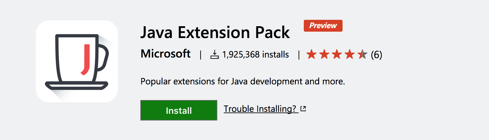
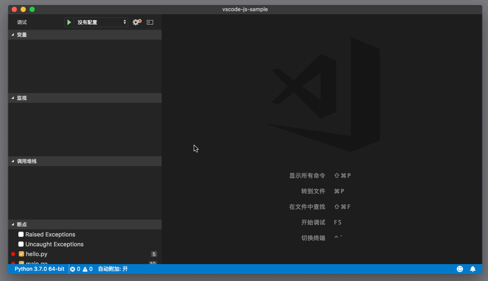
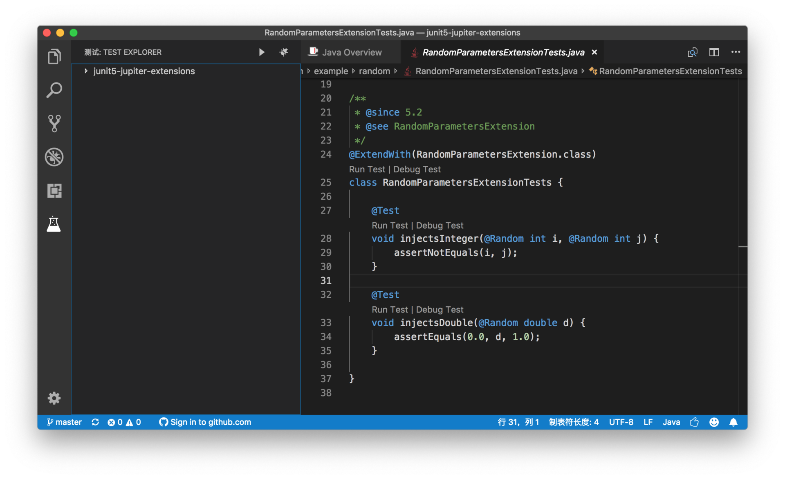
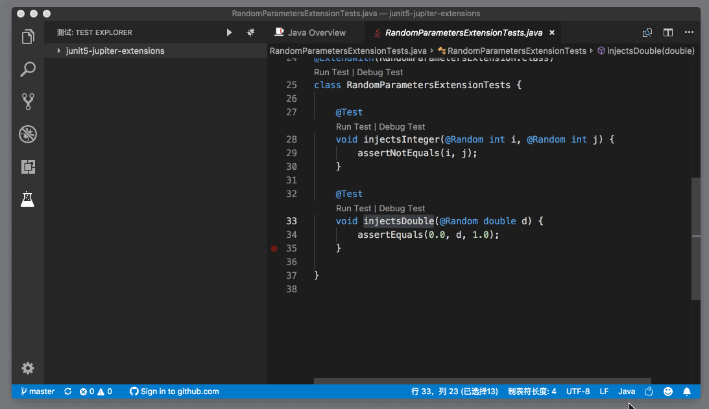
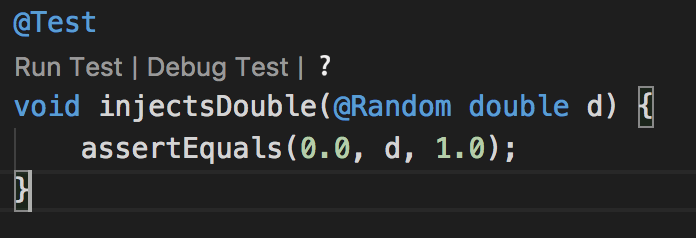
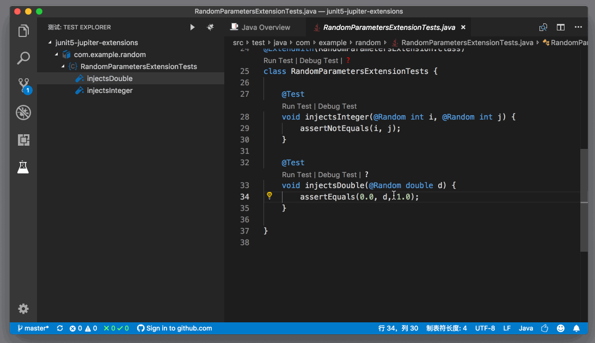

# 75_VSCode支持Java

**VSCode 支持Java**，VS Code上的 Java 语言支持，可以说是多家大企业通力合作了。最早成熟的 Java 插件，是由 Red Hat 公司实现的，叫做 Language Support for Java by Red Hat。 它背后使用的技术则是 Java Language Server，也就是 Language Server Protocol 的 Java 实现。除了VS Code的这个 Java 插件在使用以外，Eclipse Che 现在也在使用 Java Language Server。而说到 Java Language Server ，又不得不提它的底层一个非常重要的库 Eclipse JDT （Eclipse Java development tools ），VS Code的项目领导 Erich Gamma，在加入微软之前，就是在 IBM 负责 Eclipse JDT 这个项目的。

继续回到 Java 插件上。Language Support for Java by Red Hat 这个插件，能够提供代码跳转、自动补全、重构等智能语言功能。不过，它并不支持 Java 代码的调试。如果要对 Java 代码进行调试，则需要安装另一个插件 Debugger for Java ，这个插件则是由微软 Visual Studio 中国团队开发和维护的。而现在 Red Hat 和 Visual Studio 中国团队正在一起合作，共同为 Java 用户在VS Code上提供更好的编程体验。

文章目录

- [1 安装使用](https://geek-docs.com/vscode/vscode-tutorials/vscode-support-java.html#i)
- 2 语言支持
  - [2.1 调试](https://geek-docs.com/vscode/vscode-tutorials/vscode-support-java.html#i-3)
  - [2.2 JUnit 测试](https://geek-docs.com/vscode/vscode-tutorials/vscode-support-java.html#JUnit)
- [3 问题和前瞻](https://geek-docs.com/vscode/vscode-tutorials/vscode-support-java.html#i-4)

## 安装使用

为了保证你能有比较完整的 Java 开发体验，你可以下载插件包 [Java Extension Pack](https://marketplace.visualstudio.com/items?itemName=vscjava.vscode-java-pack)。



这个插件包，包含了四个插件：

- Language Support for Java by Red Hat，提供智能语言服务，项目地址是

   

  https://github.com/redhat-developer/vscode-java

  

- Debugger for Java，提供调试功能，项目地址是 <https://github.com/Microsoft/vscode-java-debug>

- Java Test Runner，在VS Code中运行和调试 JUint 测试，项目地址是 <https://github.com/Microsoft/vscode-java-test>

- Maven for Java，提供更丰富的 Maven 支持，<https://github.com/Microsoft/vscode-maven>

不过，要注意的是，要想这些插件能够正常工作，你需要安装好 JDK 。如果你的环境变量里设置好了 JDK_HOME 或者 JAVA_HOME，那么插件就可以正常启动了。而如果插件无法找到 JDK，你也可以通过在个人或者项目设置中添加 java.home 指定 JDK 的位置。

## 语言支持

在安装完上面的插件后，你可以在VS Code中使用 Maven、Eclipse 和 Gradle 项目。上面我提到了 Java 语言服务的最底层是 Eclipse JDT，无论是代码提示，还是重构、代码跳转等，Eclipse 里能够完成的，VS Code中都能有接近的体验。

### 调试

当你打开一个 Java 项目后，你可以点击调试视图里的齿轮按钮，创建 launch.json 。选择了 Java 这个环境后，Java 插件会为我们创建两个调试的模板。



第一个模板，就是调试本地的项目，要注意的是，你需要填写设置 mainClass，这个设置的值则是你想要调试的 Java Main Class，而且这个地址必须是这个类的完整地址，类似于 com.example.Main 。而第二个模板，则是将调试器 attach 到已经在调试中的 Java 代码，你则需要提供正在运行的调试器的地址（hostName）和端口（port）。

Java 调试配置支持的属性，可以参考[官方文档](https://github.com/Microsoft/vscode-java-debug#options)。不过，这里有三个功能值得特别提一下。

第一个功能是跟用户输入有关。VS Code内置的调试面板，并不支持用户输入。也就是说，如果你写的 Java 程序，依赖于用户从命令行中输入代码，Java 程序会打开一个系统终端，然后你需要在这个系统终端中输入内容。而如果你希望使用VS Code的集成终端来进行输入的话，就可以使用调试配置属性 “console: integratedTerminal” 。

第二个功能是Step filtering。它是什么意思呢? 当你在使用跳转入函数（Step in），或者继续执行函数（Step through）等方法时，有的时候，你会跳入到 Java 语言本身的代码中，或者进入到某些第三方库的代码中。但是你可能只是要调试自己的代码，那么你就可以通过 stepFilters 这个属性，对类的名字进行过滤，所有匹配了这个列表的类，在调试时都可以被直接跳过。你甚至还可以指定你是否要跳过构造函数、静态函数等等。

下面就是一段 stepFilters 属性的例子。

```json
"stepFilters": {
    "classNameFilters": [
        "java.*",
        "javax.*",
        "com.sun.*",
        "sun.*",
        "sunw.*",
        "org.omg.*"
    ],
    "skipSynthetics": false,
    "skipStaticInitializers": false,
    "skipConstructors": false
}
```

JSON

第三个功能是Hot Code replacement，即“热代码替换”。相信对前端有经验的朋友已经比较熟悉这个功能了。这个功能的作用是，当你在调试代码的时候，如果发现代码哪里写错了，可以立即修改。然后调试器就会默默地在底层将整个代码执行切换到一个新的 JVM instance 上，而你无需重启整个调试进程，就能够继续调试最新的代码了。

### JUnit 测试

接下来，我们看看 Java 的插件对 JUnit 测试的支持情况如何。当你打开一个 JUnit 测试时，Java Test Runner 这个插件就会被激活了。此时，在界面最左侧活动栏的最下面，多了一个按钮，点击这个按钮，你就能看到一个测试视图，这个视图里展示的就是当前项目中的所有测试。



在这个视图中，你可以在测试项目上进行右击，调出上下文菜单，然后执行单个，或者多个测试。



与此同时，在编辑器中，你可以看到每个测试的上方，都有 “Run Test” 和 “Debug Test” 等字样。通过点击它们，同样可以执行和调试测试。



另外，在上图中，你还能够看到一个问号，它说明测试没有被正确执行。你可以点击它，这之后，VS Code则会打开一个新的编辑器，详细介绍这个测试相关的情况。



当然，如果你觉得左侧的测试视图已经足够好用了，不希望在编辑器中再看到 “Run Test” 等字样，那你也可以通过 “editor.codelens” 将其关闭。

## 问题和前瞻

虽然VS Code上的 Java 支持，无论是代码积淀还是团队阵容，都是非常强大的，但是还是有一些不尽如人意的地方：

- 首先，就是配置还是相对繁琐，在开发 Java 项目时，还是 IDE 那样开箱即用更省力一些。
- 其次，支持还没有完整，比如还不支持 ant ，对 Android 支持也不够好。
- 最后，也是我心目中比较重要的，性能相比较于其他重型的 IDE ，并没有太大的优势。