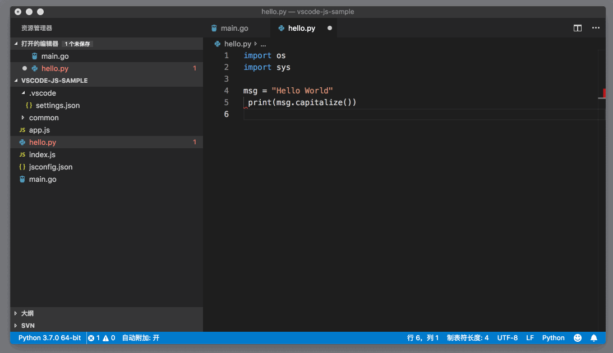

# 76_VSCode支持Python

**VSCode 支持Python**，VS Code上的 Python 语言插件，是VS Code插件市场中下载量最大的一个插件。它最初是一个社区项目，在开发了两年后，作者 Don Jayamanne 加入了微软，从而将这个项目正式升级为微软的官方维护项目。它的下载地址如下：<https://marketplace.visualstudio.com/items?itemName=ms-vscode.Go>


Python 插件现在的维护地址是 <https://github.com/Microsoft/vscode-python> ，你可以看到这个项目是从 <https://github.com/DonJayamanne/pythonVSCode> fork过来的。现在所有的反馈和支持都是在微软的这个 fork repository 上，希望大家不要搞混了。

文章目录

- [1 安装使用](https://geek-docs.com/vscode/vscode-tutorials/vscode-support-python.html#i)
- 2 语言支持
  - [2.1 IntelliSense](https://geek-docs.com/vscode/vscode-tutorials/vscode-support-python.html#IntelliSense)
  - [2.2 代码格式化](https://geek-docs.com/vscode/vscode-tutorials/vscode-support-python.html#i-3)
  - [2.3 代码检测 Linting](https://geek-docs.com/vscode/vscode-tutorials/vscode-support-python.html#_Linting)
  - [2.4 运行脚本](https://geek-docs.com/vscode/vscode-tutorials/vscode-support-python.html#i-4)
  - [2.5 调试](https://geek-docs.com/vscode/vscode-tutorials/vscode-support-python.html#i-5)
- [3 Unit Test](https://geek-docs.com/vscode/vscode-tutorials/vscode-support-python.html#Unit_Test)
- [4 已知问题和前瞻](https://geek-docs.com/vscode/vscode-tutorials/vscode-support-python.html#i-6)

## 安装使用

Python 插件支持绝大多数主流的 Python 版本，但是 macOS 用户要注意一点，系统自带的 Python 并不在支持之列，你可以使用 homebrew 重新安装一个版本。

同时，在安装了 Python 之后，你需要将 Python 的地址添加到环境变量 PATH 中。这里你可以参考文档查询[更多的关于 Python 安装的指导](https://code.visualstudio.com/docs/python/python-tutorial#_prerequisites)。

安装完 Python 和这个插件后，当你第一次打开 Python 文件时，VS Code就会在本地系统查找 Python 解释器。如果没有安装合适的 Python 的话，VS Code就会给出错误提示。比如在 macOS 上，如果没有额外安装 Python，你就会看到下面的错误提示。


然后你可以通过点击 “Select Python Interpreter” 来选择合适的 Python 解释器。当你选择完正确的 Python 解释器后，Python 插件则会提示你安装它需要的 packages。


你按需安装或者禁用这个功能即可。


在状态栏的最左侧，就能够看到当前使用的 Python 解释器，你可以通过点击这个按钮进行切换。

## 语言支持

### IntelliSense

说到 Python 插件的语言支持，就不得不提 Visual Studio 和 IronPython。IronPython 是 Python 的一个开源实现，它能够运行在 .NET 环境之上。Visual Studio 对 IronPython 就有很好的智能语言支持，而它的语言支持的代码是开源的。这也是VS Code上的 Python 插件在使用的语言服务。

无论是自动补全，还是参数提醒、代码跳转等，都可以进行，可以说这个语言服务还是很成熟的。


Python 插件会自动读取本地的各种 Python packages，然后为你提供智能提醒。而这里特别值得一提的是，如果你有一些第三方的 Python 脚本，但是它们并没有被VS Code的 Python 插件所识别，而你又希望能够获得它们的智能提示，那你可以通过添加如下的配置来实现：

```json
"python.autoComplete.extraPaths": [
]
```

JSON

Python 插件就会分析 `python.autoComplete.extraPaths` 下的所有文件夹，然后分析这些代码，并且提供 IntelliSense。

### 代码格式化

Python 插件默认是使用 autopep8 来进行代码的格式化，同时也支持 black 和 yapf，你可以通过 python.formatting.provider 来进行格式化工具的选择。


当你第一次使用格式化文件（Format Document）时，如果你本地并没有安装对应的格式化工具的话，VS Code会提出警告。

我建议你打开 `editor.formatOnSave` 或者 `editor.formatOnType` ，对代码进行及时的格式化。因为代码格式不对而无法运行 Python 脚本可是十分头疼的。


此外，你还可以通过 `python.formatting.autopep8Args`、`python.formatting.yapfArgs`或者 `python.formatting.blackArgs` 来调整格式化参数。

### 代码检测 Linting

默认情况下，VS Code会在你保存 Python 文件时进行代码检测，然后将错误显示在问题面板中。


默认使用的代码检测工具是 Pylint。如果你希望使用其他的 Linter，最佳的方法是，打开命令面板，搜索 `Python: Select Linter` 执行，然后选择你想要的 Linter。



你也可以直接修改设置来进行选择，不过要相对复杂一些，具体则可以参考相关文档。

### 运行脚本

Python 是解释型语言，无需编译即可运行。你可以在编辑器内右击打开上下文菜单，然后选择 “在终端中运行 Python 文件” 来执行脚本，VS Code就会使用你指定的 Python 解释器来执行这个文件。


你也可以选择部分文本，然后将它们在集成终端中运行。

### 调试

Python 代码的调试，并不需要安装其他的脚本或者工具，只要你选择了合适的 Python 解释器即可。和前面专栏介绍的 Node.js 调试一样，如果没有 launch.json 的话，VS Code会默认调试当前文件。


当你为 Python 工程创建 launch.json 时，Python 插件会自动提供多种不同的模板，比如在集成终端中调试当前文件，Attach 到某个正在运行的 Python 脚本上，调试 Python 模块，调试 Django 等等。


相信你还记得，在介绍调试器 launch.json 的书写时，我提到过，各个调试器的配置选项都不完全相同，如果 Python 调试的模板不能满足你的需求，你可以通过[相关文档](https://code.visualstudio.com/docs/python/debugging#_standard-configuration-and-options)来了解 Python 插件都支持哪些调试参数。

## Unit Test

Python 插件既支持 Python 自带的 unittest，同时也支持 pytest 和 Nose。在安装了对应的 Python package 后，你可以从命令面板里执行 `Python: Discover Unit Tests` 命令，Python 插件就会依次问以下问题：

- Enable/Configure Test Framework，选择测试框架，在下面的动图里，我选择了unittest；

  

- 选择在哪个文件夹下搜索测试文件，我选择了根目录；

- 选择测试文件名字的模式 glob，Python 插件会根据这个模式来寻找测试文件。


在测试被成功找到后，你能够看到测试文件里，每个测试的上面都有两个快捷操作 `Run Test` 和 `Debug Test`，你可以点击它们进行测试的执行。

你也可以在状态栏上找到一个按钮`Run Tests`，点击选择运行所有测试。


测试执行完后，你能在状态栏上看到测试的结果。


当然，真正发挥VS Code威力，还是通过 “Debug Test” 来调试某个单独的测试。你只需设置断点，点击 Debug Test 即可进入调试状态。


## 已知问题和前瞻

虽然 Python 插件在维护了接近三年后，已经非常成熟了，但是我觉得还有一个问题很值得一提的。

Windows 10 现在支持了 Linux Subsystem，你可以在这个 Linux 系统中使用 Python 和各种只能在 Linux 上使用的 package。但是受限于VS Code的支持，Python 插件还不能很好地识别和加载 WSL 里的 Python 环境，如此一来，你就没法使用VS Code和 Python 插件的各种功能了。不过好在VS Code团队已经在研究解决方案了。

另外，Python 插件最振奋人心的消息就是微软加大了对它的投资，从最开始的一个个人项目，到微软的官方项目，再到微软请来了 Python 的核心开发者Brett Cannon担任 Python 语言支持的领导工作，所以可以预见：无论是在VS Code上，还是 Visual Studio 上，Python都会有不错的前景。