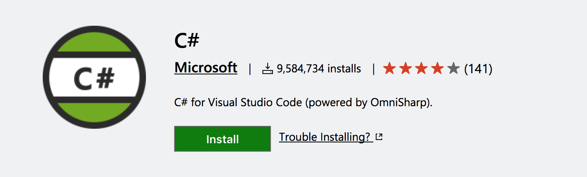
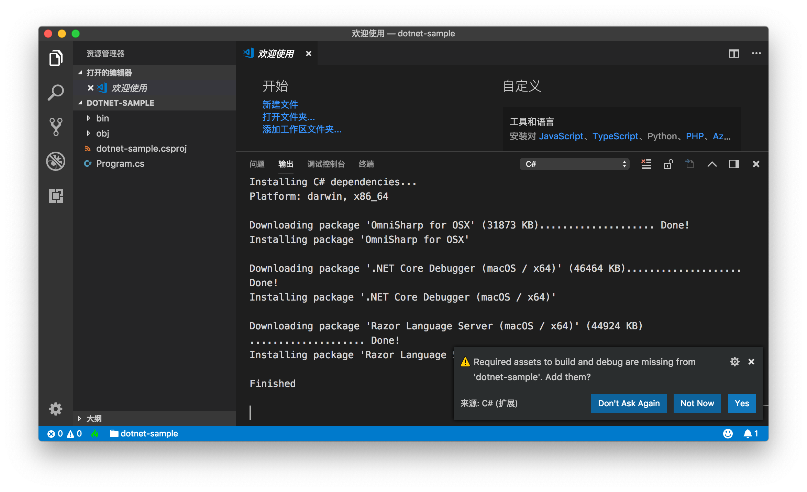
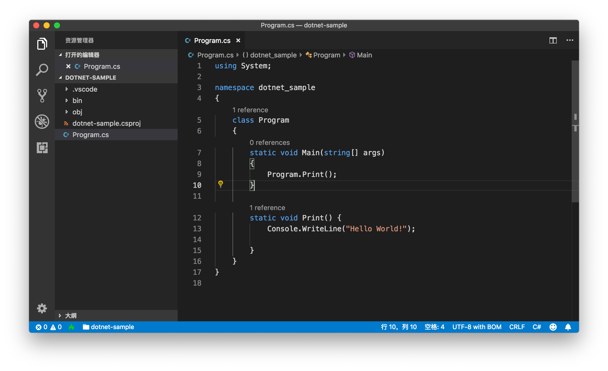
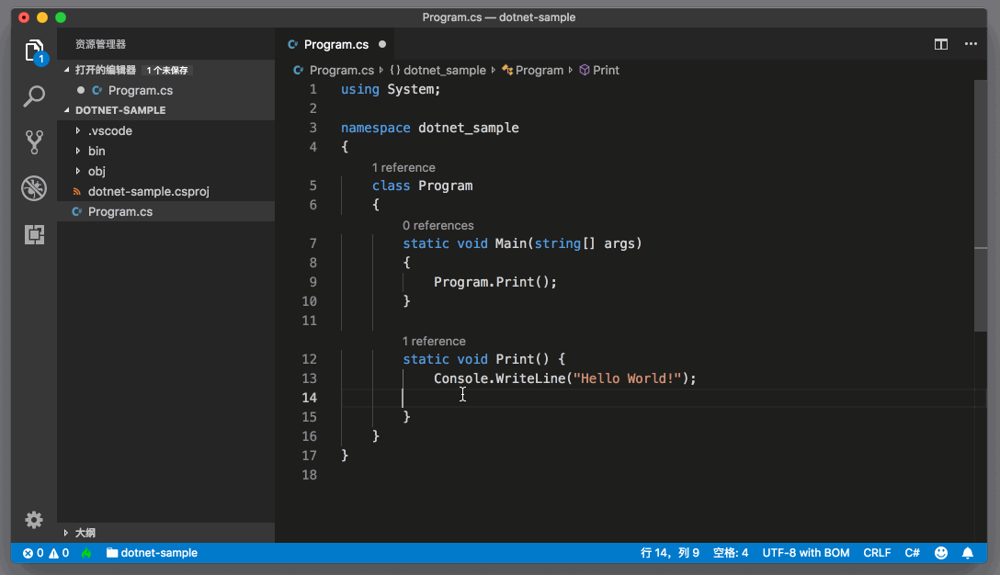
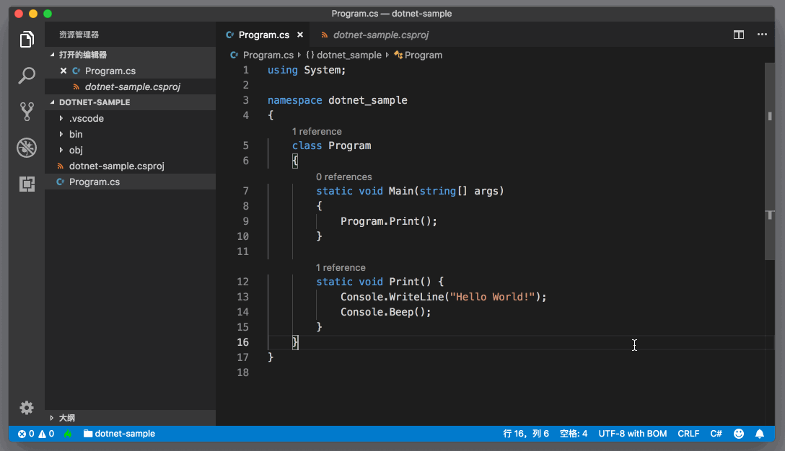
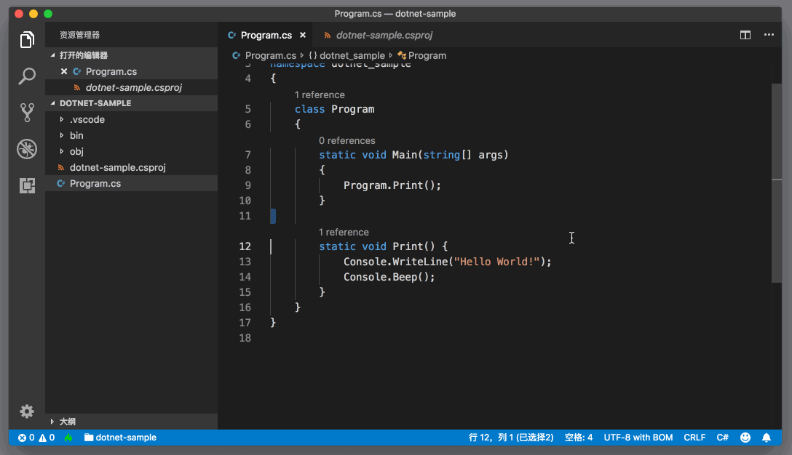
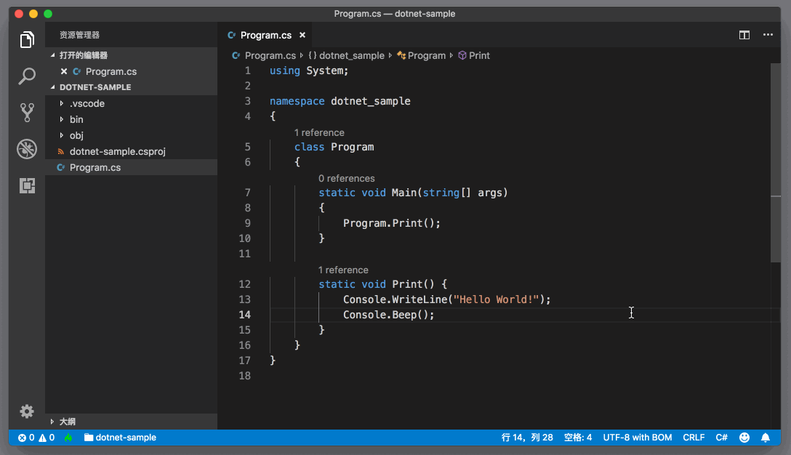
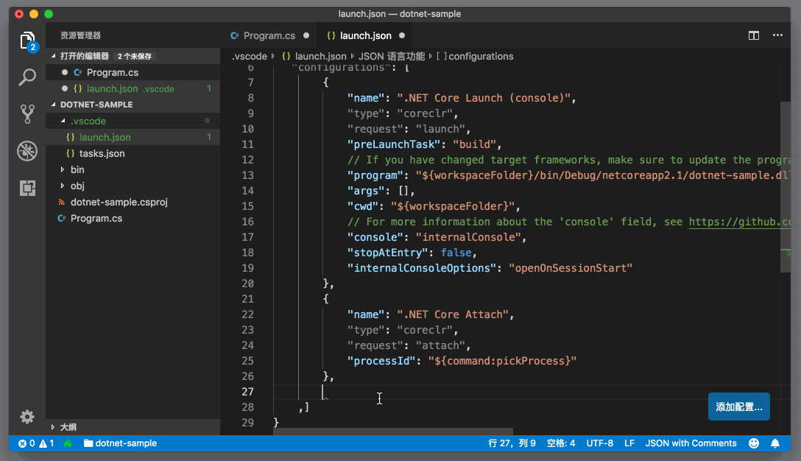
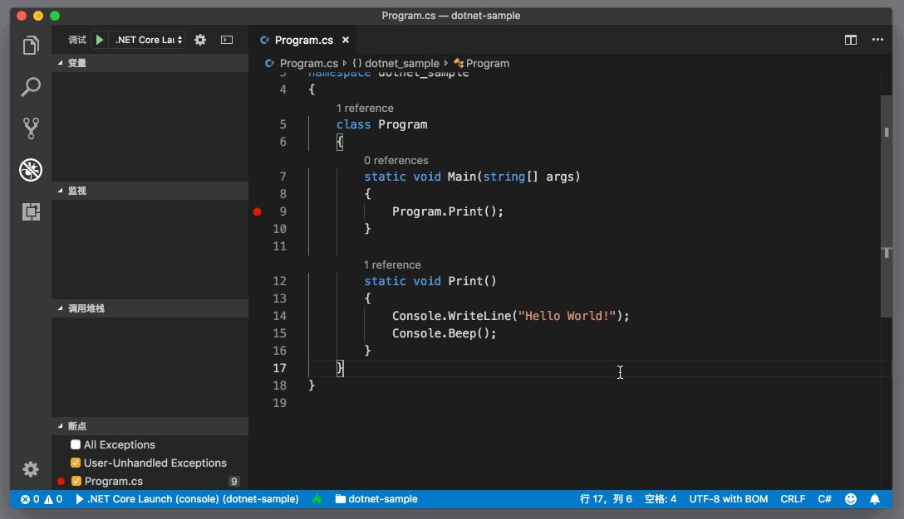

# 77_VSCode支持C#

**VSCode 支持C#** ，VS Code上的 `C#` 支持并不是十分完整。为什么这么说呢？这个 `C#` 插件，并不是要完成 Visual Studio 的 `C#` 支持的所有功能，而只是立足于 `.NET Core` 和 Mono。也就是说，即使你是在 Windows 上使用VS Code并且使用这个插件，也不能很好地支持完整的 `.NET framework`。

看到这里，如果你的目的是使用VS Code和 C# 插件来替代 Visual Studio 完成你日常的 `.NET` 开发（非 `.NET Core`），那么相信你已经知道答案了，你还是应该使用 Visual Studio。

而如果你本身对 .NET Core 很感兴趣，或者你就是在 macOS 和 Linux 上，想尝试 C#，那么下面的介绍就值得一看了。

文章目录

- [1 安装使用](https://geek-docs.com/vscode/vscode-tutorials/vscode-support-cs.html#i)
- 2 语言支持
  - [2.1 任务](https://geek-docs.com/vscode/vscode-tutorials/vscode-support-cs.html#i-3)
  - [2.2 调试](https://geek-docs.com/vscode/vscode-tutorials/vscode-support-cs.html#i-4)
- [3 已知问题和前瞻](https://geek-docs.com/vscode/vscode-tutorials/vscode-support-cs.html#i-5)

## 安装使用

首先，你需要到插件市场安装 [C# 插件](https://marketplace.visualstudio.com/items?itemName=ms-vscode.csharp)。

通过[这个项目地址](https://github.com/OmniSharp/omnisharp-vscode)，你可能也发现了，它的底层支持是依赖 OmniSharp 的，而OmniSharp 本身就是为了解决跨平台的 `.NET` 开发问题的。

这个插件主要支持的项目类型有：

- `.NET Core`
- MSBuild
- C# scripts

要正常使用这个插件，你就需要安装 C# 环境。在 macOS 和 Linux，你要安装的则是[.NET Core](https://www.microsoft.com/net/learn/dotnet/hello-world-tutorial)。

而当你打开一个 .NET 项目时，C# 插件则会自动地去下载所需要的 package，你可以从输出面板中看到相关的下载信息。

## 语言支持

当所有的 package 都安装完成后，打开 C# 文件时，VS Code已经开始提供语言服务了。比如在下图中，你能够看到函数被引用的情况。

至于自动补全、参数提示等，都跟 Visual Studio 上的体验基本一致，因为其底层使用的是同一个 C# 编译器[Roslyn](https://github.com/dotnet/roslyn)。

当然你也可以在 C# 项目中进行符号跳转。

C# 插件也自带了一个代码格式化工具。

### 任务

VS Code已经支持了 .NET Core 的构建脚本，所以你可以直接通过任务系统构建代码。默认情况下，VS Code会把构建脚本运行在集成终端中。

### 调试

如果你是使用 dotnet 脚本来创建的项目，那么项目已经自带了 launch.json ，而无需你再进行配置。如果你的项目没有 C# 相关的调试配置，你也可以借助自动补全来生成。

有了书写完整的 launch.json，你就能够无缝地调试 .NET Core 代码了。

## 已知问题和前瞻

相信跟前面介绍的其他几门语言相比，C# 插件的已知问题，应该比功能介绍可能还要多。比如 ：

- Razor 里不支持 Intellisense；
- 调试时不支持编辑代码并热更新；
- 不支持 VB；
- csproject 的编辑体验也很有限；
- …

不过，我们在最上面已经提过了，它有这些问题，最主要的还是因为它的立足点是 .NET Core。

对于VS Code上的 C# 支持，我自己的感觉是它依然会以 .NET Core 为主要核心，这和VS Code跨平台的特性也非常吻合。而全尺寸的 C# 开发体验，Visual Studio 依然是不二之选。