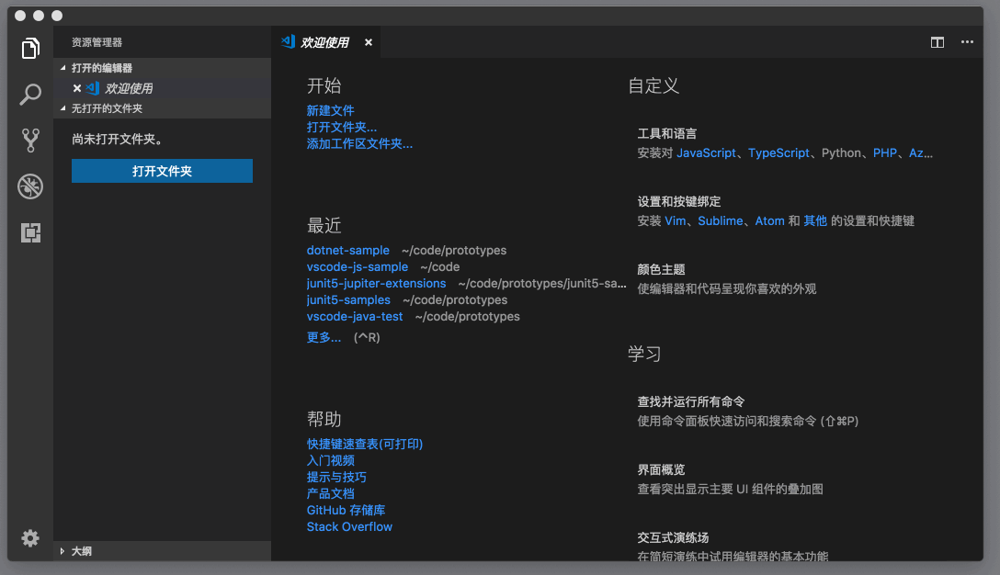

# 81_VSCode固定UI视图

**VSCode 固定 UI 视图**，VSCode可以让我们可以做持久化 UI 视图，这句话是什么意思呢？VS Code 的各种 “切换 xyz 视图可见性” 的命令，它**最终都是将这个配置写到了你的个人设置中**。比如说，我们运行 “切换状态栏可见性”（Toggle Status Bar Visibility），然后再打开个人设置 （JSON），我们可以在设置中找到这样一条：

`"workbench.statusBar.visible": false`,这个配置也非常好理解，它是表达：statusBar（状态栏）并不是 visibile （可见）的。

再比如，你可以将侧边栏显示在右侧，像 Visual Studio 里那样，你可以运行 “切换边栏位置”（Toggle Side Bar Position）。

完成这样的命令后，个人设置里就会多出下面这条设置：
`"workbench.sideBar.location": "right"`还有就是搜索视图的位置，你可以运行“切换搜索视图位置”命令。

VS Code 就会在设置里添加如下代码：`"search.location": "panel"`相信通过这三个例子，你就可以了解如何在你的不同设备之间共享 UI 设置了。通过设置来控制 UI 最棒的地方在于，你**可以为不同的项目指定不同的设置**。比如你可以在自己的个人设置里，将状态栏、侧边栏等都隐藏，这样当你打开一个新窗口时，或者只是编辑单个文件时，你不需要用到它们，自然也就不需要显示它们。而当你打开了某个项目时，可以由这个项目的情况来决定是否要将它们打开。比如说这个项目用了 Git，那么将侧边栏展示出来可能会更方便一些。