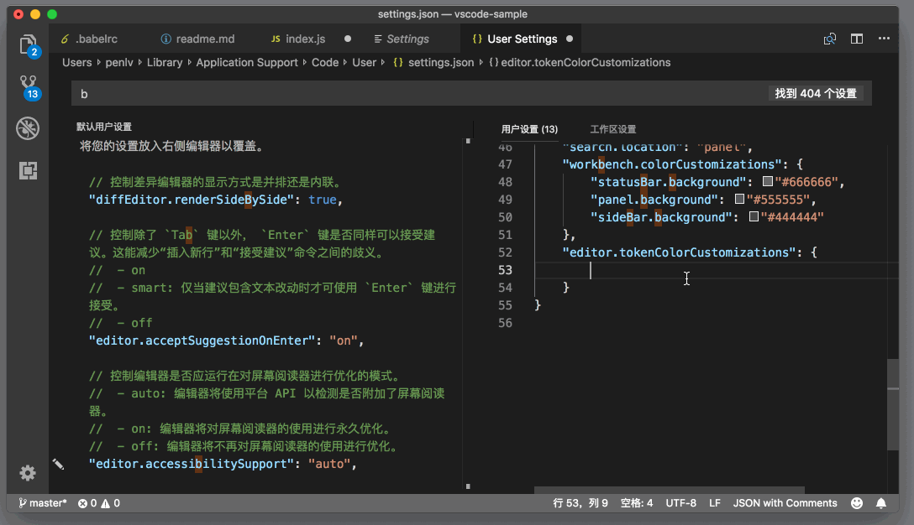
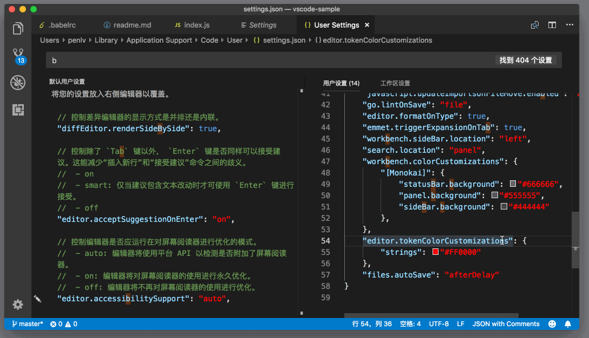

# 83_VSCode修改主题配色

**VSCode 修改主题配色**，前面我们提到了，当你[自定义编辑器内配色](https://geek-docs.com/vscode/vscode-tutorials/vscode-modify-editor-color-matching.html)时，自动补全给你提示了所有已经安装的主题。



通过选择这些主题，你可以只针对它们做颜色修改，而不影响其他的主题的颜色。工作区的颜色修改也是如此。比如说，你想修改 Monokai 的某个颜色定义，那么你可以这么写：

```json
"workbench.colorCustomizations": {
        "[Monokai]": {
            "statusBar.background": "#666666",
            "panel.background": "#555555",
            "sideBar.background": "#444444"
        },
 }
```

JSON

而相应的编辑器颜色修改则是：

```json
"editor.tokenColorCustomizations": {
        "[Monokai]": {
            "strings": "#FF0000"
        }
}
```

JSON

是不是非常方便呢？

在前面介绍 HTML、CSS 的功能时，我介绍过可以在 HTML 和 CSS 中使用取色器来修改颜色。同样的，在 JSON 文件中，你也可以使用取色器来修改。



在上图中，我因为开启了文件自动保存，设置文件会自动保存然后触发颜色的更新，所以当我使用取色器修改颜色后，稍等片刻，就能看到这个颜色在编辑器中的效果了。