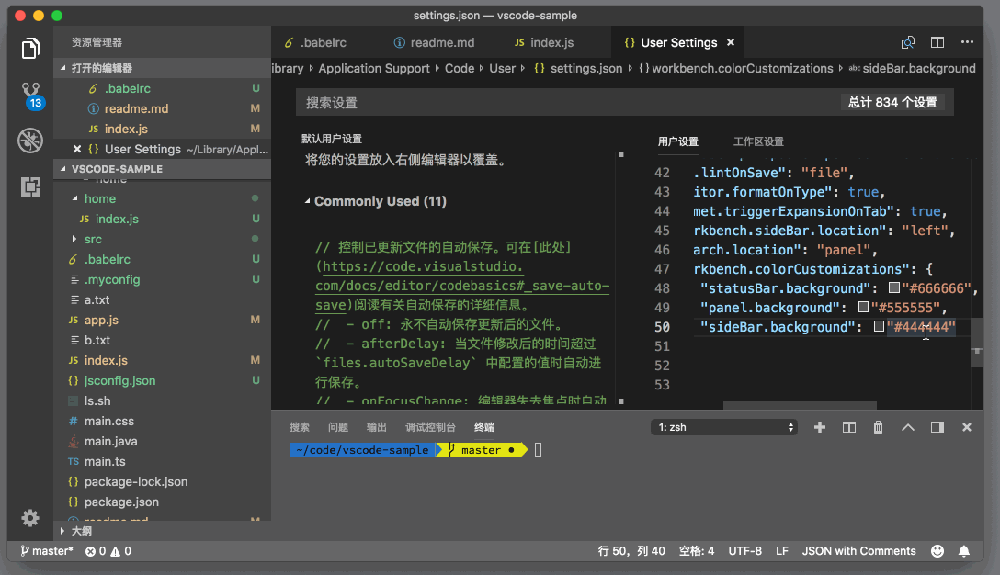

# 84_VSCode修改工作区配色

**VSCode 修改工作区配色**，[持久化 UI 视图](https://geek-docs.com/vscode/vscode-tutorials/vscode-fixes-the-ui-view.html)设置是 VS Code 定制的第一步，而第二步就是修改工作区里各个视图的配色了。相信你早就在插件市场下载过各种主题然后使用了，但其实自己修改主题颜色也非常简单，甚至不要求你有任何的编程知识。

首先，运行命令 “打开设置（JSON）”去打开个人设置。
然后你在编辑器里输入 “workbench.colorCustomizations”，这时候，VS Code 的自动补全就会给你两个提示项了，第一个是：

```json
{
        "statusBar.background": "#666666",
        "panel.background": "#555555",
        "sideBar.background": "#444444"
}
```

JSON

第二个是 {} 。当你选择第一个提示项，此时这个配置是这样的：

```json
"workbench.colorCustomizations": {
        "statusBar.background": "#666666",
        "panel.background": "#555555",
        "sideBar.background": "#444444"
}
```

JSON

workbench.colorCustomizations 有很多属性，它们的键（key）就是代表着各个组件的属性，在示例里，它们是：

- statusBar.background，状态栏背景色
- panel.background，面板背景色
- sideBar.background，侧边栏背景色

而它们的值则是颜色的 HEX 值。此时当你保存文件后，你会发现 VS Code 发生了变化。


没错，上面提到的这三个组件的背景色都立刻发生了变化。而你在设置里添加的这三组键值（key-value pair），跟主题插件里的书写方式一模一样。

已经知道了去哪里书写这些颜色配置，下面就是要知道有哪些可以修改的值了。最简单的方式当然是通过自动补全。



VS Code 自动补全列表提供了所有可以修改的颜色，而如果你希望对此有个全的了解再进行书写，你也可以阅读[官方文档](https://code.visualstudio.com/docs/getstarted/theme-color-reference)。